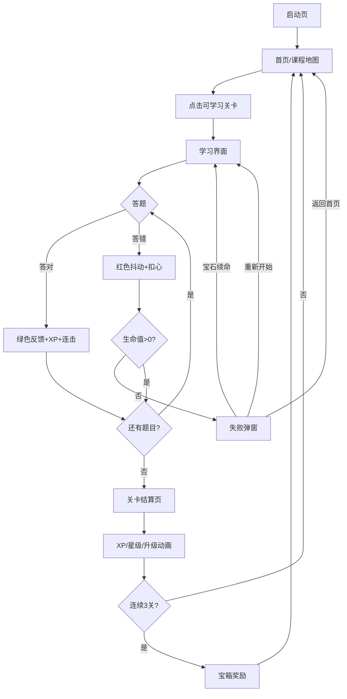

# 多邻国风格 H5 英语单词学习应用 - 产品需求文档（PRD）

## 1. 产品概述

开发一款单页 H5 英语单词学习应用，视觉与交互完全对标多邻国（Duolingo），具有强烈的游戏化、趣味性和沉浸式学习体验。应用采用纯前端技术实现，数据存储在 localStorage，无需后端服务。

- **核心目标**：通过游戏化学习体验让用户轻松、有趣地记忆英语单词
- **目标用户**：英语初学者、希望利用碎片时间背单词的用户
- **产品价值**：以关卡式学习、生命值、连胜、排行榜等游戏化机制激发学习动力，提升用户留存与学习效果

## 2. 核心功能

### 2.1 用户角色

| 角色 | 注册方式 | 核心权限 |
|------|---------------------|------------------|
| 普通用户 | 本地创建（无需注册） | 使用全部学习功能、管理个人进度、自定义设置 |

### 2.2 功能模块

1. **启动页**：猫头鹰 Logo + 应用名称，2 秒后自动进入首页
2. **首页/课程地图**：顶部用户信息栏 + 垂直路径式关卡地图 + 单元结构
3. **学习界面**：全屏卡片式一题一屏学习模式，含 6 种题型
4. **关卡结算页**：显示获得 XP、正确率、用时、星级评价、升级动画
5. **个人中心**：统计图表、成就徽章、设置（音效/夜间模式）
6. **单词本**：已学单词分类展示、错题本、每日复习（艾宾浩斯曲线）
7. **商店**：用金币购买心、双倍卡、皮肤等（纯前端模拟）
8. **排行榜**：模拟本周学习排行榜，前三名金/银/铜皇冠

### 2.3 页面详情

| 页面名称 | 模块名称 | 功能描述 |
|-----------|-------------|---------------------|
| 启动页 | Logo 动画 | 猫头鹰 SVG 吉祥物 + 应用名称，2 秒自动跳转 |
| 首页 | 用户信息栏 | 头像、连胜天数、宝石、生命值、每日目标环形进度 |
| 首页 | 关卡地图 | 垂直路径式关卡节点，含未解锁/可学习/已完成三种状态 |
| 首页 | 单元结构 | 多个单元（基础问候/家庭/食物），每单元 5-8 关 |
| 学习界面 | 进度条+生命值 | 顶部本课进度条（橙→绿渐变）+ 5 颗生命值 |
| 学习界面 | 单词翻译选择 | 中文释义+4 英文选项，即时反馈（绿/红+音效） |
| 学习界面 | 看图选词 | emoji 图片+4 个英文单词选项 |
| 学习界面 | 听音选义 | speechSynthesis 播放发音+4 中文释义选项 |
| 学习界面 | 单词拼写 | 中文释义+乱序字母，点击拼出单词，提示按钮（10 金币） |
| 学习界面 | 配对题 | 左 4 英文+右 4 中文，点击连线配对 |
| 学习界面 | 句子翻译 | 乱序单词卡片，拖拽/点击排序组成句子 |
| 学习界面 | 即时反馈 | 答对绿+Correct!+10XP 飘字；答错红抖动+Oops!+正确答案 |
| 学习界面 | 连击系统 | 连续答对 3 题触发 Combo x3 火焰特效，5 连击双倍积分 |
| 学习界面 | 提示/跳过 | 提示按钮（20 金币）、跳过按钮（50 金币） |
| 关卡结算页 | 结算信息 | 总 XP、正确率、用时、1-3 星评价、经验条增长动画 |
| 关卡结算页 | 升级动画 | 全屏彩带、猫头鹰举奖杯、等级数字跳动放大 |
| 关卡结算页 | 宝箱奖励 | 连续完成 3 关获宝箱，开箱动画随机奖励 |
| 个人中心 | 统计图表 | 总 XP、等级、连胜、掌握单词数、学习天数 |
| 个人中心 | 成就系统 | 10 个成就徽章（初次学习/完美通关/单词达人/连胜 7 天等） |
| 个人中心 | 设置 | 音效开关、夜间模式、每日目标设置 |
| 单词本 | 单词列表 | 按单元分类，显示英文/音标/中文/例句/掌握程度 |
| 单词本 | 错题本 | 自动收集答错单词，可进入"错题挑战"模式 |
| 单词本 | 每日复习 | 艾宾浩斯曲线推送复习单词，闪卡形式翻转 |
| 商店 | 商品列表 | 心、双倍 XP 卡、额外生命、皮肤（金币购买） |
| 排行榜 | 排名列表 | 本周学习排行榜，前三名金/银/铜皇冠标识 |

## 3. 核心流程

### 3.1 学习流程

用户打开应用 → 启动页 2 秒 → 首页课程地图 → 点击可学习关卡 → 进入全屏学习界面 → 逐题作答（含即时反馈/连击/生命值） → 完成全部题目 → 关卡结算页（XP/星级/升级/宝箱） → 返回首页（关卡状态更新，解锁下一关）

### 3.2 生命值失败流程

答错扣 1 心 → 心扣完 → 本关失败弹窗 → 选择用宝石续命 / 重新开始 / 返回首页

### 3.3 流程图



## 4. 用户界面设计

### 4.1 设计风格

- **主色**：#58CC02（多邻国绿）
- **辅色**：#1CB0F6（天空蓝）、#FF9600（活力橙）、#FF4B4B（错误红）、#FFD900（金币黄）
- **背景**：#F7F7F7（浅灰）、#FFFFFF（卡片白）
- **文字**：#3C3C3C（主文字）、#AFAFAF（次要文字）
- **按钮风格**：大圆角（12-16px），主按钮 16px 圆角，3D 按压效果（scale 0.95 + 颜色加深）
- **字体**：`-apple-system, BlinkMacSystemFont, "Segoe UI", Roboto, "PingFang SC", "Microsoft YaHei", sans-serif`
- **布局风格**：卡片式布局，移动端优先（375-428px），桌面端居中卡片式（最大宽度 480px）
- **图标/emoji 风格**：SVG 内联图标 + emoji 替代真实图片，猫头鹰吉祥物多表情变化

### 4.2 页面设计概览

| 页面名称 | 模块名称 | UI 元素 |
|-----------|-------------|-------------|
| 启动页 | Logo 区 | 居中猫头鹰 SVG（眨眼动画）+ 应用名称渐变色，2 秒淡出过渡 |
| 首页 | 顶部栏 | 左侧头像+用户名，右侧连胜🔥+宝石💎+生命❤️，底部每日目标环形进度 |
| 首页 | 关卡地图 | 垂直居中路径，圆形节点（80px），未解锁灰/可学习彩色发光脉动/已完成金色皇冠，虚线连接 |
| 首页 | 单元标题 | 彩色横幅单元名，完成单元显示奖杯 |
| 学习界面 | 顶部栏 | 左退出按钮，中进度条（橙→绿渐变），右生命值❤️x5 |
| 学习界面 | 题目区 | 上方题干大字，下方选项卡片网格（2x2），按压效果 |
| 学习界面 | 反馈条 | 底部弹出条，答对绿+Correct!+XP 飘字，答错红+Oops!+正确答案 |
| 学习界面 | 底部按钮 | 提示（20💎）/跳过（50💎），右下角 |
| 关卡结算页 | 结算卡片 | 居中大卡片：总 XP 数字滚动、正确率环形、1-3 星、经验条增长 |
| 关卡结算页 | 升级动画 | 全屏彩带粒子，猫头鹰举奖杯，等级数字跳动放大 |
| 个人中心 | 统计卡 | 网格布局：总 XP/等级/连胜/掌握单词/学习天数，数字大字 |
| 个人中心 | 成就墙 | 网格徽章（已解锁彩色/未解锁灰色），点击查看详情 |
| 单词本 | 单词卡 | 列表式，每卡：英文+音标+中文+掌握进度条，点击播放发音 |
| 商店 | 商品卡 | 网格商品卡：图标+名称+价格+购买按钮 |

### 4.3 响应式

- **移动端优先**：375px - 428px，关卡地图垂直单列
- **平板**：768px - 1024px，关卡地图改为网格布局
- **桌面**：>1024px，居中卡片式布局，最大宽度 480px
- **触摸优化**：所有可点击元素 ≥44px，按压 scale 0.95 反馈

### 4.4 动画与微交互

- **页面过渡**：滑动过渡（slide），300ms，ease-out
- **按钮交互**：active 状态 scale 0.95 + 颜色加深
- **加载状态**：按钮点击后旋转加载器，防重复提交
- **浮动元素**：猫头鹰偶尔眨眼、点头；完成关卡跳跃
- **成就弹出**：顶部滑入横幅，3 秒自动消失
- **数字滚动**：XP、金币变化时数字滚动动画
- **连击特效**：Combo x3 火焰粒子
- **升级庆祝**：全屏彩带动画
- **关卡脉动**：当前关卡节点彩色发光脉动

## 5. 音效设计（Web Audio API 生成）

| 音效名称 | 触发场景 | 实现方式 |
|----------|----------|----------|
| 正确音 | 答对题目 | C5 音符，100ms 短促"叮"声 |
| 错误音 | 答错题目 | A3 音符，200ms 低频"嘟"声 |
| 点击音 | 点击按钮 | 极短促"嗒"声（气泡音） |
| 升级音 | 等级提升 | 上行音阶 C4-E4-G4-C5 快速连续 |
| 完成音 | 关卡完成 | 胜利和弦 C4-E4-G4 同时播放 500ms |
| 心恢复音 | 生命恢复 | 柔和"啵"声 |

## 6. 数据存储结构（localStorage）

```json
{
  "user": {
    "name": "Learner",
    "avatar": 1,
    "xp": 0,
    "level": 1,
    "streak": 0,
    "lastStudyDate": "2026-07-11",
    "gems": 100,
    "hearts": 5,
    "maxHearts": 5,
    "heartRecoveryTime": null,
    "dailyGoal": 20,
    "todayXp": 0
  },
  "progress": {
    "currentUnit": 1,
    "completedLessons": [],
    "lessonStars": {}
  },
  "wordbook": [
    {"word": "apple", "meaning": "苹果", "unit": 1, "mastery": 0, "wrongCount": 0}
  ],
  "achievements": [],
  "settings": {"sound": true, "notifications": true}
}
```

## 7. 内置课程数据

**Unit 1: 基础问候**
- Lesson 1: hello, hi, bye, good
- Lesson 2: I, you, am, are
- Lesson 3: name, nice, meet, too
- Lesson 4: thanks, please, sorry, yes
- Lesson 5: no, ok, great, fine

**Unit 2: 家庭与人物**
- Lesson 1: mom, dad, family, home
- Lesson 2: brother, sister, friend, baby
- Lesson 3: man, woman, boy, girl
- Lesson 4: love, live, happy, together
- Lesson 5: [Boss] 混合测试

**Unit 3: 日常食物**
- Lesson 1: apple, banana, bread, water
- Lesson 2: rice, noodle, egg, milk
- Lesson 3: meat, fish, fruit, vegetable
- Lesson 4: eat, drink, hungry, full
- Lesson 5: [Boss] 混合测试

## 8. 额外趣味功能（加分项）

1. **每日签到**：连续签到奖励递增，第 7 天大奖
2. **成就系统**：10 个成就徽章
3. **夜间模式**：深色主题，猫头鹰戴墨镜
4. **学习提醒**：浏览器通知权限申请
5. **分享功能**：完成关卡生成分享卡片（Canvas 绘制）

## 9. 性能要求

- 首屏加载 < 2 秒
- 所有图片/图标使用 SVG 或 CSS 绘制，不依赖外部图片资源
- 动画使用 transform 和 opacity，避免触发重排
- localStorage 数据读写做防抖处理
