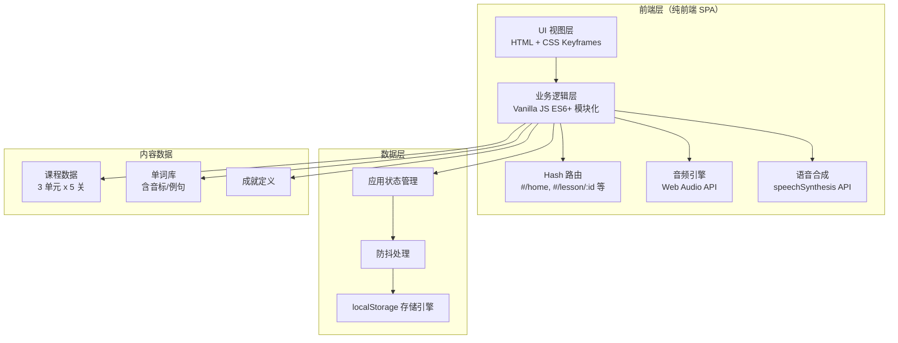
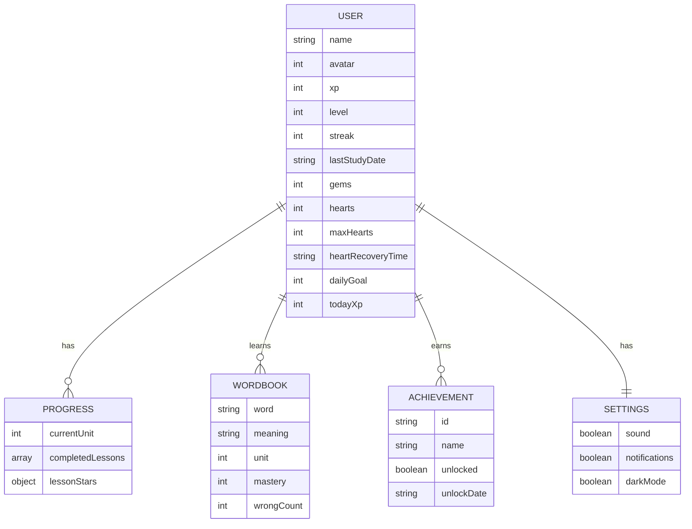

# 多邻国风格 H5 英语单词学习应用 - 技术架构文档

## 1. 架构设计



**架构特点**：

* 纯前端单页应用（SPA），无后端依赖

* Hash 路由实现页面切换，支持浏览器前进后退

* 模块化 ES6+ 组织代码，职责分离

* localStorage 持久化，防抖处理优化性能

* Web Audio API 程序化生成音效，无外部音频文件

## 2. 技术说明

* **前端**：HTML5 + CSS3 + Vanilla JavaScript（ES6+ 模块化）

* **构建工具**：无（直接浏览器运行，零依赖）

* **路由**：自实现 Hash 路由（`#/splash`、`#/home`、`#/lesson/:id` 等）

* **数据存储**：localStorage（带防抖处理）

* **音频**：Web Audio API（程序化生成音效）

* **语音**：Web Speech API（speechSynthesis 单词发音）

* **图标**：SVG 内联 + emoji

* **动画**：CSS Keyframes + Transition（transform/opacity 优化）

* **后端**：无

* **数据库**：无（localStorage 替代）

## 3. 路由定义

| 路由                | 用途                             |
| ----------------- | ------------------------------ |
| `#/splash`        | 启动页：猫头鹰 Logo + 应用名称，2 秒后自动进入首页 |
| `#/home`          | 首页/课程地图：顶部用户信息栏 + 垂直关卡地图       |
| `#/lesson/:id`    | 学习界面：全屏学习，顶部进度条+生命值，6 种题型      |
| `#/lesson-result` | 关卡结算页：XP/星级/升级动画/宝箱            |
| `#/profile`       | 个人中心：统计图表、成就、设置                |
| `#/wordbook`      | 单词本：单词列表/错题本/每日复习              |
| `#/shop`          | 商店：用金币购买心、双倍卡、皮肤               |
| `#/leaderboard`   | 排行榜：本周学习排名                     |

## 4. 文件结构

```
TraeDemo/
├── index.html                 # 单页应用入口（含所有 HTML 结构）
├── css/
│   ├── main.css              # 全局样式 + CSS 变量 + 重置
│   ├── components.css        # 组件样式（按钮/卡片/导航）
│   ├── lesson.css            # 学习界面专用样式
│   ├── animations.css        # 所有关键帧动画
│   └── responsive.css        # 响应式断点
├── js/
│   ├── app.js                # 应用入口 + 路由初始化
│   ├── router.js             # Hash 路由实现
│   ├── store.js              # localStorage 数据层 + 防抖
│   ├── audio.js              # Web Audio API 音效引擎
│   ├── speech.js             # speechSynthesis 语音合成
│   ├── data.js               # 课程数据 + 单词库 + 成就定义
│   ├── components.js         # 可复用 UI 组件（猫头鹰 SVG/进度条/反馈条）
│   ├── pages/
│   │   ├── splash.js         # 启动页逻辑
│   │   ├── home.js           # 首页课程地图
│   │   ├── lesson.js         # 学习界面（核心）
│   │   ├── lessonResult.js   # 关卡结算页
│   │   ├── profile.js        # 个人中心
│   │   ├── wordbook.js       # 单词本
│   │   ├── shop.js           # 商店
│   │   └── leaderboard.js    # 排行榜
│   └── utils.js              # 工具函数（数字滚动/防抖/随机打乱）
└── 原始需求.md                # 原始需求文档（已存在）
```

## 5. 数据模型

### 5.1 数据模型定义



### 5.2 数据定义语言（localStorage JSON 结构）

```json
{
  "duolingo_user": {
    "name": "Learner",
    "avatar": 1,
    "xp": 0,
    "level": 1,
    "streak": 0,
    "lastStudyDate": "2026-07-11",
    "gems": 100,
    "hearts": 5,
    "maxHearts": 5,
    "heartRecoveryTime": null,
    "dailyGoal": 20,
    "todayXp": 0,
    "totalStudyDays": 0,
    "consecutiveLessons": 0
  },
  "duolingo_progress": {
    "currentUnit": 1,
    "completedLessons": [],
    "lessonStars": {}
  },
  "duolingo_wordbook": [
    {
      "word": "apple",
      "phonetic": "/ˈæpəl/",
      "meaning": "苹果",
      "unit": 1,
      "lesson": 1,
      "example": "I eat an apple every day.",
      "mastery": 0,
      "wrongCount": 0,
      "lastReview": null,
      "nextReview": null
    }
  ],
  "duolingo_achievements": [
    {
      "id": "first_lesson",
      "name": "初次学习",
      "description": "完成第一个关卡",
      "icon": "🎯",
      "unlocked": false,
      "unlockDate": null
    }
  ],
  "duolingo_settings": {
    "sound": true,
    "notifications": true,
    "darkMode": false
  },
  "duolingo_checkin": {
    "lastCheckin": null,
    "consecutiveDays": 0
  }
}
```

## 6. 核心模块设计

### 6.1 路由模块（router.js）

* 监听 `hashchange` 事件

* 解析 `#/lesson/:id` 等动态路由参数

* 页面切换滑动过渡（300ms ease-out）

* 路由守卫（如学习界面需检查关卡是否解锁）

### 6.2 数据层（store.js）

* `getItem(key)` / `setItem(key, value)` 封装

* 写操作防抖（300ms）

* 数据迁移与默认值合并

* 初始化时检测并填充默认数据

### 6.3 音效引擎（audio.js）

* Web Audio API 创建 AudioContext

* `playCorrect()`：C5（523.25Hz），100ms，正弦波

* `playWrong()`：A3（220Hz），200ms，方波

* `playClick()`：极短促"嗒"声

* `playLevelUp()`：上行音阶 C4-E4-G4-C5

* `playComplete()`：胜利和弦 C4-E4-G4 同时 500ms

* `playHeartRecover()`：柔和"啵"声

* 受 settings.sound 开关控制

### 6.4 学习界面（lesson.js）

* 题目生成器：根据关卡单词动态生成 6 种题型

* 状态管理：当前题目索引、生命值、连击数、XP

* 即时反馈：答对/答错动画 + 音效 + 猫头鹰表情

* 连击系统：3 连击 Combo x3 火焰，5 连击双倍积分

* 生命值系统：答错扣心，0 心失败弹窗

* 提示/跳过：扣金币功能

### 6.5 游戏化系统

* **XP 与等级**：XP 阈值升级（level = floor(sqrt(xp/100)) + 1）

* **连胜天数**：每日首次学习更新 streak

* **生命值恢复**：每 4 小时恢复 1 心，离线计时

* **宝箱奖励**：连续完成 3 关触发开箱动画

* **每日目标**：环形进度条，完成触发庆祝动画

## 7. 题型实现方案

| 题型     | 实现方式                        |
| ------ | --------------------------- |
| 单词翻译选择 | 中文题干 + 4 英文选项卡片，点击即时反馈      |
| 看图选词   | emoji 大图 + 4 英文选项           |
| 听音选义   | speechSynthesis 播放 + 4 中文选项 |
| 单词拼写   | 乱序字母按钮 + 空格槽，点击填入，提示显示一字母   |
| 配对题    | 左右两列，点击高亮，配对成功连线变绿          |
| 句子翻译   | 乱序单词卡片，点击按序排列组成句子           |

## 8. 动画清单

| 动画名称  | 实现方式                               | 触发场景    |
| ----- | ---------------------------------- | ------- |
| 猫头鹰眨眼 | CSS keyframes 改变 SVG 眼睛            | 启动页/首页  |
| 关卡脉动  | box-shadow 发光 + scale 循环           | 当前可学关卡  |
| 按钮按压  | active:scale(0.95)                 | 所有按钮    |
| 页面滑动  | transform: translateX + transition | 路由切换    |
| 答对反馈  | 选项变绿 + Checkmark 弹出                | 答对题目    |
| 答错抖动  | shake keyframes                    | 答错题目    |
| XP 飘字 | translateY 上升 + opacity 淡出         | 获得 XP   |
| 连击火焰  | 粒子 emoji 上升                        | 3 连击    |
| 数字滚动  | requestAnimationFrame              | XP/金币变化 |
| 升级彩带  | 多个 div 粒子下落                        | 等级提升    |
| 宝箱开合  | rotate + scale                     | 获得宝箱    |
| 成就横幅  | translateY 从顶部滑入                   | 解锁成就    |
| 星级弹出  | scale 0→1 + bounce                 | 结算页     |

## 9. 性能优化

* 动画仅使用 `transform` 和 `opacity`，避免重排

* localStorage 写操作防抖 300ms

* SVG 内联，无外部图片请求

* Web Audio API 程序化音效，无音频文件

* 事件委托减少监听器数量

* 页面切换时清理上一页事件监听

* 首屏加载 < 2 秒（零外部依赖）

## 10. 代码规范

* 语义化 HTML 标签（`<header>`、`<main>`、`<section>`）

* CSS 使用 BEM 命名规范（`.lesson__option--correct`）

* JavaScript ES6+ 语法（const/let、箭头函数、模板字符串、解构、模块化）

* CSS 变量管理主题色（支持夜间模式切换）

* 详细注释说明核心逻辑

* i18n 结构准备（默认中文界面，学习内容英文）

