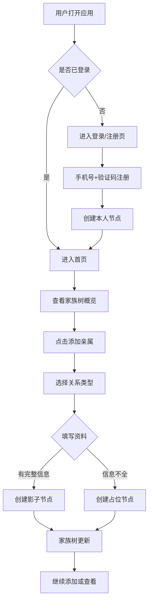
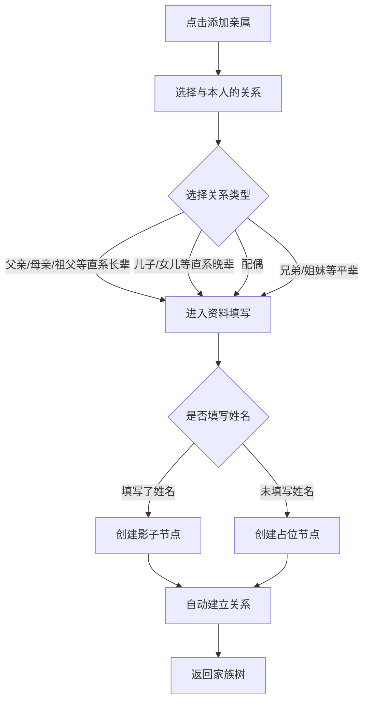

# 亲络家谱 PRD（P0 基础骨架）

## 1. 产品概述

亲络家谱是一款面向现代家庭的谱系制作与关系连接平台。P0 阶段聚焦于建立账号、人员节点、基础关系和家族树的骨架，让用户能够从自己开始创建一棵家族树，并支持未注册亲属以影子节点和占位节点形式存在。
- 目标用户：家庭中想整理家谱的普通用户
- 解决问题：让用户能用手机快速建立自己的家族树，先存关系结构，后续再补资料
- 平台定位：网页版（移动端竖屏优先），后期同步小程序、iOS、Android、华为

## 2. 核心功能

### 2.1 用户角色

| 角色 | 注册方式 | 核心权限 |
|------|----------|----------|
| 普通用户 | 手机号注册 | 创建本人节点、添加亲属、管理自己创建的影子节点和占位节点、查看家族树 |
| 访客（未登录） | 无 | 仅可查看落地邀请页最小必要信息 |

### 2.2 功能模块

1. **账号页**：手机号注册、登录、退出登录、登录态保持
2. **首页**：我的家族树概览、待完善节点提醒、快速添加亲属入口
3. **家族树页**：树状图浏览、节点点击查看详情、添加亲属、节点类型区分展示
4. **人物详情页**：基础资料、亲属关系列表、编辑入口、隐私设置入口
5. **添加亲属页**：关系选择、新建影子节点、新建占位节点、基础资料填写
6. **设置页**：隐私设置、账号信息、退出登录

### 2.3 页面详情

| 页面名称 | 模块名称 | 功能描述 |
|----------|----------|----------|
| 账号页 | 注册 | 手机号 + 验证码注册，注册后创建本人节点 |
| 账号页 | 登录 | 手机号 + 验证码登录，或账号密码登录 |
| 首页 | 顶部信息 | 显示用户姓名、头像、家族成员数量 |
| 首页 | 家族树预览 | 缩略家族树图，点击进入完整家族树页 |
| 首页 | 待完善提醒 | 占位节点、未填写资料的影子节点提醒 |
| 首页 | 快捷操作 | 添加亲属、查看家族树入口 |
| 家族树页 | 树状图 | 上祖下孙的层级展示，支持缩放和拖拽 |
| 家族树页 | 节点类型区分 | 注册节点、影子节点、占位节点、已故节点视觉区分 |
| 家族树页 | 关系线区分 | 血缘实线、姻亲虚线、待确认半透明 |
| 家族树页 | 节点点击 | 弹出节点简要信息和操作入口 |
| 人物详情页 | 基础资料 | 姓名、性别、出生日期（支持精度）、出生地、在世状态 |
| 人物详情页 | 姓名体系 | 谱名、曾用名、英文名等多姓名管理 |
| 人物详情页 | 亲属关系 | 父母、配偶、子女、兄弟姐妹列表 |
| 人物详情页 | 编辑入口 | 修改基础资料（仅本人和创建的影子节点可编辑） |
| 添加亲属页 | 关系选择 | 父亲、母亲、配偶、儿子、女儿、兄弟、姐妹等常用关系 |
| 添加亲属页 | 新建影子节点 | 填写姓名、性别、出生年份等创建未注册亲属 |
| 添加亲属页 | 新建占位节点 | 姓名可留空，仅保存关系结构 |
| 添加亲属页 | 高级关系 | 关系大类、血缘属性、是否法律关系 |
| 设置页 | 隐私设置 | 基础资料可见性、关系可见性 |
| 设置页 | 账号管理 | 查看登录信息、退出登录 |

## 3. 核心流程

### 3.1 新用户注册建树流程

用户打开应用 → 注册账号（手机号+验证码）→ 创建本人节点（填写姓名、性别、出生日期）→ 进入首页看到只有自己的家族树 → 点击"添加亲属"→ 选择关系（如"父亲"）→ 填写资料创建影子节点 → 家族树更新显示父子关系 → 继续添加更多亲属。

### 3.2 添加亲属流程

## 4. 用户界面设计

### 4.1 设计风格

**美学方向：现代东方雅致**

家谱承载家族记忆与文化传承，设计需在传统东方美学与现代移动应用之间找到平衡。整体气质追求"水墨入纸"的雅致感，避免浓重装饰。

- **主色**：墨色 `#1a1a2e`（深墨蓝黑），象征书卷与传承
- **辅色**：宣纸色 `#f5f1e8`（暖米白），作为背景基底，营造纸质感
- **强调色**：朱砂红 `#c8553d`，用于重要操作和当前选中状态
- **点缀色**：竹青色 `#5b8c5a`，用于成功状态和血缘关系线
- **金色**：`#c9a961`，用于装饰线和等级标识

**按钮风格**：圆角矩形（8px 圆角），主要按钮用朱砂红填充白字，次要按钮用墨色描边白底
**字体**：标题用衬线字体（思源宋体 Noto Serif SC），正文用无衬线字体（思源黑体 Noto Sans SC），体现传统与现代的平衡
**布局**：移动端竖屏单列卡片式布局，底部导航栏，大量留白营造呼吸感
**图标**：线性图标为主，风格简洁，配合少量传统纹样装饰
**背景质感**：宣纸纹理叠加，轻微噪点，营造纸面书写的真实感

### 4.2 页面设计概览

| 页面名称 | 模块名称 | UI 元素 |
|----------|----------|----------|
| 登录/注册页 | 品牌区 | 顶部居中"亲络家谱"书法体 logo，水墨纹样背景，宣纸质感 |
| 登录/注册页 | 表单区 | 手机号输入、验证码输入（带获取按钮），圆角输入框，朱砂红主按钮 |
| 首页 | 顶部信息卡 | 头像 + 姓名 + 家族成员数，左侧带竖向装饰线 |
| 首页 | 家族树预览 | 卡片式缩略图，墨色节点 + 朱砂关系线，点击进入完整树 |
| 首页 | 待完善提醒 | 列表项，左侧竹青色圆点，右侧箭头 |
| 首页 | 快捷操作 | 两个并排卡片：添加亲属、查看家族树 |
| 家族树页 | 树状图 | 全屏画布，可缩放拖拽，节点为圆角卡片，不同类型不同颜色 |
| 家族树页 | 顶部工具栏 | 返回、搜索、视图切换、筛选 |
| 家族树页 | 底部操作栏 | 添加亲属、导出（后期） |
| 人物详情页 | 顶部头像区 | 居中头像 + 姓名 + 关系称谓，宣纸背景 |
| 人物详情页 | 资料卡 | 分组卡片：基础资料、姓名体系、亲属关系 |
| 人物详情页 | 操作按钮 | 编辑、添加亲属、隐私设置 |
| 添加亲属页 | 关系选择 | 网格按钮：父亲、母亲、配偶、儿子、女儿、兄弟、姐妹、更多 |
| 添加亲属页 | 资料表单 | 姓名、性别、出生年份、出生地、备注，占位节点姓名可空 |
| 添加亲属页 | 节点类型提示 | 顶部提示当前将创建影子节点还是占位节点 |
| 设置页 | 隐私设置 | 列表项带开关，分组：资料可见性、关系可见性 |
| 设置页 | 账号信息 | 手机号脱敏显示、登录设备 |

### 4.3 响应式设计

- **移动端竖屏优先**：设计基准为 375px 宽度，所有页面针对竖屏单列布局优化
- **平板适配**：768px 以上变为双栏布局，家族树页保持全屏
- **桌面端**：1024px 以上家族树页可展开左侧筛选面板，其他页面居中限宽 480px 模拟移动端
- **触摸优化**：所有可点击元素最小 44px 触摸区域，底部导航栏适配安全区

### 4.4 节点类型视觉规范

| 节点类型 | 视觉表现 |
|----------|----------|
| 注册节点（本人） | 朱砂红描边 + 实心填充 + "我"标识 |
| 注册节点（他人） | 墨色描边 + 白底 |
| 影子节点 | 竹青色描边 + 浅绿底 + 半透明人物图标 |
| 占位节点 | 灰色虚线描边 + 问号图标 + "待完善"标签 |
| 已故节点 | 左上角灰色蝴蝶结标识 + 名字下方生卒年 |

### 4.5 关系线视觉规范

| 关系类型 | 视觉表现 |
|----------|----------|
| 血缘（父子、母子） | 竹青色实线，2px |
| 姻亲（配偶） | 金色虚线，2px |
| 待确认 | 半透明灰色虚线 |
| 有争议 | 朱砂色警示线 + 标记 |
