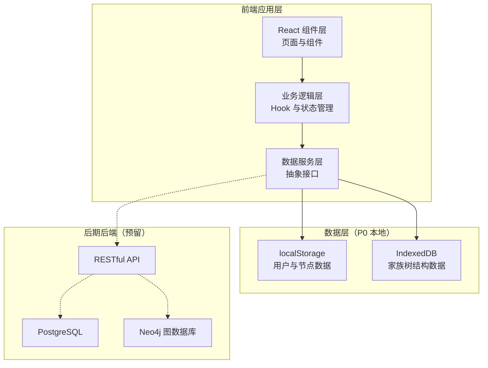
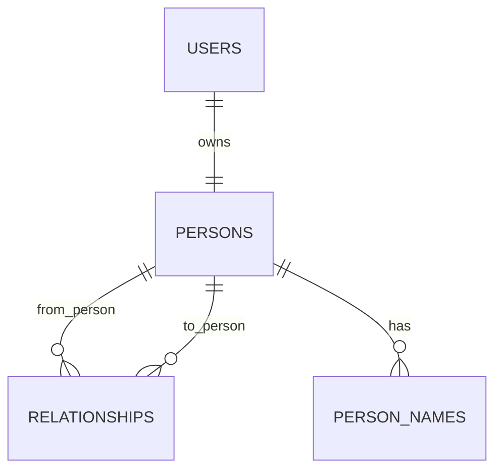

# 亲络家谱 技术架构（P0 基础骨架）

## 1. 架构设计

P0 阶段采用纯前端 + 本地数据持久化方案，快速验证产品核心流程。后期接入真实后端时，只需替换数据服务层，UI 和业务逻辑层保持不变。



## 2. 技术说明

- **前端框架**：React 18 + TypeScript + Vite
- **样式方案**：Tailwind CSS 3 + CSS 变量（主题色系）
- **路由**：React Router v6
- **状态管理**：Zustand（轻量，适合 P0 规模）
- **图谱可视化**：ReactFlow（节点树渲染，支持缩放拖拽）
- **图标**：lucide-react（线性图标库）
- **字体**：Noto Serif SC（标题）+ Noto Sans SC（正文），通过 Google Fonts 引入
- **数据持久化**：localStorage（用户、会话）+ IndexedDB（家族树节点和关系）
- **后端**：P0 阶段无后端，数据服务层抽象接口预留，后期替换为真实 API 调用
- **初始化工具**：Vite

## 3. 路由定义

| 路由 | 用途 |
|------|------|
| `/auth` | 登录/注册页 |
| `/` | 首页（家族树概览） |
| /tree` | 家族树完整页 |
| `/person/:id` | 人物详情页 |
| `/person/:id/edit` | 编辑人物资料 |
| `/add-relative` | 添加亲属页 |
| `/settings` | 设置页 |

## 4. 数据模型定义

### 4.1 ER 模型



### 4.2 TypeScript 类型定义

```typescript
// 用户
interface User {
  id: string;
  phone: string;
  createdAt: string;
  personId: string; // 关联的本人节点 ID
}

// 人员节点
interface Person {
  id: string;
  ownerUserId?: string; // 注册节点的所属用户
  nodeType: 'registered' | 'shadow' | 'placeholder';
  displayName: string | null;
  surname: string;
  givenName: string;
  gender: 'male' | 'female' | 'unknown';
  birthDate: string | null;
  birthDateAccuracy: 'exact' | 'year' | 'decade' | 'approximate' | 'unknown';
  deathDate: string | null;
  deathDateAccuracy: 'exact' | 'year' | 'decade' | 'approximate' | 'unknown';
  isAlive: boolean;
  birthPlace: string;
  ancestralPlace: string;
  avatarUrl: string;
  biography: string;
  privacyLevel: 0 | 1 | 2 | 3 | 4;
  claimStatus: 'none' | 'claimable' | 'claiming' | 'claimed';
  createdBy: string; // 创建者用户 ID
  status: 'active' | 'merged' | 'archived';
  createdAt: string;
  updatedAt: string;
}

// 姓名变体
interface PersonName {
  id: string;
  personId: string;
  nameValue: string;
  nameType: 'display' | 'formal' | 'childhood' | 'former' | 'courtesy' | 'english' | 'other';
  languageCode: string;
  isPrimary: boolean;
}

// 关系
interface Relationship {
  id: string;
  fromPersonId: string;
  toPersonId: string;
  relationCategory: 'BLOOD' | 'MARRIAGE' | 'ADOPTION' | 'STEP' | 'FOSTER' | 'SWORN' | 'AFFINAL' | 'OTHER';
  relationType: 'PARENT_CHILD' | 'SPOUSE' | 'SIBLING' | 'ANCESTOR' | 'DESCENDANT' | 'KINSHIP_GROUP';
  fromRole: string; // CHILD, HUSBAND, YOUNGER_BROTHER 等
  toRole: string; // FATHER, WIFE, ELDER_SISTER 等
  lineageSide: 'PATERNAL' | 'MATERNAL' | 'SPOUSE_SIDE' | 'UNKNOWN';
  startDate: string | null;
  endDate: string | null;
  isActive: boolean;
  verificationStatus: 'UNVERIFIED' | 'PENDING' | 'CONFIRMED' | 'DISPUTED' | 'REVOKED';
  createdBy: string;
  createdAt: string;
}
```

### 4.3 数据存储策略

| 数据类型 | 存储位置 | 说明 |
|----------|----------|------|
| 当前用户会话 | localStorage | 登录态、用户 ID、本人节点 ID |
| 所有人员节点 | IndexedDB | persons 表，主键 id |
| 所有关系 | IndexedDB | relationships 表 |
| 姓名变体 | IndexedDB | person_names 表 |
| 主题偏好 | localStorage | 字体大小、主题模式（预留） |

## 5. 项目目录结构

```
亲络家谱/
├── src/
│   ├── components/          # 通用组件
│   │   ├── common/          # 基础组件（Button, Input, Card 等）
│   │   ├── layout/          # 布局组件（AppShell, BottomNav, PageHeader）
│   │   ├── tree/            # 家族树相关组件
│   │   └── person/          # 人物相关组件
│   ├── pages/               # 页面组件
│   │   ├── AuthPage.tsx
│   │   ├── HomePage.tsx
│   │   ├── TreePage.tsx
│   │   ├── PersonDetailPage.tsx
│   │   ├── PersonEditPage.tsx
│   │   ├── AddRelativePage.tsx
│   │   └── SettingsPage.tsx
│   ├── hooks/               # 自定义 Hook
│   ├── store/               # Zustand 状态管理
│   ├── services/            # 数据服务层（抽象接口 + 本地实现）
│   │   ├── db.ts            # IndexedDB 操作
│   │   ├── personService.ts # 人员节点服务
│   │   ├── relationshipService.ts
│   │   └── authService.ts
│   ├── types/               # TypeScript 类型定义
│   ├── utils/               # 工具函数（关系计算、日期格式化等）
│   ├── constants/           # 常量定义（关系类型、角色映射等）
│   └── styles/              # 全局样式
├── index.html
├── vite.config.ts
├── tailwind.config.js
└── tsconfig.json
```

## 6. 关系计算工具

P0 阶段需要实现基础的关系路径计算和称谓推导：

```typescript
// 关系称谓计算（简化版）
// 输入起点和终点，输出最短关系路径和中文称谓
interface RelationPath {
  path: Array<{ personId: string; relationToNext: string }>;
  title: string; // 如"父亲""祖父""表兄"
  generationDiff: number; // 辈分差
  confidence: 'high' | 'medium' | 'low';
}

// 常用关系映射
const RELATION_PRESETS = {
  father: { category: 'BLOOD', type: 'PARENT_CHILD', fromRole: 'CHILD', toRole: 'FATHER' },
  mother: { category: 'BLOOD', type: 'PARENT_CHILD', fromRole: 'CHILD', toRole: 'MOTHER' },
  son: { category: 'BLOOD', type: 'PARENT_CHILD', fromRole: 'FATHER', toRole: 'CHILD' },
  daughter: { category: 'BLOOD', type: 'PARENT_CHILD', fromRole: 'MOTHER', toRole: 'CHILD' },
  husband: { category: 'MARRIAGE', type: 'SPOUSE', fromRole: 'HUSBAND', toRole: 'WIFE' },
  wife: { category: 'MARRIAGE', type: 'SPOUSE', fromRole: 'WIFE', toRole: 'HUSBAND' },
  brother: { category: 'BLOOD', type: 'SIBLING', fromRole: 'YOUNGER_BROTHER', toRole: 'ELDER_BROTHER' },
  sister: { category: 'BLOOD', type: 'SIBLING', fromRole: 'YOUNGER_BROTHER', toRole: 'ELDER_SISTER' },
  // ...
};
```
