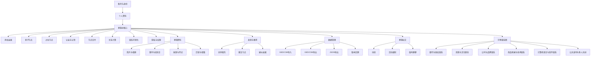
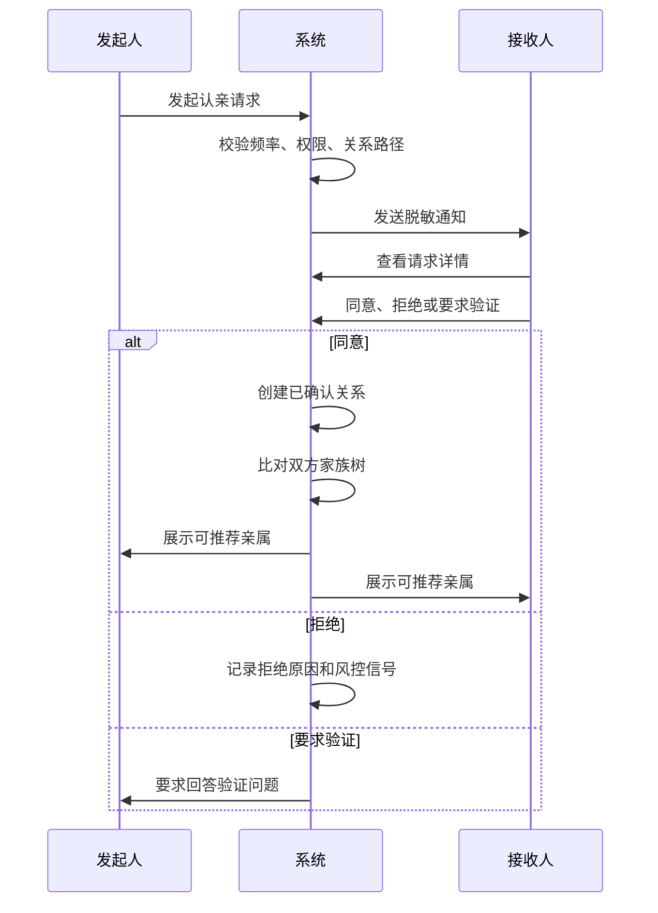
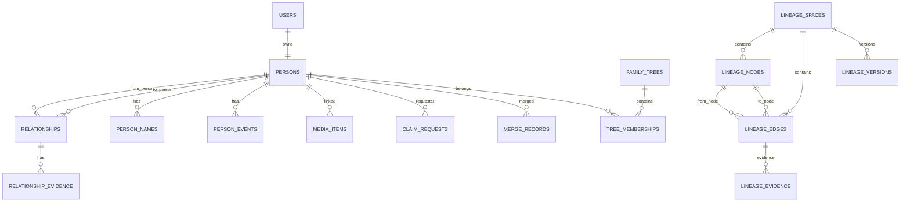
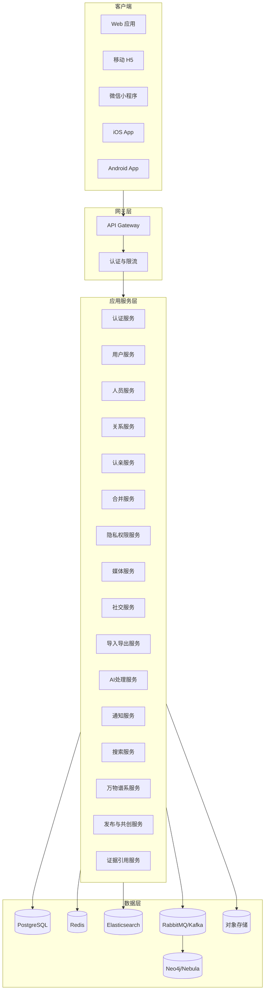

# 亲络家谱设计方案 1.0

创建日期：2026-07-11  
文档定位：完整产品与技术设计方案  
适用阶段：产品规划、架构评审、原型设计、后续研发拆解  

## 1. 产品定位

“亲络家谱”是一款面向现代家庭、宗亲组织、知识整理者和谱系研究者的谱系制作与关系连接平台。产品以个人家谱为起点，支持用户创建自己的家族树，并通过影子节点、占位节点、认亲确认、关系合并和关系推荐，逐步把分散在不同用户手中的家族信息连接成可持续演进的家族关系网络。

产品不只记录传统父系家谱，也覆盖母系关系、姻亲关系、继亲关系、养亲关系、义亲关系、结拜关系、再婚家庭、跨地域迁徙、多语言姓名、老照片、家族事件和家族记忆。它的目标不是简单画一张树，而是让家族成员能够共同维护一份可信、可追溯、可授权、可传承的家族资料。

在家谱之外，平台扩展“万物谱系图”能力。任何存在承接、演化、分支、继承、影响、派生、并购、替代、版本迭代或师承关系的对象，都可以被制作成谱系图。中国历史朝代的承接、五代十国政权的延续、民族源流、公司并购与品牌演化、商品品类发展、机械结构迭代、计算机语言影响关系、学派传承、技术路线演进，都可以在同一套谱系编辑、证据记录、版本管理、共创发布和图谱浏览体系中表达。

### 1.1 核心判断

家谱产品的核心难点并不在于“画树”，而在于三件事：

- 多人共同录入时，如何判断两个人是不是同一个人；
- 家庭信息涉及隐私时，谁有权查看、编辑和导出；
- 关系复杂、资料不完整、记忆不一致时，系统如何保留历史、证据和争议。

“亲络家谱”的设计重点围绕这三件事展开。系统需要允许不完整的信息先进入家谱，也要允许后续被修正、确认、合并、撤销和审计。

万物谱系图的核心难点与家谱相似，但对象从“人”扩展到“实体与概念”。它需要解决“关系是否真实”“来源是否可靠”“不同观点如何并存”“多人共创如何避免混乱”“一个谱系如何发布成可被引用的公共知识作品”等问题。平台底层因此采用通用谱系模型：节点表示对象，关系表示承接或影响，证据表示来源，版本表示演变，权限表示谁能查看和编辑。

### 1.2 产品边界

产品第一性目标是“制作、维护、确认和传承谱系”。家谱是最重要、最有情感价值的核心场景；万物谱系图是平台能力的横向扩展，用于知识整理、教育展示、公共共创和专业研究。社交、活动、相册、AI修复、同城提醒等能力服务于家谱；共创、引用、发布、订阅、专题页等能力服务于公共谱系。

产品不定位为公共人口数据库，不鼓励用户批量采集陌生人信息，不默认公开未注册成员资料，不以“发现所有亲戚”为单一增长目标。任何关系推荐、认亲请求、资料展示和数据导出，都需要受权限、授权和风控约束。

万物谱系图不默认把公共知识等同于事实终局。历史承接、民族源流、公司控制关系、技术影响关系常常存在争议，系统需要允许多个版本、多个观点和多个证据并存。平台提供结构化表达和协作机制，不替用户替代学术判断。

## 2. 用户与场景

### 2.1 用户角色

| 角色 | 典型身份 | 核心诉求 | 关键权限 |
| :--- | :--- | :--- | :--- |
| 普通用户 | 家庭成员、年轻一代、家谱整理爱好者 | 创建自己的家族树，邀请亲人确认，保存家庭记忆 | 管理本人资料、创建亲属节点、发起认亲、查看被授权资料 |
| 节点本人 | 被他人创建为影子节点后注册的人 | 认领自己的身份，控制自己的资料 | 认领节点、确认关系、修改本人隐私 |
| 家族维护者 | 家族中负责修谱的人、宗亲会成员 | 整理分支、处理重复节点、补充祖辈信息 | 在授权范围内编辑分支公共资料、发起合并建议 |
| 分支管理员 | 某个家族分支的被授权管理者 | 维护本分支成员、事件、字辈、祖籍 | 管理分支资料、审核分支内关系变更 |
| 谱系创作者 | 历史爱好者、教师、研究者、产品经理、技术作者 | 创建朝代、公司、商品、技术、语言等公共谱系 | 创建专题谱系、设定模板、发布作品、邀请共创 |
| 共创贡献者 | 被邀请参与某个公共谱系的人 | 补充节点、关系、证据和说明 | 在授权范围内提交修改、评论、引用来源 |
| 谱系审核者 | 专题管理员、领域专家、平台认证作者 | 维护公共谱系质量和争议处理 | 审核贡献、处理冲突、标注可信等级 |
| 系统管理员 | 平台运营与安全人员 | 处理投诉、违规、数据争议和安全事件 | 查看审计记录、冻结异常账号、处理申诉 |
| 访客 | 未注册的受邀用户 | 查看邀请内容并决定是否注册 | 仅查看邀请落地页中的最小必要信息 |

### 2.2 核心场景

| 场景 | 描述 | 系统要解决的问题 |
| :--- | :--- | :--- |
| 从自己开始建家谱 | 用户注册后填写本人信息，再添加父母、配偶、子女、兄弟姐妹 | 快速形成第一棵家族树，降低启动成本 |
| 添加未注册亲属 | 用户创建父母、祖辈、子女等影子节点 | 未注册人员也能出现在家谱中，但隐私受限 |
| 不知道姓名也要保留关系 | 用户创建“曾祖父”“外婆的母亲”等占位节点 | 先保存关系结构，后续再补充姓名和资料 |
| 邀请亲属确认 | 用户把影子节点邀请给本人注册认领 | 把单人录入转化为多人共同确认 |
| 两份家谱相遇 | 两个用户确认亲属关系后，系统发现共同祖先或重复节点 | 推荐可能相同的人和可补全的分支 |
| 节点合并 | 多人创建了同一个祖辈或亲属 | 合并资料、关系和来源，保留历史 |
| 家族资料传承 | 上传照片、故事、迁徙记录、纪念日和重要事件 | 让家谱从关系结构扩展为家族记忆 |
| 宗亲组织修谱 | 宗亲会或家族分支共同维护族谱 | 支持分支管理、字辈、祖籍、导入导出和审核 |
| 制作历史朝代谱系 | 用户制作夏商周、秦汉、三国、五代十国、宋辽金元明清等承接关系 | 处理政权并立、正统争议、割据政权、继承与灭亡 |
| 制作民族源流谱系 | 用户整理族群迁徙、融合、分化与名称演变 | 允许多观点、多证据和时间区间表达 |
| 制作公司谱系 | 用户整理公司创立、拆分、并购、品牌继承和股权控制 | 表达并购、分拆、改名、母子公司和品牌延续 |
| 制作技术谱系 | 用户整理机械、商品、计算机语言、操作系统、芯片架构等演化关系 | 表达影响、派生、替代、兼容和版本迭代 |
| 发布共创谱系 | 创作者把谱系发布到平台，邀请他人补充和校对 | 建立公共知识作品、版本记录和贡献者体系 |

## 3. 核心概念

### 3.1 人员节点

| 概念 | 定义 | 说明 |
| :--- | :--- | :--- |
| 注册节点 | 已有账号并可登录的真实用户节点 | 用户本人控制个人资料和隐私 |
| 影子节点 | 被他人创建但本人尚未注册的亲属节点 | 可被邀请认领，资料默认受限 |
| 占位节点 | 姓名未知但关系存在的节点 | 用于保留关系结构，如“高祖父” |
| 历史节点 | 已被合并、删除、注销或归档的节点 | 不直接展示，但用于审计和回溯 |
| 公共人物节点 | 已故多年、历史人物或公开族谱人物 | 可在严格规则下设为较高公开性 |

### 3.2 关系类型

关系采用“关系大类 + 关系结构 + 角色语义 + 证据状态”的组合模型，而不是只用一个枚举值表达所有关系。

| 字段 | 示例 | 作用 |
| :--- | :--- | :--- |
| `relation_category` | BLOOD、MARRIAGE、ADOPTION、STEP、FOSTER、SWORN、AFFINAL、OTHER | 表示关系来源 |
| `relation_type` | PARENT_CHILD、SPOUSE、SIBLING、ANCESTOR、DESCENDANT、KINSHIP_GROUP | 表示结构类型 |
| `from_role` | CHILD、HUSBAND、YOUNGER_BROTHER | 表示起点人在关系中的角色 |
| `to_role` | FATHER、WIFE、ELDER_SISTER | 表示终点人在关系中的角色 |
| `lineage_side` | PATERNAL、MATERNAL、SPOUSE_SIDE、UNKNOWN | 区分父系、母系、姻亲侧 |
| `verification_status` | UNVERIFIED、PENDING、CONFIRMED、DISPUTED、REVOKED | 表示可信状态 |

这种模型允许系统表达“生父”“养父”“继父”“义父”之间的差异，也能表达同父异母、继兄弟、结拜兄弟、前配偶、事实伴侣等复杂关系。

### 3.3 认亲、认领与合并

| 概念 | 定义 | 典型例子 |
| :--- | :--- | :--- |
| 认亲 | 两个注册用户确认彼此之间存在亲属关系 | A 发起“你是我的表弟”，B 确认 |
| 认领 | 注册用户声明某个影子节点就是自己 | A 发现家谱中“张伟”是自己，申请认领 |
| 合并 | 两个或多个节点被确认是同一人 | “大舅张强”和“张强舅舅”合并 |
| 纠错 | 用户对错误关系、错误资料或错误合并提出修正 | 发现某人不是亲生父亲而是继父 |
| 争议 | 多方对同一事实有不同说法 | 出生年份、配偶关系、过继关系存在不同记载 |

### 3.4 万物谱系图

万物谱系图是对家谱模型的抽象扩展。家谱中的“人”扩展为任意可被定义的对象，家谱中的“亲属关系”扩展为任意有方向、有时间、有证据的关系。

| 概念 | 定义 | 示例 |
| :--- | :--- | :--- |
| 谱系空间 | 一组围绕特定主题组织的节点和关系 | “中国历史朝代谱系”“编程语言谱系” |
| 谱系节点 | 谱系中的对象 | 唐朝、后梁、契丹、Java、C++、大众甲壳虫 |
| 谱系关系 | 节点之间的承接、派生、影响或隶属关系 | “后梁取代唐”“C++ 受 C 影响” |
| 谱系模板 | 某类谱系的字段、关系类型和展示规则 | 朝代模板、公司模板、技术模板 |
| 公共谱系 | 发布到平台供他人查看、收藏、引用或共创的谱系 | 公开的“五代十国政权图” |
| 私有谱系 | 仅本人或团队可见的谱系 | 企业内部产品谱系、课程备课图 |
| 共创谱系 | 多人协作维护的谱系 | 民族源流共创图、开源项目演化图 |
| 版本分支 | 对同一谱系的不同编辑版本或观点版本 | “传统史观版”“考古新说版” |
| 证据引用 | 支撑节点或关系的来源材料 | 史书、论文、官网公告、产品手册 |

万物谱系图中的关系不只是一条线，还需要表达关系类型、方向、时间范围、强弱、可信度、来源和争议状态。一个节点可以出现在多个谱系空间中，例如“唐朝”既可以出现在“中国朝代谱系”，也可以出现在“东亚政权关系图”“丝绸之路贸易网络”“诗歌流派背景图”中。

## 4. 产品功能架构



## 5. 功能设计

### 5.1 账号与身份

系统支持手机号、邮箱、微信、Apple ID、Google 账号等登录方式。国内优先支持手机号和微信，海外优先支持邮箱、Apple ID 和 Google。

注册后用户需要创建本人节点。本人与账号之间是一对一绑定关系，但人员节点与账号并不完全等同。一个账号只能控制一个本人节点，但可以创建和维护多个影子节点。账号注销后，本人节点可以按用户选择转为匿名历史节点、影子节点或彻底删除可删除字段。

账号体系需要支持：

- 多端登录；
- 登录设备管理；
- 二次验证；
- 账号注销；
- 数据导出；
- 未成年人保护；
- 异常登录提醒；
- 隐私协议与用户授权记录。

### 5.2 个人资料

人员资料分为基础资料、身份资料、家族资料、联系方式、扩展资料和隐私资料。

| 分类 | 字段示例 | 默认可见性 |
| :--- | :--- | :--- |
| 基础资料 | 显示名、姓氏、名、性别、头像、在世状态 | 按节点类型和权限决定 |
| 出生与死亡 | 出生日期、日期精度、出生地、死亡日期、安葬地 | 已确认亲属可见，默认脱敏 |
| 姓名体系 | 谱名、乳名、曾用名、字、号、英文名、多语言名 | 按字段单独控制 |
| 家族资料 | 祖籍、堂号、字辈、排行、迁徙记录 | 分支内可见 |
| 联系方式 | 手机、邮箱、微信、地址 | 默认仅本人可见 |
| 传记资料 | 生平、职业、教育、故事、备注 | 创建者或本人设置 |
| 证据资料 | 户籍、族谱页、墓碑照片、证书、口述来源 | 默认不公开 |

日期必须支持精度标注，例如精确日期、年份、年代、约略、未知。家谱中大量历史资料无法精确到日，系统不能强迫用户填写精确日期。

### 5.3 添加亲属

添加亲属流程需要兼顾普通用户的低门槛和复杂关系的完整表达。

基础流程：

1. 用户选择“添加亲属”。
2. 系统询问“他/她与你是什么关系”。
3. 用户选择常见关系或进入高级关系选择。
4. 用户搜索已有用户或节点。
5. 若找到疑似对象，系统展示脱敏结果。
6. 若未找到，用户创建影子节点或占位节点。
7. 系统创建关系边，并标注来源、创建者和验证状态。

常见关系入口包括：

| 关系组 | 选项 |
| :--- | :--- |
| 直系长辈 | 父亲、母亲、爷爷、奶奶、外公、外婆 |
| 直系晚辈 | 儿子、女儿、孙子、孙女、外孙、外孙女 |
| 配偶 | 丈夫、妻子、伴侣、前配偶 |
| 平辈 | 哥哥、弟弟、姐姐、妹妹 |
| 旁系 | 伯父、叔父、姑母、舅舅、姨母、堂兄弟姐妹、表兄弟姐妹 |
| 现代家庭 | 继父、继母、养父、养母、养子、养女、监护人 |
| 拟亲缘 | 义父、义母、义子、义女、结拜兄弟、结拜姐妹 |

高级关系入口允许用户选择关系大类、血缘属性、是否法律关系、是否仍然有效、开始时间、结束时间、证据资料和备注。

### 5.4 影子节点

影子节点是系统的关键设计。用户可以为未注册亲属创建节点，但影子节点不能等同于已授权的真实用户。

影子节点规则：

- 影子节点由创建者负责维护；
- 影子节点默认不可被全网搜索到；
- 影子节点敏感字段默认不建议录入；
- 影子节点可生成邀请链接或邀请码；
- 影子节点被本人认领后，原创建者不再拥有本人隐私字段控制权；
- 影子节点可被多个用户引用；
- 多个影子节点疑似同一人时，可进入合并流程。

影子节点需要记录：

| 字段 | 说明 |
| :--- | :--- |
| `created_by` | 创建者 |
| `source_family_tree_id` | 来源家族树 |
| `claim_status` | 是否可认领、认领中、已认领 |
| `visibility_scope` | 可见范围 |
| `evidence_summary` | 资料来源摘要 |
| `confidence_score` | 系统计算的可信度 |

### 5.5 占位节点

占位节点用于解决“知道关系但不知道名字”的情况。例如用户知道爷爷的父亲存在，但不知道姓名，就可以创建“曾祖父”占位节点。

占位节点规则：

- 可以没有姓名；
- 必须至少有一条关系边；
- 不参与公开搜索；
- 可后续升级为影子节点或注册节点；
- 可被合并到已有节点；
- 在图谱中显示为“待完善”。

占位节点对家谱制作很重要，因为它可以让关系结构先完整，再慢慢补资料。

### 5.6 认亲流程

认亲是两个注册用户之间确认关系的流程。



认亲请求必须包含：

- 发起人身份；
- 声明关系；
- 与对方可能存在的关系路径；
- 发起人希望对方看到的信息；
- 对方同意后双方可见范围；
- 验证问题；
- 有效期；
- 举报入口。

认亲成功后，系统不应自动把双方全部家谱合并。正确做法是先建立确认关系，再展示“可导入、可关联、疑似重复”的推荐列表，由用户逐项确认。

### 5.7 认领流程

认领用于影子节点本人注册后声明“这个节点是我”。

认领流程：

1. 用户通过邀请链接进入，或在搜索中发现疑似自己的影子节点。
2. 用户提交认领申请。
3. 系统根据手机号、邮箱、邀请码、关系验证问题、创建者确认等方式验证。
4. 验证通过后，影子节点升级为注册节点。
5. 原影子节点中的资料按隐私规则迁移。
6. 原创建者保留关系记录和非隐私备注，但不再控制本人敏感资料。

如果有多个影子节点都指向同一人，认领后进入合并候选池，由本人或相关亲属确认。

### 5.8 节点合并

节点合并是系统复杂度最高的功能之一。合并必须保留历史，不允许简单删除。

合并触发来源：

- 用户主动发起；
- 认领后自动发现；
- 系统根据相似度推荐；
- GEDCOM 导入后发现重复；
- 分支管理员整理时发起。

合并判断因素：

| 因素 | 权重参考 |
| :--- | :--- |
| 姓名相似度 | 高 |
| 出生年份和地点 | 高 |
| 父母关系一致 | 高 |
| 配偶关系一致 | 中 |
| 子女关系一致 | 中 |
| 祖籍、字辈、排行 | 中 |
| 创建者关系路径 | 中 |
| 手机、邮箱等唯一标识 | 很高，但必须严格保护 |

合并结果：

- 保留主节点；
- 从节点标记为 `merged`；
- 从节点关系迁移或重定向；
- 冲突字段进入待确认状态；
- 所有来源和证据保留；
- 合并操作写入审计日志；
- 在一定时间内允许撤销或申诉。

字段冲突不能简单覆盖。例如两个节点的出生年份分别是 1948 和 1950，系统应同时保留两条记录，并标注来源、可信度和当前采用值。

### 5.9 家族树可视化

家族树至少支持五类视图。

| 视图 | 用途 | 特点 |
| :--- | :--- | :--- |
| 经典树状图 | 查看祖先与后代 | 上祖下孙，适合传统家谱 |
| 横向代际图 | 宽屏浏览 | 左右展开，适合大屏 |
| 关系网络图 | 查看复杂关系 | 可展示姻亲、义亲、结拜 |
| 辈分层级图 | 查看同辈与代差 | 同一辈排列在同一层 |
| 时间轴图 | 查看家族历史 | 按出生、迁徙、事件排序 |

图上节点需要区分：

- 注册节点；
- 影子节点；
- 占位节点；
- 已故人员；
- 存在争议的节点；
- 已合并历史节点；
- 当前用户；
- 被搜索命中的节点。

关系线需要区分：

| 关系 | 视觉表达 |
| :--- | :--- |
| 血缘 | 实线 |
| 姻亲 | 虚线 |
| 继亲 | 短虚线 |
| 收养 | 双线或带标识线 |
| 义亲 | 彩色双线 |
| 结拜 | 点线 |
| 待确认 | 半透明线 |
| 有争议 | 警示标记线 |

前端需要支持缩放、拖拽、节点聚焦、路径高亮、按关系类型筛选、按代数展开、按隐私隐藏字段、导出图片和打印。

### 5.10 关系计算

系统需要支持基础亲属称谓计算和关系路径解释。完整称谓计算分阶段实现，但底层必须保留可扩展空间。

输入：

- 起点节点；
- 终点节点；
- 关系范围；
- 是否包含姻亲；
- 是否包含义亲；
- 是否只计算已确认关系。

输出：

- 最短关系路径；
- 共同祖先；
- 相对辈分；
- 中文称谓；
- 路径可信度；
- 是否存在多条可能路径。

复杂关系不能强行输出单一称谓。例如再婚家庭、收养家庭、结拜关系和多路径关系，系统应展示路径，并提示“称谓可能因地区和家庭习惯不同而不同”。

### 5.11 家族资料

家族资料用于承载关系之外的记忆。

资料类型包括：

- 家族照片；
- 老照片修复版本；
- 人物传记；
- 口述历史；
- 迁徙记录；
- 祖籍与堂号；
- 字辈派语；
- 族规家训；
- 墓碑与祠堂照片；
- 证书、族谱页、档案扫描件；
- 红白喜事、生日、忌日、纪念日。

每份资料都需要记录：

- 上传者；
- 关联人物；
- 关联事件；
- 发生时间；
- 发生地点；
- 资料来源；
- 可见范围；
- 是否允许下载；
- 是否允许转发；
- 审计记录。

### 5.12 家族社交

家族社交不应做成开放社交平台，而应围绕家族事件和资料协作展开。

核心功能：

- 家族动态；
- 事件模板；
- 活动通知；
- 临时群聊；
- 家族相册评论；
- 资料补充请求；
- 关系确认提醒；
- 纪念日提醒。

动态类型：

| 类型 | 示例 |
| :--- | :--- |
| 普通动态 | 分享老照片、家族故事 |
| 人物事件 | 出生、结婚、逝世、迁居 |
| 家族活动 | 聚会、祭祖、修谱会议 |
| 资料协作 | 请求补充某位祖辈信息 |
| 系统动态 | 某关系已确认、某节点已合并 |

临时群聊应绑定具体事件或任务，例如“爷爷八十大寿筹备”“某分支资料校对”。活动结束后可归档为家族记忆，不宜无限扩展为泛聊天工具。

### 5.13 GEDCOM 导入导出

GEDCOM 是家谱领域的重要数据交换格式。系统需要支持导入、导出和字段映射。

导入流程：

1. 用户上传 GEDCOM 文件。
2. 系统解析编码、版本和结构。
3. 展示导入预览。
4. 用户选择导入范围。
5. 系统检测重复节点。
6. 用户确认合并或新建。
7. 导入完成后生成报告。

导出规则：

- 用户只能导出自己有权限查看的数据；
- 隐私字段默认脱敏；
- 未注册影子节点默认不导出敏感字段；
- 导出记录写入审计日志；
- 支持 GEDCOM、JSON、CSV 和图片导出。

GEDCOM 需要重点处理：

- 日期格式不一致；
- 中文姓名映射；
- 多语言姓名；
- 自定义标签；
- 家庭关系 `FAMC`、`FAMS`；
- 收养、继亲、离婚、再婚；
- 来源资料和备注。

### 5.14 AI 能力

AI 能力作为增强功能，不参与核心事实自动裁决。

可用场景：

- 老照片修复；
- 人脸聚类；
- 照片人物推荐标注；
- 手写族谱 OCR；
- 墓碑文字识别；
- 关系重复检测；
- 资料冲突提示；
- 人物生平草稿生成；
- 家族故事整理；
- GEDCOM 导入字段纠错。

AI 输出必须标注为“系统建议”，不能直接覆盖用户资料。涉及人物身份、亲属关系、死亡信息、敏感资料时，必须由用户确认。

### 5.15 万物谱系图

万物谱系图把家谱产品的图谱能力扩展为通用谱系创作平台。用户可以像制作家谱一样制作任何对象之间的承接关系、演化关系、继承关系、影响关系、隶属关系和版本关系。

#### 5.15.1 谱系类型

| 类型 | 节点示例 | 关系示例 | 适用展示 |
| :--- | :--- | :--- | :--- |
| 历史朝代谱系 | 夏、商、周、秦、汉、魏、晋、唐、宋、元、明、清 | 取代、继承、并立、割据、灭亡、复国 | 时间轴、朝代承接图、并立政权图 |
| 五代十国谱系 | 后梁、后唐、后晋、后汉、后周、吴、南唐、前蜀、后蜀 | 政权更替、区域割据、降附、被灭 | 分区时间轴、政权关系图 |
| 民族源流谱系 | 华夏、匈奴、鲜卑、契丹、女真、蒙古、满族 | 融合、迁徙、分化、改称、同源争议 | 迁徙图、源流图、多观点图 |
| 公司谱系 | Google、Alphabet、YouTube、Motorola Mobility | 创立、并购、拆分、改名、控股、品牌继承 | 公司树、股权图、品牌演化图 |
| 商品谱系 | iPhone、ThinkPad、丰田 Corolla、可口可乐 | 代际升级、分支型号、停产、替代 | 产品代际图、型号树 |
| 机械谱系 | 蒸汽机、内燃机、涡轮机、数控机床 | 技术改进、结构继承、应用分化 | 技术路线图、结构演化图 |
| 计算机语言谱系 | Fortran、C、C++、Java、Python、Rust、Go | 受影响、派生、语法借鉴、生态继承 | 影响网络图、时间轴 |
| 学派与思想谱系 | 儒家、理学、心学、经学、诸子学派 | 师承、批判、融合、分化 | 师承图、思想流派图 |
| 项目与软件谱系 | Unix、BSD、Linux、Android、ChromeOS | 分叉、发行版、内核继承、兼容 | 分支树、版本演化图 |

#### 5.15.2 谱系创建流程

1. 用户选择“创建谱系图”。
2. 系统让用户选择谱系类型，也可以创建空白谱系。
3. 用户填写谱系名称、主题简介、可见范围、编辑权限和引用规范。
4. 系统根据类型加载模板字段和关系类型。
5. 用户添加节点、关系、时间、说明和证据。
6. 用户选择视图样式，包括树状图、时间轴、网络图、地图图层或多视图组合。
7. 用户保存为草稿、私有作品、团队共创作品或公开作品。

谱系创建不要求一次完成。用户可以先建立骨架，再逐步补充资料、证据和说明。公开发布前，系统提示用户标注资料来源和不确定关系。

#### 5.15.3 谱系模板

不同领域的谱系有不同字段。平台提供模板，但允许高级用户自定义。

| 模板 | 节点字段 | 关系字段 |
| :--- | :--- | :--- |
| 朝代模板 | 名称、起止时间、都城、建立者、末代君主、地域、政权类型 | 继承、取代、并立、臣属、灭亡、复国、正统争议 |
| 民族模板 | 名称、别称、活动区域、时间范围、语言、文化特征、来源说明 | 融合、迁徙、分化、改称、同源、影响、争议 |
| 公司模板 | 名称、成立时间、创始人、总部、行业、状态、官网 | 控股、并购、拆分、改名、品牌继承、投资、关闭 |
| 商品模板 | 名称、品牌、发布时间、型号、品类、状态、价格区间 | 迭代、替代、衍生、同系列、兼容、停产 |
| 技术模板 | 名称、提出时间、发明者、应用领域、关键特性 | 改进、派生、影响、替代、兼容、标准化 |
| 编程语言模板 | 名称、发布时间、作者、范式、运行平台、包管理、生态 | 受影响、派生、语法借鉴、生态继承、替代 |

模板本质是字段配置、关系配置、视图配置和校验规则。平台可以逐步开放模板市场，允许用户发布自己的模板。

#### 5.15.4 关系模型

万物谱系关系分为七类：

| 大类 | 关系 | 示例 |
| :--- | :--- | :--- |
| 时间承接 | 继承、取代、延续、终止 | 秦取代周，后周被北宋取代 |
| 分支派生 | 分化、派生、分叉、衍生 | C++ 派生自 C，Unix 分化出 BSD |
| 影响借鉴 | 影响、借鉴、启发、兼容 | Python 受 ABC 影响，Java 借鉴 C++ 语法 |
| 组织控制 | 控股、并购、拆分、合资、改名 | Google 重组为 Alphabet |
| 空间迁移 | 迁徙、扩张、迁都、转移 | 鲜卑族群南迁，中原王朝迁都 |
| 文化融合 | 融合、吸收、同化、传承 | 民族融合、学派融合 |
| 争议关系 | 疑似、可能、传统说法、考古新说 | 某族源流存在多种解释 |

每条关系必须支持：

- 起点节点；
- 终点节点；
- 关系类型；
- 起止时间；
- 方向；
- 强度；
- 可信等级；
- 证据来源；
- 贡献者；
- 审核状态；
- 争议说明。

#### 5.15.5 共创与发布

谱系图支持四种发布状态：

| 状态 | 说明 |
| :--- | :--- |
| 草稿 | 仅创建者可见 |
| 私有 | 指定成员可见和编辑 |
| 共创 | 被邀请者可以提交修改，创建者或审核者确认 |
| 公开 | 平台用户可查看、收藏、评论、引用和申请共创 |

公开谱系页面需要包含：

- 谱系标题；
- 简介；
- 作者与贡献者；
- 最近更新时间；
- 版本号；
- 适用领域；
- 可信等级；
- 主要视图；
- 节点列表；
- 关系列表；
- 证据引用；
- 争议说明；
- 评论与修改建议；
- 复制、引用、收藏、订阅入口。

共创采用“提交建议，再审核合并”的模式。普通贡献者不直接修改已发布版本，而是提交变更请求。创建者、共创管理员或专题审核者可以批准、拒绝或要求补充证据。

#### 5.15.6 版本与分支

公共谱系需要像代码仓库一样支持版本历史。

版本能力包括：

- 保存版本；
- 查看历史；
- 对比两个版本；
- 回滚版本；
- 从公开谱系派生自己的版本；
- 合并他人的修改建议；
- 给某个版本生成引用链接；
- 标注“稳定版”“草稿版”“争议版”。

对于有争议的历史、民族和文化谱系，平台不强迫只有一个版本。可以存在多个观点版本，例如“传统史书记载版”“考古发现修订版”“某学者观点版”。不同版本之间可以互相引用，但需要清晰标注来源和立场。

#### 5.15.7 谱系广场

谱系广场是公共谱系的发现入口。

主要栏目包括：

- 历史与文明；
- 民族与文化；
- 公司与品牌；
- 商品与机械；
- 科学与技术；
- 编程语言与软件；
- 思想与学派；
- 影视、游戏与虚构世界；
- 教育专题；
- 用户共创。

用户可以按领域、时间、热度、更新时间、可信等级、节点数量、贡献人数和收藏数筛选谱系。平台可以为优质谱系提供精选推荐，但推荐理由需要透明，例如“资料完整”“证据充分”“视图清晰”“近期更新”。

#### 5.15.8 家谱与万物谱系的关系

家谱是万物谱系中最特殊的一类。它涉及真实个人、隐私和亲属伦理，因此权限最严格。历史朝代、公司、商品、计算机语言等公共谱系可以开放共创和发布，但仍需要证据、版本和审核。

两套能力共用底层图谱引擎，但在权限上分开处理：

| 能力 | 家谱 | 万物谱系 |
| :--- | :--- | :--- |
| 节点对象 | 真实个人和家族成员 | 朝代、民族、公司、商品、技术、概念 |
| 隐私强度 | 高 | 按公开资料和作者设置 |
| 关系确认 | 本人、亲属或授权者确认 | 证据、审核者或共创共识确认 |
| 发布方式 | 默认私有或家族内可见 | 可公开发布和共创 |
| 争议处理 | 保护个人权益优先 | 多版本、多观点并存 |
| 导出限制 | 严格受权限控制 | 按版权和作者授权控制 |

## 6. 隐私、权限与风控

### 6.1 隐私分级

| 等级 | 名称 | 信息范围 | 默认可见对象 |
| :--- | :--- | :--- | :--- |
| Lv.0 | 公开信息 | 显示名、在世状态、粗略辈分 | 按节点类型决定 |
| Lv.1 | 家族信息 | 真实姓名、出生年份、祖籍、基础关系 | 已确认亲属 |
| Lv.2 | 核心信息 | 详细生日、照片、详细关系、事件 | 近亲或授权成员 |
| Lv.3 | 私密信息 | 手机、邮箱、地址、证件、私密备注 | 仅本人或明确授权对象 |
| Lv.4 | 系统受限信息 | 风控记录、审计日志、认证材料 | 系统管理员按流程查看 |

未注册影子节点默认不开放 Lv.2 以上信息。注册用户的联系方式和精确地址默认仅本人可见。

### 6.2 权限模型

权限由四个因素共同决定：

- 用户角色；
- 与目标节点的关系距离；
- 目标节点的隐私设置；
- 资料创建者或本人授权。

系统需要支持 RBAC 与 ABAC 混合权限模型。RBAC 用于角色权限，如普通用户、分支管理员、系统管理员。ABAC 用于基于属性的判断，如“是否五代以内亲属”“是否被本人授权”“是否同一分支”“是否资料创建者”。

### 6.3 编辑权

编辑权必须比查看权更严格。

| 对象 | 编辑规则 |
| :--- | :--- |
| 本人注册节点 | 本人拥有最高编辑权 |
| 他人注册节点 | 不允许直接编辑，只能提交修改建议 |
| 影子节点 | 创建者可编辑，相关亲属可申请补充 |
| 已故节点 | 授权亲属或分支管理员可编辑，重要字段需记录来源 |
| 公共分支资料 | 分支管理员维护，普通用户可提交建议 |
| 争议字段 | 不覆盖，保留多版本并标注采用值 |

### 6.4 风控规则

需要重点防止以下风险：

- 批量搜索陌生人；
- 通过认亲探测家庭关系；
- 恶意创建他人隐私资料；
- 错误合并节点；
- 冒领影子节点；
- 导出他人资料；
- 上传敏感证件或未授权照片；
- 对未成年人信息过度展示。

风控措施：

- 搜索结果脱敏；
- 认亲频率限制；
- 邀请链接有效期；
- 高风险操作二次确认；
- 合并可撤销；
- 导出需权限校验；
- 敏感字段加密；
- 审计日志不可篡改；
- 举报与申诉机制；
- 异常账号冻结。

### 6.5 公共谱系权限

万物谱系图的权限与家谱不同。公共谱系面向知识共创，需要更开放的阅读、更明确的作者权益和更完整的版本审计。

| 权限对象 | 权限规则 |
| :--- | :--- |
| 谱系创建者 | 创建、编辑、删除草稿，设置发布状态，邀请共创者，决定是否接受修改建议 |
| 共创管理员 | 审核贡献、处理争议、管理评论、维护模板字段 |
| 普通贡献者 | 提交新增节点、修改关系、补充证据、提出纠错 |
| 普通查看者 | 查看公开谱系、收藏、评论、引用、复制公开模板 |
| 平台审核者 | 处理侵权、虚假信息、恶意编辑、敏感内容和公共争议 |

公共谱系的编辑采用“建议提交”机制，避免多人同时直接改坏主版本。创建者可以为某个谱系设置更开放的协作模式，例如允许认证贡献者直接编辑草稿分支，但公开主版本仍需要经过审核或版本发布。

### 6.6 版权与引用

公共谱系需要处理资料来源和二次创作边界。平台不鼓励用户直接复制受版权保护的整段资料，也不允许把他人的作品冒名发布。

谱系发布时需要设置：

- 是否允许他人复制；
- 是否允许派生版本；
- 是否允许商业使用；
- 是否必须署名；
- 引用格式；
- 主要资料来源；
- 原创说明；
- 侵权投诉入口。

证据引用可以记录书名、网页、论文、数据库、公告、产品手册、官网新闻、博物馆资料、族谱页、口述来源等。对于公共历史和技术谱系，证据引用是可信度的重要组成部分。

## 7. 数据模型设计

### 7.1 总体数据架构



### 7.2 用户表

```sql
CREATE TABLE users (
    id UUID PRIMARY KEY DEFAULT gen_random_uuid(),
    phone VARCHAR(32),
    email VARCHAR(255),
    password_hash VARCHAR(255),
    auth_provider VARCHAR(50),
    status VARCHAR(30) NOT NULL DEFAULT 'active',
    last_login_at TIMESTAMP,
    created_at TIMESTAMP NOT NULL DEFAULT NOW(),
    updated_at TIMESTAMP NOT NULL DEFAULT NOW()
);
```

### 7.3 人员节点表

```sql
CREATE TABLE persons (
    id UUID PRIMARY KEY DEFAULT gen_random_uuid(),
    owner_user_id UUID REFERENCES users(id),
    node_type VARCHAR(30) NOT NULL,
    display_name VARCHAR(120),
    surname VARCHAR(60),
    given_name VARCHAR(80),
    gender VARCHAR(30),
    birth_date DATE,
    birth_date_accuracy VARCHAR(30),
    death_date DATE,
    death_date_accuracy VARCHAR(30),
    is_alive BOOLEAN,
    birth_place VARCHAR(255),
    ancestral_place VARCHAR(255),
    avatar_url VARCHAR(500),
    biography TEXT,
    privacy_level INT NOT NULL DEFAULT 2,
    claim_status VARCHAR(30) DEFAULT 'none',
    status VARCHAR(30) NOT NULL DEFAULT 'active',
    created_by UUID REFERENCES users(id),
    merged_to UUID REFERENCES persons(id),
    created_at TIMESTAMP NOT NULL DEFAULT NOW(),
    updated_at TIMESTAMP NOT NULL DEFAULT NOW()
);
```

### 7.4 姓名表

```sql
CREATE TABLE person_names (
    id UUID PRIMARY KEY DEFAULT gen_random_uuid(),
    person_id UUID NOT NULL REFERENCES persons(id),
    name_value VARCHAR(120) NOT NULL,
    name_type VARCHAR(50) NOT NULL,
    language_code VARCHAR(20),
    start_year INT,
    end_year INT,
    is_primary BOOLEAN DEFAULT false,
    created_at TIMESTAMP NOT NULL DEFAULT NOW()
);
```

### 7.5 关系表

```sql
CREATE TABLE relationships (
    id UUID PRIMARY KEY DEFAULT gen_random_uuid(),
    from_person_id UUID NOT NULL REFERENCES persons(id),
    to_person_id UUID NOT NULL REFERENCES persons(id),
    relation_category VARCHAR(50) NOT NULL,
    relation_type VARCHAR(50) NOT NULL,
    from_role VARCHAR(50),
    to_role VARCHAR(50),
    lineage_side VARCHAR(50),
    start_date DATE,
    end_date DATE,
    is_active BOOLEAN DEFAULT true,
    verification_status VARCHAR(30) NOT NULL DEFAULT 'unverified',
    confidence_score NUMERIC(5,2),
    privacy_level INT NOT NULL DEFAULT 1,
    source_type VARCHAR(50),
    created_by UUID REFERENCES users(id),
    created_at TIMESTAMP NOT NULL DEFAULT NOW(),
    updated_at TIMESTAMP NOT NULL DEFAULT NOW()
);
```

### 7.6 认亲请求表

```sql
CREATE TABLE claim_requests (
    id UUID PRIMARY KEY DEFAULT gen_random_uuid(),
    requester_user_id UUID NOT NULL REFERENCES users(id),
    target_person_id UUID REFERENCES persons(id),
    target_user_id UUID REFERENCES users(id),
    request_type VARCHAR(50) NOT NULL,
    claimed_relationship_id UUID REFERENCES relationships(id),
    status VARCHAR(30) NOT NULL DEFAULT 'pending',
    verification_question TEXT,
    verification_answer_hash VARCHAR(255),
    message TEXT,
    expires_at TIMESTAMP,
    responded_at TIMESTAMP,
    created_at TIMESTAMP NOT NULL DEFAULT NOW()
);
```

### 7.7 合并记录表

```sql
CREATE TABLE merge_records (
    id UUID PRIMARY KEY DEFAULT gen_random_uuid(),
    primary_person_id UUID NOT NULL REFERENCES persons(id),
    merged_person_id UUID NOT NULL REFERENCES persons(id),
    merge_status VARCHAR(30) NOT NULL DEFAULT 'pending',
    conflict_snapshot JSONB NOT NULL DEFAULT '{}'::jsonb,
    field_decisions JSONB NOT NULL DEFAULT '{}'::jsonb,
    requested_by UUID REFERENCES users(id),
    approved_by UUID REFERENCES users(id),
    created_at TIMESTAMP NOT NULL DEFAULT NOW(),
    completed_at TIMESTAMP
);
```

### 7.8 事件与媒体

```sql
CREATE TABLE person_events (
    id UUID PRIMARY KEY DEFAULT gen_random_uuid(),
    person_id UUID NOT NULL REFERENCES persons(id),
    event_type VARCHAR(50) NOT NULL,
    event_date DATE,
    event_date_accuracy VARCHAR(30),
    location VARCHAR(255),
    description TEXT,
    privacy_level INT NOT NULL DEFAULT 1,
    created_by UUID REFERENCES users(id),
    created_at TIMESTAMP NOT NULL DEFAULT NOW()
);

CREATE TABLE media_items (
    id UUID PRIMARY KEY DEFAULT gen_random_uuid(),
    uploader_user_id UUID NOT NULL REFERENCES users(id),
    media_type VARCHAR(50) NOT NULL,
    file_url VARCHAR(500) NOT NULL,
    thumbnail_url VARCHAR(500),
    title VARCHAR(200),
    description TEXT,
    taken_at DATE,
    location VARCHAR(255),
    privacy_level INT NOT NULL DEFAULT 2,
    ai_metadata JSONB DEFAULT '{}'::jsonb,
    created_at TIMESTAMP NOT NULL DEFAULT NOW()
);
```

### 7.9 审计日志

```sql
CREATE TABLE audit_logs (
    id UUID PRIMARY KEY DEFAULT gen_random_uuid(),
    actor_user_id UUID REFERENCES users(id),
    action_type VARCHAR(80) NOT NULL,
    target_type VARCHAR(80) NOT NULL,
    target_id UUID,
    before_snapshot JSONB,
    after_snapshot JSONB,
    ip_address VARCHAR(64),
    user_agent TEXT,
    risk_level VARCHAR(30),
    created_at TIMESTAMP NOT NULL DEFAULT NOW()
);
```

### 7.10 通用谱系空间表

```sql
CREATE TABLE lineage_spaces (
    id UUID PRIMARY KEY DEFAULT gen_random_uuid(),
    creator_user_id UUID NOT NULL REFERENCES users(id),
    title VARCHAR(200) NOT NULL,
    slug VARCHAR(200) UNIQUE,
    description TEXT,
    domain_type VARCHAR(80) NOT NULL,
    visibility VARCHAR(30) NOT NULL DEFAULT 'private',
    collaboration_mode VARCHAR(30) NOT NULL DEFAULT 'owner_review',
    license_type VARCHAR(80),
    current_version_id UUID,
    status VARCHAR(30) NOT NULL DEFAULT 'draft',
    created_at TIMESTAMP NOT NULL DEFAULT NOW(),
    updated_at TIMESTAMP NOT NULL DEFAULT NOW()
);
```

`domain_type` 用于区分 `FAMILY`、`DYNASTY`、`ETHNIC_GROUP`、`COMPANY`、`PRODUCT`、`MACHINE`、`PROGRAMMING_LANGUAGE`、`SOFTWARE`、`SCHOOL_OF_THOUGHT`、`CUSTOM` 等领域。家谱也可以被视为 `FAMILY` 类型的特殊谱系空间，但会使用更严格的隐私规则。

### 7.11 通用谱系节点表

```sql
CREATE TABLE lineage_nodes (
    id UUID PRIMARY KEY DEFAULT gen_random_uuid(),
    space_id UUID NOT NULL REFERENCES lineage_spaces(id),
    node_type VARCHAR(80) NOT NULL,
    title VARCHAR(200) NOT NULL,
    subtitle VARCHAR(200),
    description TEXT,
    start_date DATE,
    start_date_accuracy VARCHAR(30),
    end_date DATE,
    end_date_accuracy VARCHAR(30),
    location VARCHAR(255),
    status VARCHAR(30) NOT NULL DEFAULT 'active',
    properties JSONB NOT NULL DEFAULT '{}'::jsonb,
    created_by UUID REFERENCES users(id),
    created_at TIMESTAMP NOT NULL DEFAULT NOW(),
    updated_at TIMESTAMP NOT NULL DEFAULT NOW()
);
```

`properties` 存储领域模板字段。例如朝代节点可以存都城、建立者、末代君主；公司节点可以存总部、行业、官网；编程语言节点可以存作者、范式、运行平台。

### 7.12 通用谱系关系表

```sql
CREATE TABLE lineage_edges (
    id UUID PRIMARY KEY DEFAULT gen_random_uuid(),
    space_id UUID NOT NULL REFERENCES lineage_spaces(id),
    from_node_id UUID NOT NULL REFERENCES lineage_nodes(id),
    to_node_id UUID NOT NULL REFERENCES lineage_nodes(id),
    edge_category VARCHAR(80) NOT NULL,
    edge_type VARCHAR(80) NOT NULL,
    direction VARCHAR(30) NOT NULL DEFAULT 'directed',
    start_date DATE,
    end_date DATE,
    strength NUMERIC(5,2),
    confidence_level VARCHAR(30) NOT NULL DEFAULT 'medium',
    verification_status VARCHAR(30) NOT NULL DEFAULT 'unverified',
    description TEXT,
    properties JSONB NOT NULL DEFAULT '{}'::jsonb,
    created_by UUID REFERENCES users(id),
    created_at TIMESTAMP NOT NULL DEFAULT NOW(),
    updated_at TIMESTAMP NOT NULL DEFAULT NOW()
);
```

### 7.13 谱系证据表

```sql
CREATE TABLE lineage_evidence (
    id UUID PRIMARY KEY DEFAULT gen_random_uuid(),
    space_id UUID NOT NULL REFERENCES lineage_spaces(id),
    target_type VARCHAR(30) NOT NULL,
    target_id UUID NOT NULL,
    evidence_type VARCHAR(60) NOT NULL,
    title VARCHAR(300),
    source_url VARCHAR(1000),
    source_text TEXT,
    author VARCHAR(200),
    published_at DATE,
    quote_text TEXT,
    reliability_level VARCHAR(30) DEFAULT 'unknown',
    created_by UUID REFERENCES users(id),
    created_at TIMESTAMP NOT NULL DEFAULT NOW()
);
```

### 7.14 谱系版本与贡献表

```sql
CREATE TABLE lineage_versions (
    id UUID PRIMARY KEY DEFAULT gen_random_uuid(),
    space_id UUID NOT NULL REFERENCES lineage_spaces(id),
    version_no VARCHAR(50) NOT NULL,
    title VARCHAR(200),
    change_summary TEXT,
    snapshot JSONB NOT NULL,
    created_by UUID REFERENCES users(id),
    created_at TIMESTAMP NOT NULL DEFAULT NOW()
);

CREATE TABLE lineage_change_requests (
    id UUID PRIMARY KEY DEFAULT gen_random_uuid(),
    space_id UUID NOT NULL REFERENCES lineage_spaces(id),
    requester_user_id UUID NOT NULL REFERENCES users(id),
    change_type VARCHAR(80) NOT NULL,
    target_type VARCHAR(50),
    target_id UUID,
    proposed_patch JSONB NOT NULL,
    evidence_ids UUID[] DEFAULT '{}',
    status VARCHAR(30) NOT NULL DEFAULT 'pending',
    reviewer_user_id UUID REFERENCES users(id),
    review_comment TEXT,
    created_at TIMESTAMP NOT NULL DEFAULT NOW(),
    reviewed_at TIMESTAMP
);
```

## 8. 图数据库设计

关系查询、共同祖先、路径计算、亲属推荐和重复节点发现适合由图数据库承载。系统可以采用 PostgreSQL 作为主数据存储，Neo4j 或 Nebula Graph 作为关系图谱查询引擎。

### 8.1 图节点

```cypher
(:Person {
  personId: "uuid",
  nodeType: "registered",
  displayNameHash: "hash",
  gender: "male",
  birthYear: 1980,
  isAlive: true,
  privacyLevel: 2,
  status: "active"
})
```

图数据库中不应存储手机号、邮箱、详细地址、证件号等敏感字段。图节点只保留关系查询必要字段和脱敏字段。

万物谱系图在图数据库中使用通用 `LineageNode` 和 `LINEAGE_EDGE`。家谱人员节点可以同步为 `Person`，公共谱系节点同步为 `LineageNode`，两者共享路径查询、影响路径、分支计算、相似节点发现和图可视化能力。

### 8.2 图关系

```cypher
(:Person {personId: "child"})
-[:RELATIONSHIP {
  relationshipId: "uuid",
  category: "BLOOD",
  type: "PARENT_CHILD",
  fromRole: "CHILD",
  toRole: "FATHER",
  verificationStatus: "CONFIRMED",
  confidenceScore: 98.5,
  isActive: true
}]->
(:Person {personId: "father"})
```

公共谱系关系示例：

```cypher
(:LineageNode {nodeId: "tang", title: "唐"})
-[:LINEAGE_EDGE {
  edgeId: "uuid",
  category: "TIME_SUCCESSION",
  type: "REPLACED_BY",
  confidenceLevel: "high",
  startYear: 907,
  verificationStatus: "REVIEWED"
}]->
(:LineageNode {nodeId: "later_liang", title: "后梁"})
```

### 8.3 同步策略

PostgreSQL 是事实源，图数据库是查询加速与图算法引擎。同步采用事件驱动：

1. 业务服务写入 PostgreSQL。
2. 同一事务写入 outbox 事件表。
3. 消息队列消费 outbox 事件。
4. 图同步服务更新 Neo4j。
5. 同步失败进入重试队列。
6. 定时任务校验 PostgreSQL 与 Neo4j 一致性。

关键事件包括：

- `PERSON_CREATED`
- `PERSON_UPDATED`
- `PERSON_MERGED`
- `RELATIONSHIP_CREATED`
- `RELATIONSHIP_UPDATED`
- `RELATIONSHIP_DELETED`
- `CLAIM_CONFIRMED`
- `PRIVACY_CHANGED`
- `LINEAGE_SPACE_PUBLISHED`
- `LINEAGE_NODE_CREATED`
- `LINEAGE_EDGE_CREATED`
- `LINEAGE_CHANGE_REQUEST_APPROVED`
- `LINEAGE_VERSION_CREATED`

## 9. 系统架构



### 9.1 技术选型

| 层级 | 建议选型 | 说明 |
| :--- | :--- | :--- |
| Web 前端 | React + TypeScript + Vite | 适合复杂交互和图谱可视化 |
| 移动端 | Flutter 或 React Native | 后期支持 iOS 和 Android |
| 小程序 | 微信小程序原生或 Taro | 适合国内家庭邀请传播 |
| 后端框架 | NestJS 或 Java Spring Boot | NestJS 适合 TypeScript 全栈，Spring Boot 适合大型团队 |
| 主数据库 | PostgreSQL | 支持事务、JSONB、全文索引和复杂权限数据 |
| 图数据库 | Neo4j 或 Nebula Graph | 支持路径查询、共同祖先、图算法 |
| 缓存 | Redis | 会话、限流、热点家族树缓存 |
| 搜索 | Elasticsearch / OpenSearch | 姓名、别名、祖籍、资料全文搜索 |
| 消息队列 | RabbitMQ / Kafka | 图同步、通知、AI任务、导入导出 |
| 对象存储 | 阿里云 OSS / AWS S3 | 照片、附件、导出文件 |
| AI服务 | OCR、人脸聚类、照片修复、文本整理 | 异步处理，不直接裁决事实 |
| 谱系编辑器 | 图编辑 Canvas + D3.js / Cytoscape.js / AntV G6 | 支持大型节点图、时间轴、网络图和交互编辑 |
| 协同编辑 | CRDT / 操作日志 / 变更请求流 | 支持多人共创、版本对比和审核合并 |
| 部署 | Docker + Kubernetes | 支持多服务扩展和灰度发布 |
| 监控 | Prometheus + Grafana + Loki | 指标、日志、告警 |

## 10. API 设计

API 采用 RESTful 为主，复杂图查询和前端聚合可补充 GraphQL。

### 10.1 认证

| 方法 | 路径 | 说明 |
| :--- | :--- | :--- |
| POST | `/api/v1/auth/register` | 注册 |
| POST | `/api/v1/auth/login` | 登录 |
| POST | `/api/v1/auth/refresh` | 刷新令牌 |
| POST | `/api/v1/auth/logout` | 退出登录 |
| GET | `/api/v1/auth/devices` | 登录设备 |
| DELETE | `/api/v1/auth/devices/{id}` | 移除设备 |

### 10.2 人员节点

| 方法 | 路径 | 说明 |
| :--- | :--- | :--- |
| GET | `/api/v1/persons/me` | 获取本人节点 |
| PUT | `/api/v1/persons/me` | 更新本人资料 |
| POST | `/api/v1/persons` | 创建影子或占位节点 |
| GET | `/api/v1/persons/{id}` | 查看人员资料 |
| PUT | `/api/v1/persons/{id}` | 更新有权限的人员资料 |
| GET | `/api/v1/persons/search` | 搜索人员，返回脱敏结果 |

### 10.3 关系

| 方法 | 路径 | 说明 |
| :--- | :--- | :--- |
| POST | `/api/v1/relationships` | 创建关系 |
| PUT | `/api/v1/relationships/{id}` | 修改关系 |
| DELETE | `/api/v1/relationships/{id}` | 删除或解除关系 |
| GET | `/api/v1/relationships/tree` | 获取家族树 |
| GET | `/api/v1/relationships/path` | 获取两人关系路径 |
| GET | `/api/v1/relationships/common-ancestor` | 查询共同祖先 |

### 10.4 认亲与认领

| 方法 | 路径 | 说明 |
| :--- | :--- | :--- |
| POST | `/api/v1/claims` | 发起认亲或认领 |
| GET | `/api/v1/claims/incoming` | 收到的请求 |
| GET | `/api/v1/claims/outgoing` | 发出的请求 |
| POST | `/api/v1/claims/{id}/approve` | 同意 |
| POST | `/api/v1/claims/{id}/reject` | 拒绝 |
| POST | `/api/v1/claims/{id}/verify` | 回答验证问题 |

### 10.5 合并

| 方法 | 路径 | 说明 |
| :--- | :--- | :--- |
| GET | `/api/v1/merge/candidates` | 获取疑似重复节点 |
| POST | `/api/v1/merge/requests` | 发起合并请求 |
| GET | `/api/v1/merge/requests/{id}` | 查看合并详情 |
| POST | `/api/v1/merge/requests/{id}/approve` | 确认合并 |
| POST | `/api/v1/merge/requests/{id}/reject` | 拒绝合并 |
| POST | `/api/v1/merge/requests/{id}/rollback` | 撤销合并 |

### 10.6 数据管理

| 方法 | 路径 | 说明 |
| :--- | :--- | :--- |
| POST | `/api/v1/import/gedcom` | 上传 GEDCOM |
| GET | `/api/v1/import/{id}/preview` | 导入预览 |
| POST | `/api/v1/import/{id}/confirm` | 确认导入 |
| POST | `/api/v1/export/gedcom` | 导出 GEDCOM |
| POST | `/api/v1/export/json` | 导出 JSON |
| GET | `/api/v1/export/tasks/{id}` | 查看导出任务 |

### 10.7 万物谱系

| 方法 | 路径 | 说明 |
| :--- | :--- | :--- |
| POST | `/api/v1/lineage/spaces` | 创建谱系空间 |
| GET | `/api/v1/lineage/spaces` | 获取我的谱系列表 |
| GET | `/api/v1/lineage/spaces/{id}` | 查看谱系详情 |
| PUT | `/api/v1/lineage/spaces/{id}` | 修改谱系设置 |
| POST | `/api/v1/lineage/spaces/{id}/publish` | 发布谱系 |
| POST | `/api/v1/lineage/spaces/{id}/fork` | 派生一个新版本 |
| POST | `/api/v1/lineage/spaces/{id}/nodes` | 新增谱系节点 |
| PUT | `/api/v1/lineage/nodes/{id}` | 修改谱系节点 |
| POST | `/api/v1/lineage/spaces/{id}/edges` | 新增谱系关系 |
| PUT | `/api/v1/lineage/edges/{id}` | 修改谱系关系 |
| POST | `/api/v1/lineage/evidence` | 添加证据引用 |
| GET | `/api/v1/lineage/spaces/{id}/versions` | 查看版本历史 |
| POST | `/api/v1/lineage/spaces/{id}/versions` | 保存新版本 |
| POST | `/api/v1/lineage/change-requests` | 提交共创修改建议 |
| POST | `/api/v1/lineage/change-requests/{id}/approve` | 批准修改建议 |
| POST | `/api/v1/lineage/change-requests/{id}/reject` | 拒绝修改建议 |
| GET | `/api/v1/lineage/explore` | 谱系广场发现页 |

## 11. 前端页面设计

### 11.1 页面结构

| 页面 | 主要内容 |
| :--- | :--- |
| 首页 | 家族树入口、最近动态、待处理认亲、纪念日提醒 |
| 家族树页 | 图谱浏览、筛选、搜索、节点详情、添加亲属 |
| 添加亲属页 | 关系选择、搜索已有节点、新建影子节点、高级关系 |
| 人物详情页 | 资料、关系、事件、照片、来源、隐私设置 |
| 认亲中心 | 收到请求、发出请求、验证问题、推荐关系 |
| 合并中心 | 疑似重复、字段冲突、关系迁移预览 |
| 家族资料页 | 相册、故事、事件、迁徙、族谱资料 |
| 导入导出页 | GEDCOM 上传、预览、冲突处理、导出任务 |
| 万物谱系工作台 | 创建谱系、管理草稿、编辑节点关系、查看共创请求 |
| 谱系广场 | 浏览公开谱系、筛选领域、收藏、引用、申请共创 |
| 谱系详情页 | 展示公开谱系图、节点详情、证据、版本、评论 |
| 谱系编辑器 | 拖拽节点、连线、设置关系类型、补充证据、保存版本 |
| 隐私设置页 | 资料可见性、关系可见性、导出权限、黑名单 |
| 管理后台 | 举报、审计、用户冻结、敏感操作查询 |

### 11.2 家族树页原型

```text
┌──────────────────────────────────────────────────────────────┐
│ 亲络家谱  搜索姓名/关系/祖籍...       认亲请求  通知  我的     │
├──────────────────────────────────────────────────────────────┤
│ 左侧筛选                    家族树画布                       │
│ ┌──────────────┐   ┌──────────────────────────────────────┐ │
│ │ 视图          │   │                                      │ │
│ │ ○ 树状图      │   │          曾祖父  ——  曾祖母          │ │
│ │ ○ 网络图      │   │              │                       │ │
│ │ ○ 时间轴      │   │          祖父  ——  祖母              │ │
│ │              │   │              │                       │ │
│ │ 关系类型      │   │      父亲  ——  母亲                  │ │
│ │ ☑ 血缘        │   │              │                       │ │
│ │ ☑ 姻亲        │   │              我  ——  配偶            │ │
│ │ ☑ 义亲        │   │             /  \                     │ │
│ │ ☑ 待确认      │   │          子女  子女                  │ │
│ │              │   │                                      │ │
│ │ 展开代数      │   └──────────────────────────────────────┘ │
│ │ 上 3 代       │                                            │
│ │ 下 2 代       │   右侧信息卡：选中节点详情                  │
│ └──────────────┘   姓名、关系、资料、照片、操作按钮            │
└──────────────────────────────────────────────────────────────┘
```

### 11.3 添加亲属页原型

```text
┌──────────────────────────────────────────────┐
│ 添加亲属                                      │
├──────────────────────────────────────────────┤
│ 他/她与你的关系                               │
│ [父亲] [母亲] [配偶] [儿子] [女儿] [更多关系] │
│                                              │
│ 搜索已有成员                                  │
│ [输入姓名、手机号后四位、别名、祖籍]           │
│                                              │
│ 搜索结果                                      │
│ ┌──────────────────────────────────────────┐ │
│ │ 张某  男  约1960年  与你可能有2条共同路径 │ │
│ │ [查看脱敏资料] [发起确认]                 │ │
│ └──────────────────────────────────────────┘ │
│                                              │
│ 未找到？创建新节点                            │
│ 姓名 [________]  可留空创建占位节点            │
│ 性别 [____]  出生年份 [____]  备注 [____]     │
│ [创建影子节点] [创建占位节点]                  │
└──────────────────────────────────────────────┘
```

### 11.4 万物谱系编辑器原型

```text
┌────────────────────────────────────────────────────────────────────┐
│ 谱系编辑器：中国历史朝代承接图        [保存草稿] [发布] [邀请共创] │
├────────────────────────────────────────────────────────────────────┤
│ 左侧组件库                  中央画布                    右侧属性面板 │
│ ┌──────────────┐   ┌──────────────────────────────┐   ┌──────────┐ │
│ │ 节点类型      │   │  夏 → 商 → 周 → 秦 → 汉       │   │ 节点：唐  │ │
│ │ [朝代]        │   │             ↘                │   │ 起：618   │ │
│ │ [政权]        │   │              三国 → 晋        │   │ 止：907   │ │
│ │ [民族]        │   │                              │   │ 都城：长安 │ │
│ │ [公司]        │   │  唐 → 后梁 → 后唐 → 后晋      │   │ 证据：3条 │ │
│ │ [技术]        │   │        ↘  吴 / 南唐 / 前蜀    │   │ 争议：1条 │ │
│ │              │   │                              │   │ [编辑]    │ │
│ │ 关系类型      │   │                              │   │ [加证据]  │ │
│ │ [继承]        │   └──────────────────────────────┘   └──────────┘ │
│ │ [取代]        │                                                    │
│ │ [并立]        │   底部：版本记录 / 修改建议 / 评论 / 引用           │
│ │ [分化]        │                                                    │
│ └──────────────┘                                                    │
└────────────────────────────────────────────────────────────────────┘
```

### 11.5 谱系广场原型

```text
┌──────────────────────────────────────────────────────────────┐
│ 谱系广场  搜索朝代、公司、技术、语言、商品...                 │
├──────────────────────────────────────────────────────────────┤
│ 分类：历史与文明  民族文化  公司品牌  商品机械  科学技术       │
│ 筛选：最新发布  最多人共创  证据充分  可派生  教育精选         │
│                                                              │
│ ┌────────────────────┐ ┌────────────────────┐ ┌───────────┐ │
│ │ 中国朝代承接图      │ │ 编程语言影响谱系    │ │ 汽车品牌谱系 │ │
│ │ 节点 86  关系 132   │ │ 节点 120 关系 260   │ │ 节点 300+    │ │
│ │ 贡献者 18  证据 240 │ │ 贡献者 42 证据 180  │ │ 贡献者 25    │ │
│ │ [查看] [收藏]       │ │ [查看] [派生]       │ │ [共创]       │ │
│ └────────────────────┘ └────────────────────┘ └───────────┘ │
└──────────────────────────────────────────────────────────────┘
```

## 12. 搜索与推荐

搜索分为精确搜索、模糊搜索和关系推荐。

### 12.1 搜索规则

手机号、邮箱等敏感标识只允许精确匹配，不支持模糊搜索。姓名搜索默认返回脱敏结果，只展示足够判断是否为目标人的信息，不展示完整家庭结构。

搜索维度：

- 姓名；
- 别名；
- 曾用名；
- 出生年份范围；
- 祖籍；
- 家族分支；
- 关系路径；
- 邀请码；
- GEDCOM 导入来源；
- 谱系标题；
- 谱系节点名称；
- 谱系关系类型；
- 证据来源；
- 贡献者；
- 公开谱系标签。

### 12.2 推荐规则

推荐类型包括：

- 疑似同一人；
- 疑似共同祖先；
- 可补全分支；
- 可能认识的亲属；
- GEDCOM 导入冲突；
- 照片中疑似人物；
- 资料字段冲突；
- 相似公共谱系；
- 可补充证据的谱系节点；
- 疑似重复的谱系节点；
- 可能相关的技术、公司、产品或朝代节点；
- 可参与共创的专题谱系。

推荐必须展示依据，例如“姓名相似、出生年份相近、父亲节点相同”。系统不应只给出结论。

公共谱系推荐同样必须展示依据，例如“同属五代十国专题”“节点时间范围重叠”“引用同一资料来源”“关系类型相同”。平台不能把存在争议的历史关系推荐成确定事实。

## 13. 数据安全

### 13.1 加密

- HTTPS 全站传输；
- 密码使用 Argon2id 或 bcrypt；
- 手机、邮箱、地址、证件号字段加密存储；
- 文件使用私有桶存储；
- 下载链接短时有效；
- 重要导出文件加水印；
- 备份数据加密。

### 13.2 审计

以下操作必须记录审计日志：

- 查看敏感资料；
- 修改人员资料；
- 创建、修改、删除关系；
- 发起认亲；
- 认领影子节点；
- 合并节点；
- 导入导出数据；
- 管理员查看用户资料；
- 修改隐私设置；
- 下载原图或附件；
- 发布公共谱系；
- 修改公共谱系主版本；
- 批准或拒绝共创修改；
- 添加、删除或修改证据引用；
- 派生他人的公开谱系。

审计日志需要记录操作者、时间、IP、设备、操作前后数据摘要和风险等级。

### 13.3 合规

系统需要支持：

- 用户数据导出；
- 账号注销；
- 删除本人可删除数据；
- 隐私协议版本记录；
- 影子节点争议处理；
- 未成年人信息保护；
- 敏感信息最小化采集；
- 用户授权撤回；
- 管理员访问留痕；
- 公共谱系版权声明；
- 证据引用来源记录；
- 公开作品侵权投诉；
- 共创贡献记录保留。

## 14. 性能设计

### 14.1 性能目标

| 场景 | 目标 |
| :--- | :--- |
| 首页首屏 | 2 秒内可交互 |
| 家族树 500 节点 | 1 秒内渲染基础视图 |
| 家族树 5000 节点 | 使用分层加载和虚拟渲染 |
| 两人关系路径查询 | 常见查询 500ms 内返回 |
| 搜索建议 | 300ms 内返回 |
| 认亲请求提交 | 300ms 内完成主流程 |
| GEDCOM 大文件导入 | 异步任务处理 |
| 公共谱系 1 万节点 | 分层加载，首屏 2 秒内可浏览 |
| 谱系版本对比 | 中型谱系 3 秒内生成差异摘要 |
| 共创修改提交 | 500ms 内完成主记录写入 |

### 14.2 缓存策略

- 用户会话缓存；
- 热门家族树结构缓存；
- 节点详情缓存；
- 权限计算结果短期缓存；
- 搜索结果缓存；
- 图查询结果缓存；
- 导入导出任务状态缓存。
- 公共谱系详情缓存；
- 谱系广场列表缓存；
- 谱系版本快照缓存；
- 热门谱系节点搜索缓存。

缓存必须感知隐私变更。用户修改隐私、删除关系、合并节点后，相关缓存需要失效。

## 15. 运维与部署

### 15.1 环境

| 环境 | 用途 |
| :--- | :--- |
| local | 本地开发 |
| dev | 联调 |
| staging | 预发布 |
| production | 生产 |

### 15.2 部署单元

- API 网关；
- 认证服务；
- 用户与人员服务；
- 关系图谱服务；
- 认亲合并服务；
- 隐私权限服务；
- 媒体服务；
- 搜索服务；
- 导入导出服务；
- AI 异步服务；
- 万物谱系服务；
- 发布与共创服务；
- 证据引用服务；
- 通知服务；
- 管理后台；
- Web 前端；
- 小程序接口层。

### 15.3 监控指标

需要监控：

- API 延迟；
- 错误率；
- 登录失败率；
- 认亲请求成功率；
- 合并撤销率；
- 图同步延迟；
- 队列积压；
- GEDCOM 导入失败率；
- 搜索耗时；
- 文件上传失败率；
- 隐私投诉数量；
- 高风险操作次数；
- 公共谱系发布数量；
- 共创修改积压数量；
- 证据引用缺失率；
- 谱系版本回滚次数；
- 公共谱系侵权投诉数量。

## 16. 开发阶段规划

完整设计不降低复杂度，但开发需要分阶段交付。阶段划分不是削弱产品，而是降低并行风险。

### 16.1 P0 基础骨架

目标：建立账号、人员节点、基础关系和家族树。

范围：

- 注册登录；
- 本人节点；
- 影子节点；
- 占位节点；
- 添加父母、配偶、子女、兄弟姐妹；
- 基础家族树；
- 基础隐私；
- 审计日志；
- PostgreSQL 主数据模型。

### 16.2 P1 认亲与合并

目标：让多人共同确认和修正家谱。

范围：

- 认亲请求；
- 影子节点认领；
- 节点合并；
- 字段冲突处理；
- 关系路径查询；
- 重复节点推荐；
- 权限细化；
- 通知。

### 16.3 P2 图谱与高级关系

目标：强化图查询和复杂家庭关系。

范围：

- Neo4j/Nebula Graph；
- 图同步服务；
- 共同祖先；
- 亲属称谓；
- 继亲、养亲、义亲、结拜；
- 多路径关系；
- 关系置信度。

### 16.4 P3 家族资料与导入导出

目标：把家谱从关系结构扩展为资料系统。

范围：

- 家族相册；
- 人物传记；
- 事件与纪念日；
- 迁徙记录；
- 字辈与祖籍；
- GEDCOM 导入导出；
- JSON/CSV 导出；
- 历史版本。

### 16.5 P4 社交与 AI

目标：提升协作、传播和资料整理效率。

范围：

- 家族动态；
- 活动通知；
- 临时群聊；
- AI 老照片修复；
- OCR；
- 人脸聚类；
- 资料冲突提示；
- 人物故事草稿；
- 智能推荐。

### 16.6 P5 多端与平台化

目标：形成完整平台能力。

范围：

- iOS；
- Android；
- 微信小程序；
- 宗亲组织后台；
- 分支管理员体系；
- 开放 API；
- 多语言；
- 国际化合规；
- 大规模图谱优化。

### 16.7 P6 万物谱系图

目标：把家谱能力扩展为通用谱系创作、发布和共创平台。

范围：

- 通用谱系空间；
- 谱系节点和关系编辑器；
- 朝代、民族、公司、商品、机械、编程语言等模板；
- 谱系广场；
- 公开发布；
- 多人共创；
- 修改建议审核；
- 证据引用；
- 版本保存、对比、回滚和派生；
- 公共谱系搜索与推荐；
- 公共谱系版权与引用规则。

## 17. 关键风险

| 风险 | 描述 | 处理方式 |
| :--- | :--- | :--- |
| 隐私争议 | 用户录入他人家庭信息可能引发争议 | 默认收紧权限、支持举报、本人优先控制 |
| 错误认亲 | 恶意或误操作确认错误关系 | 验证问题、撤销机制、审计记录 |
| 错误合并 | 两个不同的人被合并 | 合并预览、冲突保留、可回滚 |
| 图数据不一致 | PostgreSQL 与图数据库不同步 | outbox、重试、校验任务 |
| 关系复杂 | 现代家庭关系难以完整表达 | 组合关系模型、多路径展示 |
| 冷启动 | 用户初期没有亲属共同使用 | 影子节点、邀请、GEDCOM 导入 |
| 数据膨胀 | 大量影子节点和照片造成成本压力 | 分层存储、归档、去重 |
| AI 误判 | AI 错误识别人脸或关系 | AI 只给建议，用户确认后生效 |
| 公共谱系争议 | 历史、民族、文化源流可能存在不同观点 | 多版本并存、证据标注、审核者机制 |
| 共创破坏 | 恶意用户提交错误节点或删除关系 | 修改建议审核、版本回滚、贡献者信誉 |
| 版权纠纷 | 用户复制他人资料或受保护作品 | 引用规范、侵权投诉、公开授权设置 |
| 领域模板膨胀 | 不同谱系领域字段差异过大 | 模板系统、字段配置、领域插件化 |

## 18. 验收标准

系统达到以下条件，可以认为完整设计的核心能力成立：

- 用户可以创建本人节点并添加多代亲属；
- 未注册亲属可以作为影子节点存在；
- 不知道姓名的人可以作为占位节点存在；
- 两个用户可以发起并确认认亲；
- 影子节点可以被本人认领；
- 重复节点可以合并并保留历史；
- 家族树可以按多种视图展示；
- 权限系统能按关系距离和资料等级控制可见性；
- 关键操作都有审计日志；
- GEDCOM 可以导入导出；
- 图数据库可以支持共同祖先和路径查询；
- AI 能力只作为辅助建议，不直接修改事实；
- 用户可以导出和注销自己的数据；
- 管理后台可以处理举报、争议和高风险操作；
- 用户可以创建朝代、民族、公司、商品、机械、计算机语言等万物谱系；
- 谱系图可以私有保存、公开发布、收藏、引用和派生；
- 公共谱系支持多人共创、修改建议、审核合并和版本回滚；
- 每个公共谱系节点和关系可以添加证据引用、可信等级和争议说明；
- 谱系广场可以按领域、热度、更新时间、可信等级和贡献人数发现内容。

## 19. 后续文档

本设计方案是 1.0 版总设计。后续可以继续拆成以下专项文档：

- 《亲络家谱 PRD 1.0》
- 《亲络家谱技术架构设计》
- 《亲络家谱数据库设计》
- 《亲络家谱权限与隐私设计》
- 《亲络家谱关系模型设计》
- 《亲络家谱认亲与合并流程设计》
- 《亲络家谱前端原型说明》
- 《亲络家谱开发任务拆分》
- 《亲络万物谱系图产品设计》
- 《亲络万物谱系图数据模型设计》
- 《亲络谱系共创与发布机制设计》
- 《亲络公共谱系证据引用与版权规则》

这些文档可以在本方案基础上继续细化，形成后续研发、设计、测试和上线的依据。
