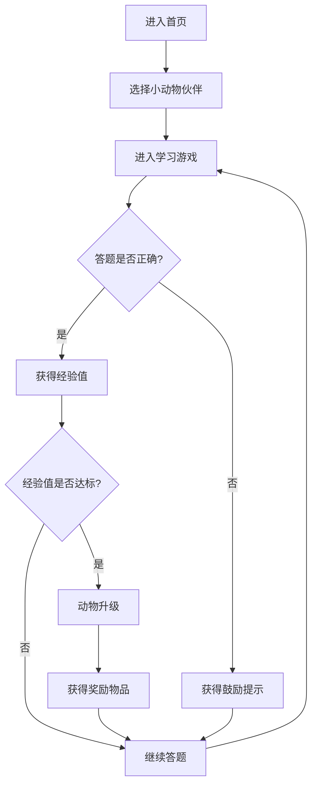

## 1. Product Overview
一款面向5-8岁儿童的小动物主题互动学习小游戏，通过可爱的动物伙伴和趣味答题机制，帮助儿童学习数字识别、颜色认知和简单词汇，提升学习兴趣和效率。

## 2. Core Features

### 2.1 User Roles
| Role | Registration Method | Core Permissions |
|------|---------------------|------------------|
| Child User | No registration required | Play games, earn rewards, track progress |

### 2.2 Feature Module
1. **首页/动物选择**: 选择小动物伙伴（兔子、松鼠、小鸟），查看动物状态
2. **学习游戏页面**: 数字识别、颜色认知、简单词汇学习关卡
3. **动物成长系统**: 动物等级、经验值、奖励物品
4. **学习进度统计**: 学习时间、答题正确率、完成关卡数

### 2.3 Page Details
| Page Name | Module Name | Feature description |
|-----------|-------------|---------------------|
| 首页 | 动物选择区 | 展示3种小动物卡片，点击选择伙伴 |
| 首页 | 动物状态区 | 显示当前伙伴的等级、经验值、成长进度 |
| 首页 | 功能入口 | 学习游戏、查看成就、设置按钮 |
| 学习游戏页 | 题目展示区 | 显示当前题目内容（图片+文字） |
| 学习游戏页 | 选项区 | 展示多个选项供儿童点击选择 |
| 学习游戏页 | 反馈动画 | 答对/答错的视觉反馈和音效提示 |
| 动物成长页 | 成长进度条 | 显示等级提升进度 |
| 动物成长页 | 奖励展示 | 展示获得的奖励物品和装扮 |
| 统计页 | 数据图表 | 学习时间、正确率、完成关卡数统计 |

## 3. Core Process

## 4. User Interface Design

### 4.1 Design Style
- **主色调**: 柔和的粉彩色系（粉、蓝、绿、黄）
- **按钮风格**: 圆润可爱的3D效果，带有动物图案
- **字体**: 圆润卡通字体，适合儿童阅读
- **布局**: 卡片式布局，大按钮设计
- **图标**: 使用emoji和卡通风格图标

### 4.2 Page Design Overview
| Page Name | Module Name | UI Elements |
|-----------|-------------|-------------|
| 首页 | 动物选择区 | 圆形动物头像卡片，悬停放大效果 |
| 首页 | 动物状态区 | 彩虹进度条，星星等级显示 |
| 学习游戏页 | 题目展示区 | 大尺寸图片，鲜艳色彩 |
| 学习游戏页 | 选项区 | 大号圆角按钮，点击动画 |
| 动物成长页 | 成长进度条 | 彩虹渐变效果 |

### 4.3 Responsiveness
- 移动端优先设计
- 触控优化，按钮尺寸≥44px
- 横向滚动支持
- 适配主流手机屏幕尺寸

### 4.4 Accessibility
- 大字体显示
- 高对比度配色
- 语音提示支持
- 简单直观的操作流程
