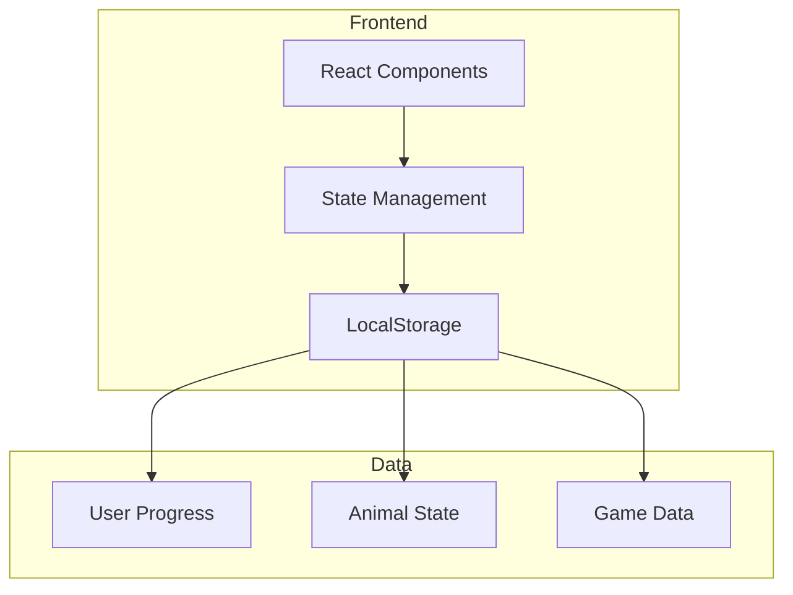
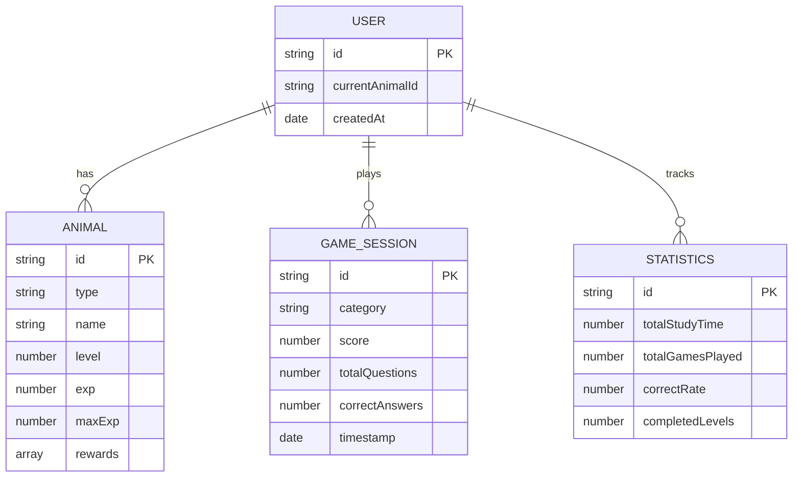

## 1. Architecture Design


## 2. Technology Description
- Frontend: React@18 + TailwindCSS@3 + Vite
- State Management: Zustand
- Data Persistence: LocalStorage
- Icons: Lucide React

## 3. Route Definitions
| Route | Purpose |
|-------|---------|
| / | 首页 - 动物选择和状态展示 |
| /game | 学习游戏页面 |
| /growth | 动物成长页面 |
| /stats | 学习统计页面 |

## 4. Data Model

### 4.1 Data Model Definition


### 4.2 Core Data Structures
```typescript
interface Animal {
  id: string;
  type: 'rabbit' | 'squirrel' | 'bird';
  name: string;
  level: number;
  exp: number;
  maxExp: number;
  rewards: string[];
}

interface Question {
  id: string;
  category: 'numbers' | 'colors' | 'vocabulary';
  question: string;
  image?: string;
  options: string[];
  correctAnswer: string;
}

interface GameSession {
  id: string;
  category: string;
  score: number;
  totalQuestions: number;
  correctAnswers: number;
  timestamp: Date;
}

interface UserStats {
  totalStudyTime: number;
  totalGamesPlayed: number;
  correctRate: number;
  completedLevels: number;
  streakDays: number;
}
```

## 5. Project Structure
```
src/
├── components/
│   ├── AnimalCard.tsx
│   ├── AnimalStatus.tsx
│   ├── GameQuestion.tsx
│   ├── GameOption.tsx
│   ├── ProgressBar.tsx
│   └── StatCard.tsx
├── pages/
│   ├── Home.tsx
│   ├── Game.tsx
│   ├── Growth.tsx
│   └── Stats.tsx
├── store/
│   └── gameStore.ts
├── data/
│   └── questions.ts
├── utils/
│   └── storage.ts
├── App.tsx
├── main.tsx
└── index.css
```

## 6. Core Features Implementation

### 6.1 Animal Selection
- 展示3种动物卡片（兔子🐰、松鼠🐿️、小鸟🐦）
- 点击选择后保存到LocalStorage
- 切换动物不影响进度

### 6.2 Quiz Engine
- 支持3种题型：数字识别、颜色认知、词汇学习
- 随机出题，每题4个选项
- 答对获得10经验值，答错获得鼓励

### 6.3 Growth System
- 每100经验值升一级
- 升级解锁奖励物品
- 动物外观随等级变化

### 6.4 Statistics
- 学习总时长统计
- 答题正确率计算
- 连续学习天数
- 完成关卡数统计

## 7. API Definitions
本项目为纯前端应用，无需后端API。数据通过LocalStorage进行持久化存储。

## 8. Security Considerations
- 无敏感数据存储
- LocalStorage仅存储游戏进度
- 无用户认证需求
