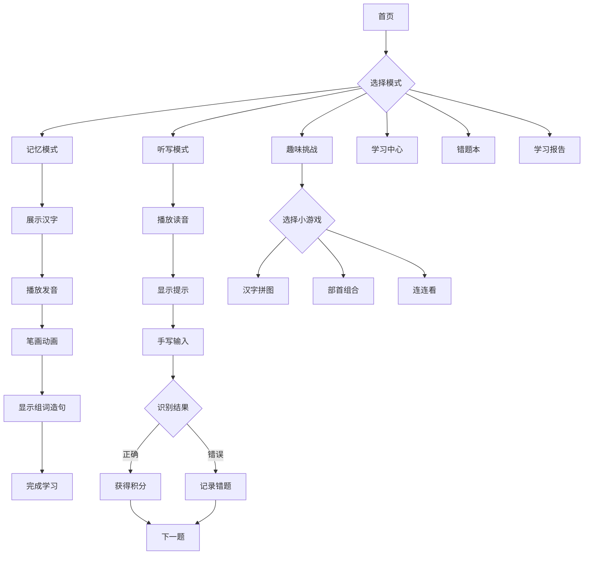

## 1. 产品概述

一款面向小学一、二年级学生的汉字记忆与默写趣味游戏，通过寓教于乐的方式帮助小学生有效记忆和正确书写一二类字。核心目标是提升汉字学习效率和兴趣，支持离线学习，提供家长查看功能。

## 2. 核心功能

### 2.1 用户角色
| 角色 | 注册方式 | 核心权限 |
|------|----------|----------|
| 学生用户 | 无需注册，本地存储 | 使用所有学习和游戏功能 |
| 家长用户 | 无需注册，本地存储 | 查看学习报告和进度统计 |

### 2.2 功能模块
1. **首页/游戏大厅**：导航入口、积分展示、等级显示、学习进度概览
2. **记忆模式**：汉字笔画顺序动画演示、结构特点展示、发音播放
3. **听写模式**：随机播放读音、拼音部首提示、田字格书写界面
4. **趣味挑战**：汉字拼图、偏旁部首组合、汉字连连看
5. **学习中心**：汉字发音、笔画演示、组词示例、造句展示
6. **错题本**：自动记录错误汉字、针对性复习功能
7. **学习报告**：进度跟踪、成绩统计、薄弱环节分析

### 2.3 页面详情
| 页面名称 | 模块名称 | 功能描述 |
|----------|----------|----------|
| 首页 | 导航区 | 游戏模式入口、等级显示、积分展示 |
| 首页 | 进度概览 | 已学汉字数、掌握程度、学习天数 |
| 记忆模式 | 汉字展示 | 大字展示、拼音标注、部首显示 |
| 记忆模式 | 笔画动画 | 分步笔画演示、可暂停/重播 |
| 记忆模式 | 学习信息 | 组词示例(3个)、造句(1-2个) |
| 听写模式 | 音频播放 | 标准普通话发音播放 |
| 听写模式 | 田字格 | 手写输入区域、实时反馈 |
| 趣味挑战 | 拼图游戏 | 汉字拆分拼图、计时挑战 |
| 趣味挑战 | 部首组合 | 偏旁部首拖拽组合 |
| 趣味挑战 | 连连看 | 相同汉字配对消除 |
| 学习中心 | 字库浏览 | 按年级/单元分类浏览 |
| 学习中心 | 智能推荐 | 根据进度推荐学习内容 |
| 错题本 | 错误记录 | 自动收集错误汉字 |
| 错题本 | 复习功能 | 针对性复习练习 |
| 学习报告 | 统计数据 | 学习进度、成绩分析 |
| 学习报告 | 家长视图 | 详细学习报告展示 |

## 3. 核心流程

### 学习流程
1. 学生进入首页，选择游戏模式
2. 进入对应模式开始学习/游戏
3. 完成任务获得积分
4. 系统记录学习数据和错误
5. 可查看学习报告了解进度

### 听写模式流程
1. 点击听写模式入口
2. 系统播放汉字读音
3. 学生在田字格中书写
4. 系统识别并给出反馈
5. 正确获得积分，错误记录到错题本

## 4. 用户界面设计

### 4.1 设计风格
- **主色调**：明亮橙色(#FF6B35)、清新绿色(#4ECDC4)、活泼蓝色(#45B7D1)
- **辅助色**：温暖黄色(#FFE66D)、柔和粉色(#FF9F87)
- **按钮风格**：圆角(12px)、卡通风格、有立体感
- **字体**：使用圆润可爱的中文字体，字号较大便于儿童阅读
- **布局**：卡片式布局、图标导航、触控友好
- **动画**：弹跳动画、渐变过渡、鼓励性特效

### 4.2 页面设计概览
| 页面名称 | 模块名称 | UI元素 |
|----------|----------|--------|
| 首页 | 头部区域 | Logo、积分、等级、设置按钮 |
| 首页 | 导航区 | 6个大图标按钮(记忆、听写、挑战、学习、错题、报告) |
| 首页 | 进度区 | 学习进度条、已学数量、连续学习天数 |
| 记忆模式 | 汉字卡片 | 大字居中、拼音下方、部首标签 |
| 记忆模式 | 控制区 | 播放发音、播放笔画、暂停/重播按钮 |
| 听写模式 | 音频区 | 播放按钮、重复播放、提示显示 |
| 听写模式 | 书写区 | 田字格Canvas、清除按钮、提交按钮 |
| 趣味挑战 | 游戏选择 | 3个游戏卡片、点击进入 |
| 学习报告 | 统计图表 | 进度饼图、趋势折线图、掌握程度柱状图 |

### 4.3 响应式设计
- **桌面端**：多列布局、鼠标交互
- **平板端**：自适应列数、触控优化
- **移动端**：单列布局、大按钮、手势支持

### 4.4 交互设计
- **语音交互**：支持语音播放、语音输入
- **手写识别**：Canvas手写输入、实时反馈
- **操作引导**：每步操作有明确引导提示
- **游戏时长**：设置学习提醒，防止过度使用

## 5. 游戏机制

### 5.1 积分系统
- 正确完成任务获得积分(基础10分)
- 连续答对可获得额外奖励(连续3题+5分，连续5题+10分)
- 趣味挑战完成获得额外积分

### 5.2 等级提升
- **初级**：1-1000积分，基础汉字
- **中级**：1001-3000积分，进阶汉字
- **高级**：3000+积分，难度汉字
- 根据表现自动调整难度

### 5.3 错题收集
- 自动记录错误汉字
- 提供针对性复习功能
- 复习正确后从错题本移除

## 6. 内容要求

### 6.1 汉字数据
- 涵盖小学语文课程标准要求的一、二类字
- 按年级(一年级上册、一年级下册、二年级上册、二年级下册)分类
- 每字包含：汉字、拼音、声调、部首、笔画数、笔画顺序、组词(3个)、造句(1-2个)

### 6.2 发音标准
- 使用Web Speech API实现标准普通话发音
- 提供拼音和声调标注

### 6.3 笔画演示
- 使用HanziWriter或自定义SVG实现笔画顺序动画
- 支持分步查看

### 6.4 智能推荐
- 根据学习进度推荐汉字
- 根据掌握程度调整难度
- 优先推荐错题和未掌握汉字

## 7. 离线功能
- 本地存储汉字数据
- 学习进度本地保存
- 无需网络即可使用
- 支持PWA模式安装

## 8. 家长功能
- 查看学习报告
- 了解学习进度和薄弱环节
- 查看学习时长统计
