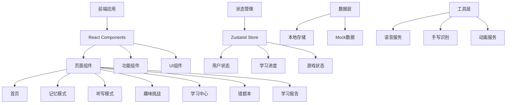

## 1. 架构设计



## 2. 技术描述

- **前端框架**: React@18 + TypeScript
- **构建工具**: Vite@6
- **样式框架**: TailwindCSS@3
- **状态管理**: Zustand
- **路由**: React Router DOM@6
- **图标**: Lucide React
- **手写识别**: Canvas API + 简单形状匹配
- **语音合成**: Web Speech API (SpeechSynthesis)
- **数据存储**: LocalStorage + IndexedDB
- **动画**: CSS Animations + HanziWriter

## 3. 路由定义

| 路由 | 用途 | 组件 |
|------|------|------|
| / | 首页/游戏大厅 | HomePage |
| /memory | 记忆模式 | MemoryMode |
| /dictation | 听写模式 | DictationMode |
| /challenge | 趣味挑战 | ChallengeMode |
| /learning | 学习中心 | LearningCenter |
| /mistakes | 错题本 | MistakeBook |
| /report | 学习报告 | ReportPage |

## 4. 数据模型

### 4.1 数据模型定义

```mermaid
erDiagram
    CHARACTER {
        string id PK
        string char 汉字
        string pinyin 拼音
        string tone 声调
        string radical 部首
        int stroke_count 笔画数
        string[] stroke_order 笔画顺序
        string[] words 组词
        string[] sentences 造句
        int grade 年级(1-2)
        int semester 学期(1-2)
        int difficulty 难度(1-3)
    }
    
    LEARNING_PROGRESS {
        string char_id FK
        int learned 学习次数
        int correct 正确次数
        int wrong 错误次数
        date last_learned 最后学习时间
        float mastery 掌握程度(0-100)
    }
    
    USER_STATS {
        string id PK
        int points 积分
        int level 等级(1-3)
        int total_learned 已学汉字数
        int days_streak 连续学习天数
        date last_login 最后登录时间
    }
    
    MISTAKE_RECORD {
        string id PK
        string char_id FK
        int wrong_count 错误次数
        date last_wrong 最后错误时间
        string wrong_type 错误类型
    }
    
    GAME_RECORD {
        string id PK
        string game_type 游戏类型
        int score 得分
        date play_time 游戏时间
        int duration 时长(秒)
    }
    
    CHARACTER ||--o{ LEARNING_PROGRESS : "has"
    CHARACTER ||--o{ MISTAKE_RECORD : "has"
    USER_STATS ||--o{ GAME_RECORD : "has"
```

### 4.2 数据定义

#### Character数据结构
```typescript
interface Character {
  id: string;
  char: string;
  pinyin: string;
  tone: string;
  radical: string;
  strokeCount: number;
  strokeOrder: string[];
  words: string[];
  sentences: string[];
  grade: number;
  semester: number;
  difficulty: number;
}
```

#### LearningProgress数据结构
```typescript
interface LearningProgress {
  charId: string;
  learned: number;
  correct: number;
  wrong: number;
  lastLearned: string;
  mastery: number;
}
```

#### UserStats数据结构
```typescript
interface UserStats {
  id: string;
  points: number;
  level: number;
  totalLearned: number;
  daysStreak: number;
  lastLogin: string;
}
```

#### MistakeRecord数据结构
```typescript
interface MistakeRecord {
  id: string;
  charId: string;
  wrongCount: number;
  lastWrong: string;
  wrongType: 'stroke' | 'writing' | 'reading';
}
```

## 5. 项目结构

```
src/
├── components/           # 组件目录
│   ├── ui/              # UI基础组件
│   │   ├── Button.tsx
│   │   ├── Card.tsx
│   │   ├── ProgressBar.tsx
│   │   └── ...
│   ├── game/            # 游戏相关组件
│   │   ├── CharacterCard.tsx
│   │   ├── StrokeAnimation.tsx
│   │   ├── TianZiGe.tsx
│   │   └── ...
│   └── layout/          # 布局组件
│       ├── Header.tsx
│       ├── Navigation.tsx
│       └── ...
├── pages/               # 页面组件
│   ├── HomePage.tsx
│   ├── MemoryMode.tsx
│   ├── DictationMode.tsx
│   ├── ChallengeMode.tsx
│   ├── LearningCenter.tsx
│   ├── MistakeBook.tsx
│   └── ReportPage.tsx
├── stores/              # Zustand状态管理
│   ├── gameStore.ts
│   ├── userStore.ts
│   └── learningStore.ts
├── data/                # 数据文件
│   ├── characters.ts    # 汉字数据
│   └── mockData.ts      # Mock数据
├── utils/               # 工具函数
│   ├── storage.ts       # 本地存储
│   ├── speech.ts        # 语音服务
│   ├── recognition.ts   # 手写识别
│   └── animation.ts     # 动画工具
├── hooks/               # 自定义Hooks
│   ├── useCharacter.ts
│   ├── useLearning.ts
│   └── useGame.ts
├── types/               # TypeScript类型定义
│   └── index.ts
├── App.tsx
├── main.tsx
└── index.css
```

## 6. 核心功能实现方案

### 6.1 笔画动画
- 使用HanziWriter库实现汉字笔画顺序动画
- 支持分步播放、暂停、重播
- 自定义颜色和速度

### 6.2 手写识别
- 使用Canvas API捕获手写输入
- 记录笔画轨迹点
- 简单形状匹配算法判断正确性

### 6.3 语音合成
- 使用Web Speech API的SpeechSynthesis接口
- 设置语言为中文(zh-CN)
- 支持音量、语速调节

### 6.4 本地存储
- 使用LocalStorage存储用户状态和学习进度
- 使用IndexedDB存储大量汉字数据
- 实现数据持久化和离线访问

### 6.5 游戏逻辑
- 积分计算：基础分 + 连续奖励分
- 等级计算：根据积分自动升级
- 错题收集：记录错误并提供复习

## 7. 开发优先级

### 第一阶段
- 核心字库导入(20-30个示例汉字)
- 基础认读功能(发音、拼音显示)
- 简单游戏模式(记忆模式、基础听写)
- 积分系统和等级系统
- 基础UI界面

### 第二阶段
- 完善默写功能
- 手写识别优化
- 语音交互功能
- 趣味挑战小游戏(拼图、部首组合、连连看)
- 错题本功能

### 第三阶段
- 学习数据分析
- 个性化推荐算法
- 学习报告生成
- 家长查看功能
- PWA支持和离线学习

## 8. 技术依赖

| 依赖 | 版本 | 用途 |
|------|------|------|
| react | ^18.2.0 | 前端框架 |
| react-dom | ^18.2.0 | DOM渲染 |
| react-router-dom | ^6.20.0 | 路由管理 |
| zustand | ^4.4.7 | 状态管理 |
| tailwindcss | ^3.4.10 | CSS框架 |
| lucide-react | ^0.294.0 | 图标库 |
| hanzi-writer | ^3.5.0 | 汉字笔画动画 |
| typescript | ^5.3.2 | 类型检查 |
| vite | ^6.5.0 | 构建工具 |
