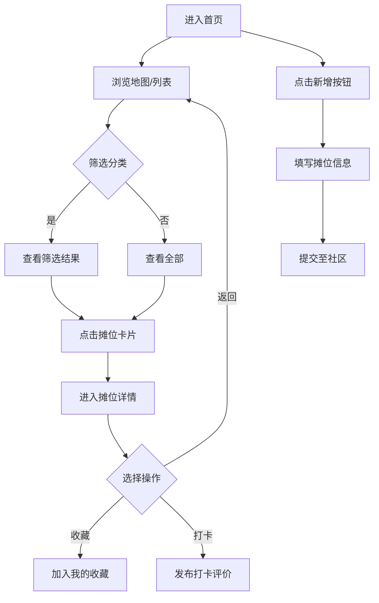

# 附近小吃摊收录 - 产品需求文档 (PRD)

## 1. 产品概述

「附近小吃摊收录」是一款面向「好吃嘴」群体的本地化美食地摊信息聚合工具，让用户可以快速记录、查询、分享身边小吃摊的位置、营业时间和排队情况。

- **目标用户**：热爱街头美食、经常寻觅本地小吃的年轻消费者
- **核心价值**：解决"哪里有吃的 / 几点开门 / 排不排队"三大寻吃痛点，把碎片化的探店经验沉淀为可检索的本地知识库
- **参赛定位**：作为 Trae 比赛 demo 的轻量化前端单页应用，先以高完成度视觉与交互呈现核心理念

## 2. 核心功能

### 2.1 用户角色
| 角色 | 注册方式 | 核心权限 |
|------|----------|----------|
| 普通用户 | 微信/手机号 | 浏览、收藏、提交新摊位 |
| 探店贡献者 | 自动识别提交次数 | 标注实时排队/营业状态 |

### 2.2 功能模块
1. **首页（地图+列表双视图）**：可视化地图、卡片列表、分类筛选
2. **摊位详情**：营业时间、招牌菜、排队热度、用户打卡
3. **新增摊位**：简易表单 + 地图选址
4. **个人中心**：我的收藏、我的提交、探店徽章

### 2.3 页面详情
| 页面名称 | 模块名称 | 功能描述 |
|----------|----------|----------|
| 首页 | 顶部搜索栏 | 关键词搜索摊位名、菜品、地址 |
| 首页 | 分类标签 | 早餐/正餐/夜宵/甜品等横向切换 |
| 首页 | 地图视图 | 摊位分布点位，点击弹出信息气泡 |
| 首页 | 卡片列表 | 摊位卡片：封面、名称、距离、当前状态徽章 |
| 详情页 | 摊位头图 | 大图 + 摊位名 + 状态徽章 |
| 详情页 | 信息面板 | 营业时间段、平均排队时长、人均价 |
| 详情页 | 招牌菜 | 横向滑动菜品卡片 |
| 详情页 | 打卡列表 | 用户探店记录与评价 |
| 新增页 | 表单 | 名称、分类、位置、营业时间、价格、简介 |
| 个人中心 | 数据概览 | 提交数 / 收藏数 / 探店等级 |

## 3. 核心流程

用户从首页进入，浏览地图或列表，筛选感兴趣的摊位；点击进入详情，查看营业时间与排队热度；可一键收藏或打卡；也可点击"+"提交新摊位为社区贡献数据。

## 4. 用户界面设计

### 4.1 设计风格
- **主色调**：暗夜暖橙（#1A0F0A） + 灯笼红（#E63946） + 琥珀金（#F4A261） + 米白（#F1E6D0）
- **辅助色**：薄荷绿（#8DA77A，用于"营业中"状态）、暮色蓝（#264653，用于"休息中"状态）
- **按钮风格**：3D 立体按钮 + 轻微下沉投影，圆角 14px，悬停时上浮 2px
- **字体**：标题用思源宋体 / Noto Serif SC，强调汉字骨架；正文用思源黑体 / Noto Sans SC
- **布局风格**：杂志卡片式 + 地图叠加，模块间使用斜切分割线制造错落感
- **图标风格**：粗描边矢量图标 + 食物 emoji 混合使用，强调烟火气

### 4.2 页面设计概述
| 页面名称 | 模块名称 | UI 元素 |
|----------|----------|---------|
| 首页 | 顶部 Hero | 巨幅中文标题 + 副标题 + 搜索框 + 食物装饰图 |
| 首页 | 分类标签 | 横向胶囊按钮，选中态填充灯笼红 |
| 首页 | 卡片列表 | 摊位封面 + 名称 + 状态徽章 + 距离/排队标签 |
| 详情页 | 信息面板 | 大字号关键信息 + 渐变背景 + 烟火装饰元素 |
| 新增页 | 表单 | 大输入框、地图选址按钮、提交按钮带微动效 |
| 个人中心 | 徽章墙 | 圆形徽章网格 + 等级进度条 |

### 4.3 响应式
- Desktop-first：1440px 主画布，12 栏栅格
- 平板：1024px，列表降为双列
- 手机：375px，地图与列表切换为全屏 tab

### 4.4 视觉氛围
- 背景叠加颗粒噪点纹理 + 微弱灯笼光晕，营造"夜市"氛围
- 关键模块使用斜切路径或毛笔笔触分割
- 标题用超大字号（80–120px）形成视觉冲击
- 食物图标采用手绘涂鸦风线稿点缀
