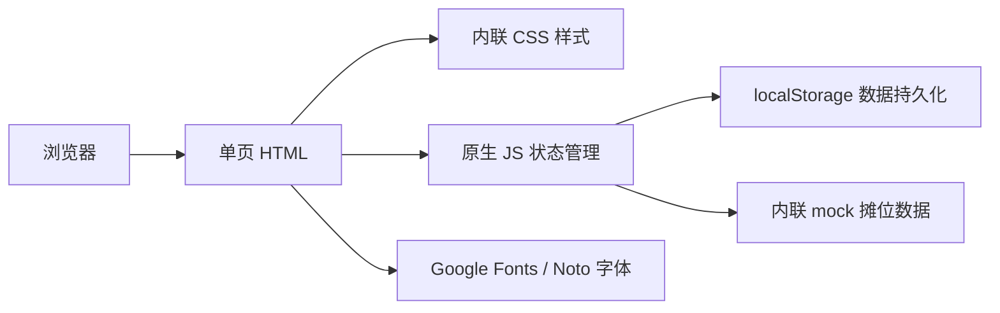

# 附近小吃摊收录 - 技术架构文档

## 1. 架构设计

为方便参赛评审快速体验，本次 demo 采用单文件 HTML 架构：HTML + 内联 CSS + 原生 JavaScript，无外部构建工具，可直接双击打开或部署到任意静态服务器。

## 2. 技术说明
- **前端**：HTML5 + CSS3 (CSS 变量、Grid、Flexbox、动画) + 原生 JavaScript (ES2020)
- **构建工具**：无（单文件 demo，方便评审查看）
- **后端**：无（demo 阶段使用前端 mock 数据 + localStorage）
- **数据**：内置 8–12 条示例摊位数据，覆盖早/午/晚/夜宵不同时段
- **字体**：通过 Google Fonts 引入 Noto Serif SC / Noto Sans SC / ZCOOL XiaoWei
- **图标**：Lucide Icons（CDN 引入）

## 3. 路由定义
| 路径 | 用途 |
|------|------|
| `#/` | 首页：Hero + 分类 + 摊位列表 + 迷你地图 |
| `#/detail/:id` | 摊位详情页 |
| `#/add` | 新增摊位表单 |
| `#/me` | 个人中心（收藏、提交、徽章） |

使用 hash 路由，便于纯静态部署。

## 4. API 定义（Mock 阶段）
demo 阶段不接入后端 API，模拟数据从 `data/stalls.js` 内部常量读取，所有写操作仅写入 `localStorage`。

## 5. 数据模型

### 5.1 摊位 (Stall)
| 字段 | 类型 | 说明 |
|------|------|------|
| id | string | 唯一标识 |
| name | string | 摊位名称 |
| category | string | 分类：早餐/正餐/夜宵/甜品 |
| address | string | 详细地址 |
| distance | number | 距离用户位置 (km) |
| openTime | string | 营业时间段描述 |
| openStatus | enum | open / busy / closed |
| queueMin | number | 预计排队分钟数 |
| priceAvg | number | 人均消费 |
| tags | string[] | 标签数组 |
| signature | string[] | 招牌菜 |
| rating | number | 评分 (0-5) |
| cover | string | 封面图 URL |

### 5.2 收藏 (Favorite)
| 字段 | 类型 | 说明 |
|------|------|------|
| stallId | string | 摊位 id |
| createdAt | number | 时间戳 |

## 6. 部署说明
- 静态资源：单文件 `index.html` + `assets/` 目录（可选）
- 启动方式：浏览器直接打开 `index.html` 即可使用
- 推荐：使用 `python -m http.server` 或 `npx serve` 启动本地预览

## 7. 后续扩展
- 接入真实后端 API（Node.js / Express）
- 接入地图 SDK（高德/百度/Mapbox）展示真实地理坐标
- 用户体系（登录、积分、徽章成就）
- 实时排队上报（社区协作）
