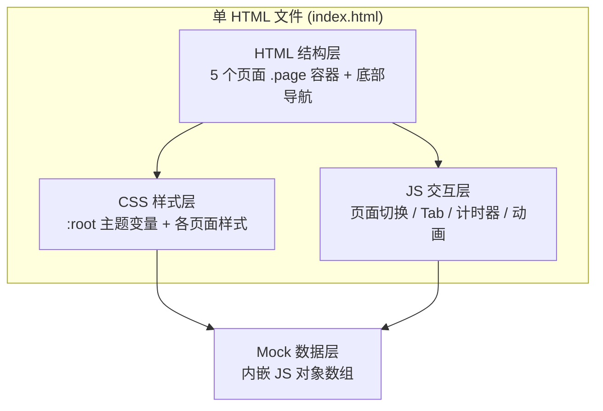

# 茶鉴 · 技术架构文档

## 1. 架构设计

本 Demo 为纯前端单页应用，无后端、无数据库、无外部 API。所有数据为内置 Mock 数据，全部逻辑在浏览器端完成。整体采用"单 HTML 文件 + 内联 CSS/JS"的结构，便于直接预览。



### 1.1 架构选择说明

用户明确要求"纯 HTML/CSS/JS，不需要任何框架，所有页面放在一个 HTML 文件中"。因此放弃 web-dev 默认推荐的 React/Vue + Vite + Tailwind 技术栈，采用以下方案：

- **单文件交付**：所有 HTML、CSS、JS 集中在 `index.html` 一个文件中，零依赖、零构建、双击即开
- **无任何外部库**：不引入 React/Vue/Tailwind/图标库，所有 UI 与图标用原生 CSS/SVG 实现
- **CSS 变量主题**：通过 `:root` 集中管理配色、圆角、阴影、动画时长，便于后续调整

## 2. 技术选型说明

- **前端**：原生 HTML5 + CSS3 + 原生 JavaScript（ES2020）
- **构建工具**：无（零构建）
- **包管理器**：无
- **字体加载**：通过 Google Fonts CDN 引入 `Noto Serif SC`（衬线标题）与 `Noto Sans SC`（无衬线正文），离线时回退到系统衬线/无衬线字体
- **图标**：全部用内联 SVG 实现，确保无外部依赖
- **动画**：CSS Animation + Transition 为主，复杂时序（如跟泡计时器）用 `setInterval` / `requestAnimationFrame`

## 3. 页面（路由）定义

Demo 不使用真实路由，而是通过 Tab 切换显示/隐藏 5 个 `.page` 容器来模拟导航。每个页面有唯一 `id`：

| 页面 id | 页面名称 | 进入方式 |
|---------|----------|----------|
| `page-home` | 首页 | 默认页 / 底部导航"首页" |
| `page-camera` | 拍照识别页 | 底部导航"拍照" / 首页"请他点评" |
| `page-agent` | Agent 点评页 | 拍照评分卡"请师傅点评" |
| `page-brew` | 跟着泡页面 | 底部导航"跟泡" / Agent 点评页"跟着泡一杯" |
| `page-shelf` | 数字博古架 | 底部导航"博古架" |

底部导航栏 5 个 Tab：首页 / 拍照 / 跟泡 / 博古架 / 我的。"我的"在 Demo 中不实现具体内容，仅占位保持导航结构完整。

## 4. 模拟数据定义

所有 Mock 数据以 JS 对象数组形式内嵌在 `<script>` 中。

### 4.1 推荐 Agent 数据

```javascript
const recommendedAgent = {
  id: 'chen-master',
  name: '岩茶陈师傅',
  title: '武夷岩茶 · 国家高级评茶师',
  avatar: 'svg',                 // 内嵌 SVG 头像
  specialty: ['岩茶', '单丛', '老茶'],
  intro: '在武夷山习茶三十年，擅长从叶底读工艺。'
};
```

### 4.2 最近品鉴记录

```javascript
const recentRecords = [
  {
    id: 'rec-001',
    teaName: '武夷星 · 牛栏坑肉桂',
    teaType: '岩茶 · 乌龙',
    score: 92,
    scoreLabel: '优',
    colorNote: '橙黄透亮',
    date: '2026-07-14',
    thumbnail: 'svg'             // 茶汤色块缩略图
  },
  {
    id: 'rec-002',
    teaName: '下关 · 甲级沱茶(2018)',
    teaType: '普洱 · 生茶',
    score: 88,
    scoreLabel: '良',
    colorNote: '金黄油润',
    date: '2026-07-12',
    thumbnail: 'svg'
  },
  {
    id: 'rec-003',
    teaName: '八马 · 铁观音(清香型)',
    teaType: '乌龙 · 清香',
    score: 85,
    scoreLabel: '良',
    colorNote: '浅金黄',
    date: '2026-07-09',
    thumbnail: 'svg'
  }
];
```

### 4.3 AI 评分结果

```javascript
const aiScoreResult = {
  teaName: '武夷星 · 牛栏坑肉桂',
  confidence: 96,
  dimensions: [
    { name: '色泽',  score: 9.4, note: '橙黄明亮' },
    { name: '透亮',  score: 9.6, note: '清澈无杂' },
    { name: '浓度',  score: 9.2, note: '饱和度高' },
    { name: '清洌',  score: 8.9, note: '微金圈' },
    { name: '叶相',  score: 9.1, note: '三红七绿' },
    { name: '工艺',  score: 9.5, note: '做青到位' }
  ],
  terms: ['金圈明显', '橙黄透亮', '岩韵显', '桂皮香']
};
```

### 4.4 Agent 点评（同图不同师傅）

```javascript
const agentComments = {
  photo: 'svg',                  // 同一张茶汤照片
  teaName: '武夷星 · 牛栏坑肉桂',
  chen: {
    name: '岩茶陈师傅',
    avatar: 'svg',
    style: '工艺向 · 严谨',
    sections: [
      { label: '汤色', text: '橙黄透亮，金圈明显，火功到位而不焦。汤色介于三黄之间，说明焙火走的是中足火，工艺成熟。' },
      { label: '香气', text: '开盖桂皮香冲鼻，落水后转为熟果香，岩韵清晰。略带辛锐，是肉桂本味，不错。' },
      { label: '滋味', text: '入口醇厚，水感稠，回甘快而长。坐杯若超过 40 秒易出微涩，建议即泡即出。' },
      { label: '工艺', text: '从汤色判断，做青走水充分，焙火曲线稳。这是工艺在线的山场茶，值得存。' }
    ]
  },
  puer: {
    name: '普洱老茶客',
    avatar: 'svg',
    style: '横向对比 · 直率',
    sections: [
      { label: '汤色', text: '这汤色搁普洱里算"橙黄偏金"，比三年生沱要亮得多。能看出工艺干净，没有做旧感。' },
      { label: '香气', text: '岩茶这种"岩韵"很特别，我喝生普喝不到。这泡的桂皮香够冲，但比不上老茶那种陈香沉下来。' },
      { label: '滋味', text: '稠度不错，但我总觉得岩茶劲儿太烈，缺了普洱那种滑顺。喜欢追求刺激的可以选它，想养胃的还是老生普稳。' },
      { label: '工艺', text: '说句外行话，岩茶那套"做青焙火"我不太懂，但汤色干净说明没杂味，工艺应该没问题。' }
    ]
  }
};
```

### 4.5 跟着泡步骤

```javascript
const brewSteps = [
  { index: 1, title: '温杯洁具',  duration: 20, animation: 'rinse', text: '沸水润盖碗与公道杯，提升器温，洁器醒香。', params: { water: '100℃', volume: '120ml' } },
  { index: 2, title: '投茶',      duration: 10, animation: 'put',   text: '称取 8g 干茶投入盖碗，轻摇使茶舒展。',     params: { weight: '8g' } },
  { index: 3, title: '环壶高冲',   duration: 45, animation: 'pour',  text: '沿盖碗壁高冲沸水，使茶叶翻腾均匀受水。',   params: { water: '95℃', volume: '120ml' } },
  { index: 4, title: '刮沫去浮',   duration: 5,  animation: 'skim',  text: '用盖沿轻刮浮沫，去杂气，护香气。',           params: {} },
  { index: 5, title: '浸泡静置',   duration: 30, animation: 'wait',  text: '合盖静置，让茶汤浓度均匀析出。',             params: { time: '30s' } },
  { index: 6, title: '出汤',      duration: 15, animation: 'out',   text: '快速倾倒至公道杯，沥干，避免久泡出涩。',     params: {} },
  { index: 7, title: '分茶',      duration: 10, animation: 'split', text: '均分入品茗杯，七分满，留三分香。',           params: {} },
  { index: 8, title: '品饮',      duration: 60, animation: 'taste', text: '分三口饮尽：一口识香，二口辨味，三口品韵。', params: {} }
];
```

### 4.6 博古架茶器

```javascript
const shelfCells = [
  { id: 'cell-01', name: '紫砂朱泥小品',  type: '紫砂壶', note: '宜泡岩茶', filled: true,  img: 'svg' },
  { id: 'cell-02', name: '青瓷盖碗(白)',   type: '盖碗',   note: '宜泡绿茶', filled: true,  img: 'svg' },
  { id: 'cell-03', filled: false },
  { id: 'cell-04', name: '建盏 · 兔毫',    type: '品茗杯', note: '宜饮岩茶', filled: true,  img: 'svg' },
  { id: 'cell-05', name: '玻璃公道杯',     type: '公道杯', note: '观汤色用', filled: true,  img: 'svg' },
  { id: 'cell-06', filled: false },
  { id: 'cell-07', name: '紫砂茶宠 · 莲',  type: '茶宠',   note: '养茶人之趣', filled: true, img: 'svg' },
  { id: 'cell-08', filled: false }
];
```

## 5. 交互与动画说明

| 交互点 | 实现方式 |
|--------|----------|
| 底部导航切换 | 点击 Tab → 切换 `.page.active` 类，配合 `transform: translateY` 进场动画 |
| 拍照对象 Tab | 切换 `干茶/茶汤/叶底` → 改变引导框尺寸与提示文字 |
| 快门按下 | 触发闪光白屏 → 800ms 后弹出底部 AI 评分卡（`translateY` 上滑） |
| Agent 切换 | 点击头像 → 切换 `.comment-panel.active`，正文段落 stagger 淡入 |
| 跟泡计时器 | `setInterval` 每秒递减/递增，到 0 自动进入下一步并切换引导动画 |
| 跟泡注水动画 | SVG + CSS `@keyframes` 控制水流与涟漪 |
| 博古架添加 | 点击空位 → 弹出"拍摄茶器"模拟弹层（Demo 中为占位提示） |

## 6. 文件结构

```text
.
└── index.html        # 全部代码（HTML + 内联 CSS + 内联 JS）
```

Demo 仅产出 `index.html` 一个文件，符合"所有页面放在一个 HTML 文件中"的硬性要求。后续若需要拆分，可按 `css/style.css`、`js/app.js`、`js/data.js` 拆分，但首版不拆分。
