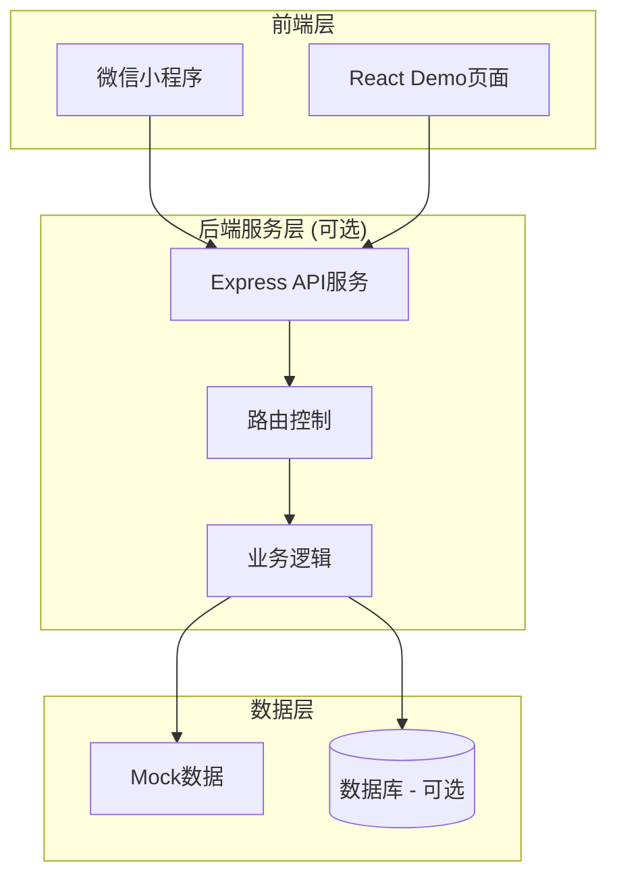
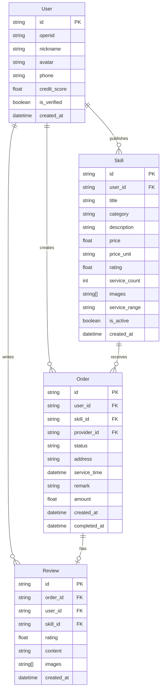

# 邻有技 - 技术架构文档

## 1. 架构设计



## 2. 技术说明

- **前端框架**: React 18 + TypeScript + Tailwind CSS + Vite
- **初始化工具**: vite-init
- **状态管理**: Zustand
- **路由**: React Router DOM
- **后端服务**: Express 4 (可选，Demo阶段使用Mock数据)
- **数据库**: SQLite (可选，Demo阶段使用内存Mock数据)
- **图标库**: Lucide React

## 3. 路由定义

| 路由路径 | 页面名称 | 功能说明 |
|----------|----------|----------|
| `/` | 首页 | 技能推荐、分类导航、搜索入口 |
| `/skills` | 技能市场 | 技能列表、筛选、搜索 |
| `/skill/:id` | 技能详情 | 技能详细信息、评价、预约 |
| `/publish` | 发布页 | 发布技能或需求 |
| `/orders` | 订单中心 | 订单列表、状态管理 |
| `/order/:id` | 订单详情 | 订单信息、操作 |
| `/profile` | 个人中心 | 用户信息、功能入口 |
| `/my-skills` | 我的技能 | 管理发布的技能 |
| `/wallet` | 钱包 | 收益管理、提现 |

## 4. 数据模型

### 4.1 实体关系图



### 4.2 Mock数据定义

```typescript
// 用户数据
interface User {
  id: string;
  nickname: string;
  avatar: string;
  phone?: string;
  creditScore: number;
  isVerified: boolean;
}

// 技能数据
interface Skill {
  id: string;
  userId: string;
  title: string;
  category: string;
  description: string;
  price: number;
  priceUnit: string;
  rating: number;
  serviceCount: number;
  images: string[];
  distance: number;
  isActive: boolean;
}

// 订单数据
interface Order {
  id: string;
  userId: string;
  skillId: string;
  providerId: string;
  status: 'pending' | 'accepted' | 'in_progress' | 'completed' | 'cancelled';
  address: string;
  serviceTime: Date;
  remark: string;
  amount: number;
}

// 评价数据
interface Review {
  id: string;
  orderId: string;
  userId: string;
  skillId: string;
  rating: number;
  content: string;
  images: string[];
}
```

## 5. 项目目录结构

```
src/
├── components/          # 公共组件
│   ├── SkillCard.tsx    # 技能卡片组件
│   ├── OrderCard.tsx    # 订单卡片组件
│   ├── CategoryNav.tsx  # 分类导航组件
│   ├── SearchBar.tsx    # 搜索栏组件
│   └── TabBar.tsx       # 底部导航组件
├── pages/               # 页面组件
│   ├── Home.tsx         # 首页
│   ├── Skills.tsx       # 技能市场
│   ├── SkillDetail.tsx  # 技能详情
│   ├── Publish.tsx      # 发布页
│   ├── Orders.tsx       # 订单中心
│   ├── OrderDetail.tsx  # 订单详情
│   ├── Profile.tsx      # 个人中心
│   ├── MySkills.tsx     # 我的技能
│   └── Wallet.tsx       # 钱包
├── hooks/               # 自定义Hooks
│   ├── useSkills.ts     # 技能相关逻辑
│   └── useOrders.ts     # 订单相关逻辑
├── store/               # 状态管理
│   └── useStore.ts      # Zustand store
├── utils/               # 工具函数
│   ├── mockData.ts      # Mock数据
│   └── helpers.ts       # 辅助函数
├── App.tsx              # 应用入口
├── main.tsx             # 渲染入口
└── index.css            # 全局样式
```

## 6. 核心功能实现要点

### 6.1 LBS定位功能
- 使用浏览器 Geolocation API 获取用户位置
- 计算技能提供者与用户的距离
- 按距离排序展示技能列表

### 6.2 技能分类系统
- 预设分类：家电维修、手机教学、理发服务、辅导作业、跑腿代劳、手工技能
- 支持多级分类筛选
- 分类图标使用 Lucide React

### 6.3 订单状态流转
```
pending(待接单) → accepted(已接单) → in_progress(进行中) → completed(已完成)
                                    ↓
                                cancelled(已取消)
```

### 6.4 评价系统
- 五星评分机制
- 文字评价 + 图片上传
- 评价展示在技能详情页

## 7. UI组件规范

### 7.1 颜色变量
```css
--primary: #FF6B35;      /* 主色-温暖橙 */
--primary-light: #FF8A5B;
--secondary: #2ECC71;   /* 辅助色-清新绿 */
--background: #F5F5F5;   /* 背景色 */
--card: #FFFFFF;         /* 卡片背景 */
--text-primary: #424242; /* 主文字 */
--text-secondary: #9E9E9E; /* 次要文字 */
--border: #E0E0E0;       /* 边框色 */
```

### 7.2 间距规范
- 基础单位: 4px
- 卡片内边距: 16px
- 页面边距: 16px
- 组件间距: 12px

### 7.3 圆角规范
- 按钮: 24px (胶囊形)
- 卡片: 12px
- 输入框: 8px
- 图片: 8px

### 7.4 阴影规范
- 卡片: 0 2px 8px rgba(0,0,0,0.08)
- 按钮: 0 4px 12px rgba(255,107,53,0.3)
- 弹窗: 0 8px 32px rgba(0,0,0,0.15)