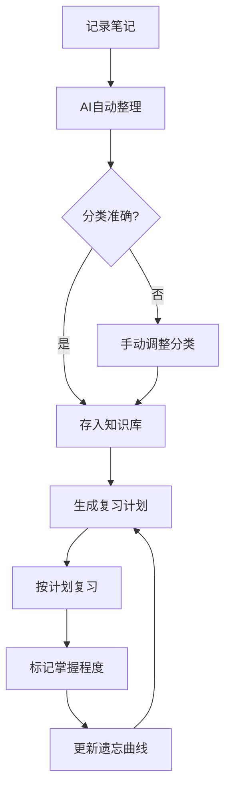
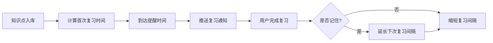

# 智能学习便签 - 产品需求文档

## 1. 产品概述

智能学习便签是一款基于AI技术的学习笔记管理工具，帮助学生和终身学习者自动整理、分类和回顾学习内容，解决笔记杂乱、复习无计划、知识遗忘快等常见学习痛点。

### 核心价值
- **效率提升**: AI自动分类整理，节省80%整理时间
- **科学复习**: 基于遗忘曲线理论，智能提醒复习
- **知识内化**: 卡片式学习 + 知识图谱，构建个人知识体系

---

## 2. 核心功能

### 2.1 目标用户

| 用户群体 | 使用场景 | 核心痛点 |
|---------|---------|---------|
| 学生（初/高中） | 课后笔记整理、考前复习 | 笔记零散、重点不突出、复习无计划 |
| 大学生 | 课程学习、论文笔记、项目整理 | 资料过多、跨学科关联困难 |
| 终身学习者 | 在线课程、书籍阅读、技能学习 | 碎片化学习、难以形成体系 |

### 2.2 核心功能模块

#### 2.2.1 智能笔记输入
- 支持文字、图片、手写内容上传
- AI自动识别笔记类型（概念、公式、案例、思考）
- 自动提取关键词和知识点

#### 2.2.2 AI整理分类
- 自动归类到预设的知识分类体系
- 智能打标（难度、重要程度、关联知识点）
- 去重和相似内容合并提醒

#### 2.2.3 遗忘曲线复习系统
- 根据艾宾浩斯遗忘曲线自动生成复习计划
- 卡片式复习模式
- 掌握度追踪与调整

#### 2.2.4 知识图谱可视化
- 知识点之间的关联可视化
- 学习进度一目了然
- 薄弱环节自动标注

---

## 3. 核心流程

### 3.1 用户主要流程

### 3.2 复习提醒流程

---

## 4. 用户界面设计

### 4.1 设计风格

**设计理念**: 简洁专注、学术感与现代感结合

| 设计元素 | 规格 |
|---------|------|
| 主色调 | #4A90D9 (学习蓝) |
| 强调色 | #FF6B6B (重点红) |
| 辅助色 | #2ECC71 (完成绿) |
| 背景色 | #F8FAFC (浅灰白) |
| 文字色 | #2C3E50 (深灰) |
| 卡片圆角 | 12px |
| 阴影 | 0 4px 20px rgba(74, 144, 217, 0.15) |

### 4.2 页面结构

| 页面 | 主要模块 | 交互特点 |
|-----|---------|---------|
| 首页/仪表盘 | 今日待复习、近期学习统计、知识图谱概览 | 数据可视化、一目了然 |
| 笔记输入页 | 笔记编辑区、AI整理结果预览、标签选择 | 简洁高效、快速录入 |
| 知识库页 | 分类树、笔记列表、搜索筛选 | 清晰分类、快速查找 |
| 复习页 | 卡片展示、掌握度按钮、进度条 | 专注复习、减少干扰 |
| 图谱页 | 知识网络可视化、节点详情 | 交互探索、可视化学习 |

### 4.3 响应式设计

- **桌面端**: 左侧导航 + 右侧内容区
- **平板端**: 顶部导航 + 适配布局
- **移动端**: 底部Tab导航、单栏内容流

---

## 5. 产品形态

- **核心产品**: Web应用 + 移动端H5
- **扩展形态**: Chrome插件（网页笔记摘录）、微信小程序（快速记录）
- **数据同步**: 云端存储，多端同步
