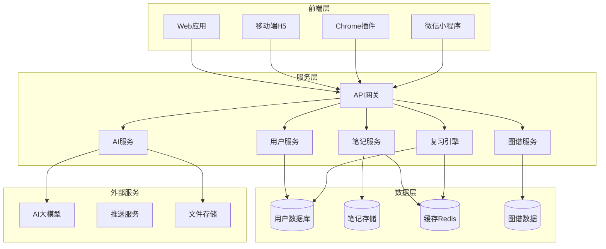
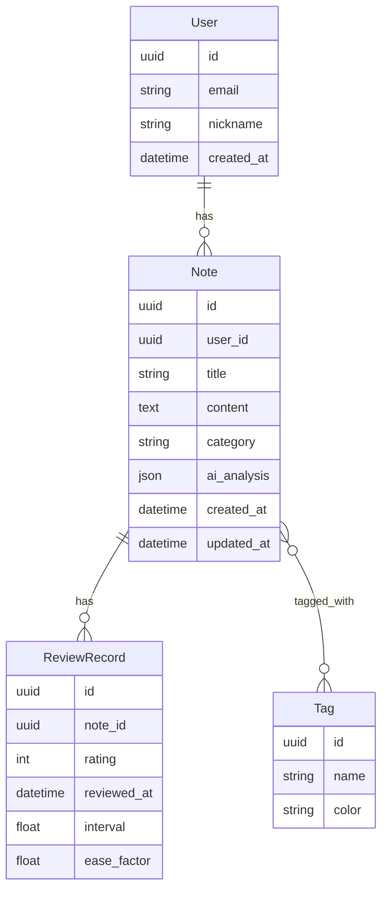
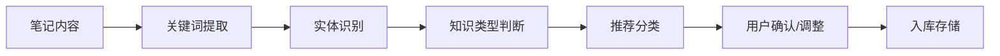

# 智能学习便签 - 技术架构文档

## 1. 架构设计



## 2. 技术选型

| 技术层级 | 技术方案 |
|---------|---------|
| 前端框架 | React 18 + TypeScript + TailwindCSS |
| 移动端 | React Native / 微信小程序 |
| 构建工具 | Vite |
| 后端框架 | Node.js + Express / NestJS |
| 数据库 | PostgreSQL (主数据) + MongoDB (笔记内容) |
| 缓存 | Redis (会话、复习队列) |
| AI服务 | OpenAI GPT-4 / 国产大模型API |
| 文件存储 | 阿里云OSS / 腾讯云COS |
| 推送服务 | 极光推送 / 个推 |

## 3. 路由定义

| 路由 | 用途 |
|-----|------|
| / | 首页仪表盘 |
| /notes | 笔记列表/知识库 |
| /notes/new | 新建笔记 |
| /notes/:id | 笔记详情 |
| /review | 复习中心 |
| /graph | 知识图谱 |
| /settings | 设置页 |

## 4. API设计

### 4.1 笔记相关API

```typescript
// 创建笔记
POST /api/notes
Request: {
  title: string,
  content: string,
  images?: string[],
  tags?: string[]
}
Response: {
  id: string,
  aiTags: string[],
  category: string,
  keywords: string[]
}

// 获取复习任务
GET /api/review/tasks
Response: {
  tasks: [{
    noteId: string,
    dueDate: string,
    interval: number,
    easeFactor: number
  }]
}

// 提交复习结果
POST /api/review/submit
Request: {
  noteId: string,
  rating: 1 | 2 | 3 | 4 | 5  // 1=完全忘记 5=轻松记住
}
```

### 4.2 数据模型



## 5. 核心算法

### 5.1 遗忘曲线复习算法 (SM-2变体)

```
初始间隔 = 1天
间隔倍数 = 2.5
难度系数 = 根据评分调整 (0.5-2.0)

当评分 >= 4:
    新间隔 = 旧间隔 * 间隔倍数 * 难度系数
    难度系数 = max(1.3, 难度系数 - 0.1)
当评分 < 3:
    新间隔 = 1天
    难度系数 = min(2.5, 难度系数 + 0.2)
```

### 5.2 AI笔记分类流程



## 6. 性能考量

- 前端：路由懒加载、组件虚拟化
- 后端：数据库索引优化、热点数据缓存
- AI：请求批处理、结果缓存
- 复习队列：Redis Sorted Set按时间排序
