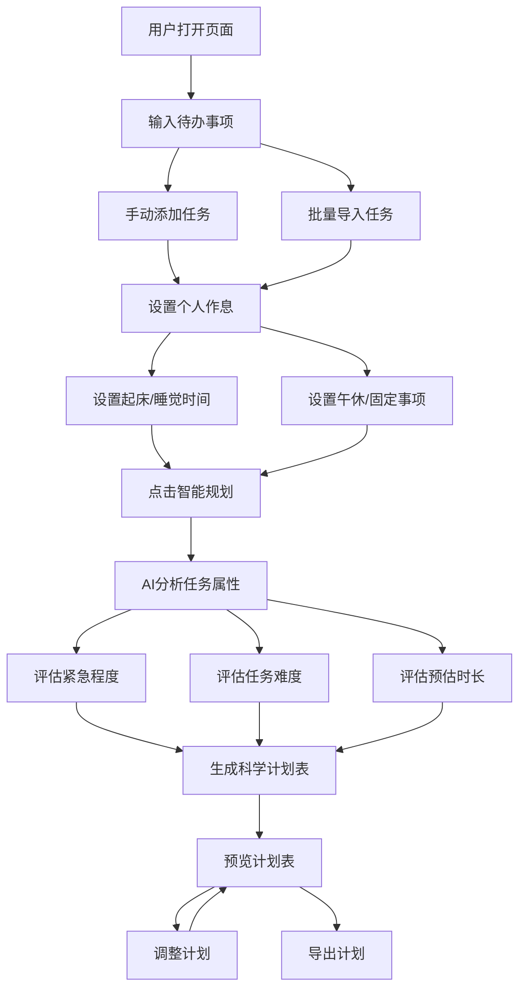

## 1. 产品概述

AI日程智能规划助手是一款轻量化在线规划工具，帮助用户告别时间管理混乱。用户只需输入待办事项和空闲时间段，AI自动根据任务难度、紧急程度、耗时长短，智能拆分任务、分配合理时间、区分优先级，生成可直接落地的个性化计划表。

- 解决学生、上班族时间管理混乱、任务优先级混乱、手动规划耗时且不科学的问题
- 目标用户：学生党、备考人群、加班上班族、时间管理困难人群

## 2. 核心功能

### 2.1 用户角色
| 角色 | 注册方式 | 核心权限 |
|------|----------|----------|
| 普通用户 | 无需注册 | 使用全部功能 |

### 2.2 功能模块
1. **首页（规划工作台）**：待办录入、作息设置、智能规划生成、计划表预览
2. **计划表详情页**：时间线视图、任务卡片、进度追踪、导出功能

### 2.3 页面详情
| 页面名称 | 模块名称 | 功能描述 |
|----------|----------|----------|
| 首页（规划工作台） | Hero区域 | 产品介绍、核心卖点展示、快速开始按钮 |
| 首页（规划工作台） | 待办录入区 | 手动添加待办事项（任务名、预估时长、紧急程度、难度）、批量导入、任务列表管理（增删改排序） |
| 首页（规划工作台） | 作息设置区 | 设置起床时间、睡觉时间、午休时段、固定事项（如上课、会议）、可用空闲时间段 |
| 首页（规划工作台） | 智能规划按钮 | 一键生成科学计划表，AI自动分配时间、区分优先级、合理安排休息 |
| 首页（规划工作台） | 计划表预览区 | 时间线视图展示当日计划，任务卡片含时间、任务名、优先级标签、进度条 |
| 计划表详情页 | 时间线视图 | 完整的24小时时间轴，任务块可视化展示，空闲时段标注 |
| 计划表详情页 | 任务详情卡片 | 任务名称、时间段、优先级、预估时长、备注、完成状态切换 |
| 计划表详情页 | 导出功能 | 导出为图片、复制为文本格式 |

## 3. 核心流程

用户打开页面 → 输入待办事项（手动/批量） → 设置个人作息时间 → 点击"智能规划" → AI根据任务属性和作息自动生成计划表 → 预览计划表 → 可调整/导出

## 4. 用户界面设计

### 4.1 设计风格
- 主色调：深蓝紫渐变（#4F46E5 → #7C3AED），传达智能、专业感
- 辅助色：琥珀色（#F59E0B）用于高优先级标注，翡翠绿（#10B981）用于完成状态
- 按钮风格：圆角胶囊按钮，带微妙阴影和hover动效
- 字体：标题使用 Noto Sans SC Bold，正文使用 Noto Sans SC Regular
- 布局风格：卡片式布局，左侧录入区+右侧预览区的双栏设计
- 图标风格：线性图标（Lucide Icons），简洁现代

### 4.2 页面设计概览
| 页面名称 | 模块名称 | UI元素 |
|----------|----------|--------|
| 首页 | Hero区域 | 渐变背景、大标题、副标题、CTA按钮、装饰性几何图形动画 |
| 首页 | 待办录入区 | 白色卡片、输入框组、优先级选择器（红/黄/绿标签）、任务列表、批量导入按钮 |
| 首页 | 作息设置区 | 时间选择器、固定事项标签、空闲时段滑块 |
| 首页 | 智能规划按钮 | 渐变主色按钮、脉冲动画、AI图标 |
| 首页 | 计划表预览区 | 垂直时间线、彩色任务块、优先级标签、时间标注 |
| 计划表详情页 | 时间线视图 | 全宽时间轴、任务块拖拽、空闲标注 |
| 计划表详情页 | 任务详情卡片 | 展开式卡片、状态切换、备注编辑 |
| 计划表详情页 | 导出功能 | 导出按钮组、格式选择 |

### 4.3 响应式设计
- 桌面优先设计，大屏双栏布局（录入+预览）
- 平板端单栏布局，上下排列
- 移动端适配，底部Tab切换录入和预览

### 4.4 3D场景指引
- 不适用
