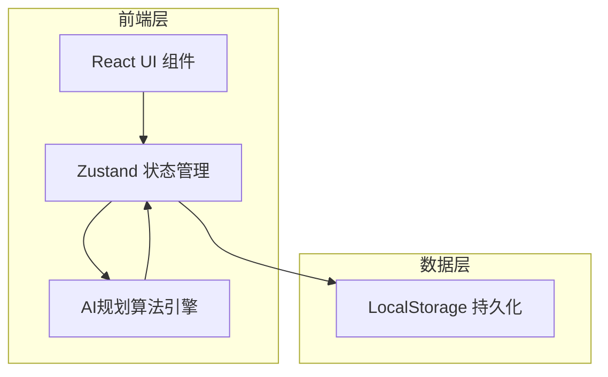
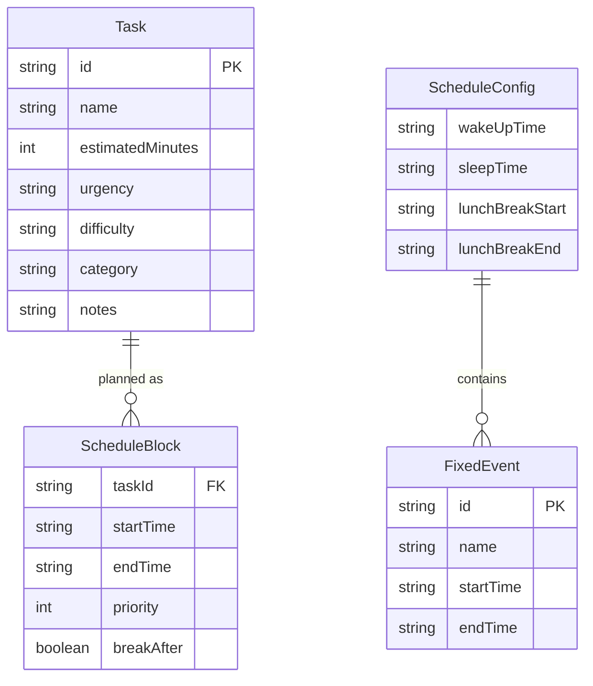

## 1. 架构设计



纯前端架构，无需后端服务。AI规划逻辑在前端实现，数据通过LocalStorage持久化。

## 2. 技术说明
- 前端：React@18 + Tailwind CSS@3 + Vite + TypeScript
- 初始化工具：vite-init
- 后端：无
- 数据库：无，使用LocalStorage持久化 + 内存状态管理

## 3. 路由定义
| 路由 | 用途 |
|------|------|
| / | 首页（规划工作台），包含待办录入、作息设置、智能规划、计划表预览 |
| /schedule/:id | 计划表详情页，展示完整时间线和任务详情 |

## 4. API定义
无后端API。AI规划算法在前端实现，核心算法接口：

```typescript
// 任务定义
interface Task {
  id: string;
  name: string;
  estimatedMinutes: number;  // 预估时长（分钟）
  urgency: 'high' | 'medium' | 'low';  // 紧急程度
  difficulty: 'hard' | 'medium' | 'easy';  // 难度
  category: string;  // 分类标签
  notes?: string;  // 备注
}

// 作息设置
interface ScheduleConfig {
  wakeUpTime: string;  // 起床时间
  sleepTime: string;  // 睡觉时间
  lunchBreak: { start: string; end: string };  // 午休
  fixedEvents: Array<{ name: string; start: string; end: string }>;  // 固定事项
}

// 规划结果
interface ScheduleBlock {
  taskId: string;
  startTime: string;
  endTime: string;
  priority: number;  // 1-3, 1最高
  breakAfter: boolean;  // 是否安排休息
}

// AI规划函数
function generateSchedule(tasks: Task[], config: ScheduleConfig): ScheduleBlock[]
```

## 5. 服务端架构图
不适用（纯前端项目）

## 6. 数据模型

### 6.1 数据模型定义



### 6.2 数据定义语言
使用LocalStorage存储，数据结构为JSON格式：

```json
{
  "tasks": [
    {
      "id": "task_1",
      "name": "完成数学作业",
      "estimatedMinutes": 90,
      "urgency": "high",
      "difficulty": "hard",
      "category": "学习",
      "notes": "第三章习题"
    }
  ],
  "scheduleConfig": {
    "wakeUpTime": "07:00",
    "sleepTime": "23:00",
    "lunchBreak": { "start": "12:00", "end": "13:30" },
    "fixedEvents": [
      { "id": "fe_1", "name": "上课", "start": "08:00", "end": "11:40" }
    ]
  },
  "scheduleBlocks": [
    {
      "taskId": "task_1",
      "startTime": "14:00",
      "endTime": "15:30",
      "priority": 1,
      "breakAfter": true
    }
  ]
}
```
