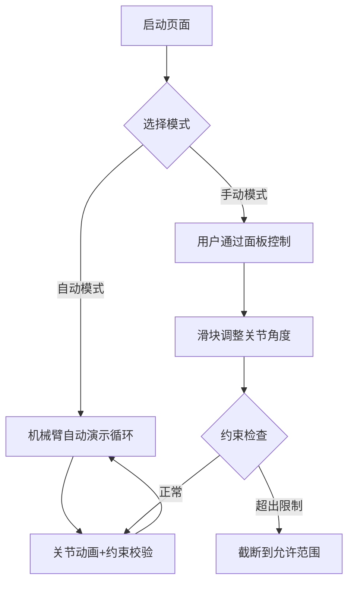

# 3D机械臂控制系统 - 产品需求文档

## 1. 产品概述

一个具有工业美学的3D机械臂可视化交互系统，用户可以观看机械臂自动执行连续动作，也可以通过控制面板手动控制每个关节的自由度，关节带有物理约束限制。

- 为机械爱好者、科技演示、教育培训等场景提供沉浸式交互体验
- 目标用户：机械爱好者、学生、教师、科技演示场景

## 2. 核心功能

### 2.1 功能模块

1. **3D机械臂展示**
   - 使用Three.js渲染的工业机械臂模型
   - 包含：底座、肩部关节（大臂）、肘部关节（小臂）、腕部关节、末端夹爪
   - 金属质感材质，工业风格设计

2. **自动演示模式**
   - 机械臂自动执行连续动作循环
   - 包含：归位、举起、伸展、抓取、下放等基础动作
   - 平滑的关节动画过渡

3. **控制面板**
   - 4个关节的独立控制滑块（肩部、肘部、腕部旋转、腕部俯仰）
   - 夹爪开合控制
   - 预设动作快捷按钮：归位、举起、伸展、抓取、下放
   - 自动/手动模式切换开关

## 3. 核心流程

## 4. 关节约束定义

| 关节 | 轴向 | 最小角度 | 最大角度 |
|------|------|----------|----------|
| 肩部旋转 | Y轴 | -90° | +90° |
| 肩部俯仰 | Z轴 | -30° | +120° |
| 肘部弯曲 | Z轴 | 0° | +150° |
| 腕部旋转 | Y轴 | -90° | +90° |
| 腕部俯仰 | Z轴 | -45° | +45° |
| 夹爪开合 | - | 0° | 45° |

## 5. 用户界面设计

### 5.1 设计风格

- **主色调**: 深空灰 #1a1a2e 配合科技蓝 #00d4ff
- **强调色**: 能量橙 #ff6b35
- **按钮风格**: 玻璃拟态效果，圆角12px，带发光边框
- **字体**: Orbitron (标题) + Rajdhani (正文)
- **布局**: 左侧3D场景占70%，右侧控制面板占30%

### 5.2 页面设计

| 区域 | 模块名称 | UI元素 |
|------|----------|--------|
| 左侧 | 3D场景 | Three.js画布，机械臂模型，轨道控制器 |
| 右侧 | 控制面板 | 模式切换、5组滑块、5个预设按钮 |
