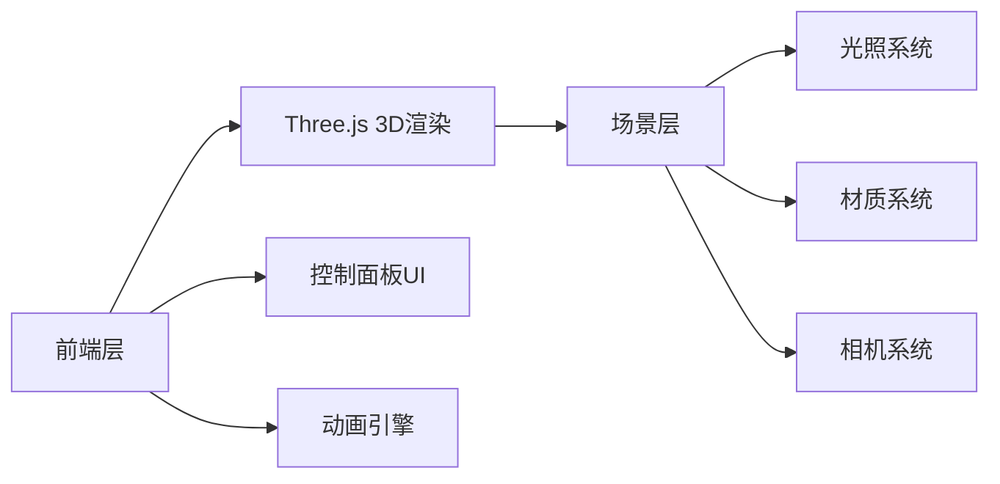

# 3D机械臂控制系统 - 技术架构文档

## 1. 架构设计



## 2. 技术选型

- **前端**: 纯HTML5 + CSS3 + JavaScript（单文件）
- **3D引擎**: Three.js (CDN引入)
- **动画库**: TWEEN.js (CDN引入)
- **控制**: 轨道控制器 (OrbitControls)
- **无后端**: 纯前端单文件应用

## 3. 模块结构

| 模块 | 功能 |
|------|------|
| ArmModel | 机械臂3D模型构建（底座+肩部+肘部+腕部+夹爪） |
| JointController | 关节角度控制与约束校验 |
| ControlPanel | UI控制面板生成与事件处理 |
| AutoDemo | 自动演示动作序列 |
| SceneManager | Three.js场景、光照、相机管理 |

## 4. 3D模型规格

### 机械臂结构
- **底座**: CylinderGeometry r=40, h=20 + BoxDecoration
- **肩部组件**: BoxGeometry 30×80×30
- **大臂**: CylinderGeometry r=15, h=120
- **肘部组件**: SphereGeometry r=20
- **小臂**: CylinderGeometry r=12, h=100
- **腕部组件**: BoxGeometry 25×25×25
- **夹爪**: 2× BoxGeometry 8×40×5

### 材质
- 主体: MeshStandardMaterial 金属灰 #888888, metalness: 0.8, roughness: 0.3
- 关节: MeshStandardMaterial 深灰 #444444, metalness: 0.9, roughness: 0.2
- 指示灯: MeshStandardMaterial + emissive 科技蓝

## 5. 关节约束规格

```javascript
const JOINT_LIMITS = {
    shoulderRotation: { min: -90, max: 90 },    // Y轴
    shoulderPitch: { min: -30, max: 120 },       // Z轴
    elbowBend: { min: 0, max: 150 },            // Z轴
    wristRotation: { min: -90, max: 90 },       // Y轴
    wristPitch: { min: -45, max: 45 },          // Z轴
    gripperOpen: { min: 0, max: 45 }            // 夹爪
};
```

## 6. 预设动作定义

| 动作 | 肩部旋转 | 肩部俯仰 | 肘部弯曲 | 腕部旋转 | 腕部俯仰 | 夹爪 |
|------|----------|----------|----------|----------|----------|------|
| 归位 | 0° | 0° | 0° | 0° | 0° | 0° |
| 举起 | 0° | 90° | 45° | 0° | 0° | 0° |
| 伸展 | 0° | 30° | 120° | 0° | 0° | 0° |
| 抓取 | 30° | 60° | 90° | 0° | 0° | 45° |
| 下放 | 30° | 30° | 60° | 0° | 30° | 45° |

## 7. 自动演示序列

每4秒切换一个动作，无限循环：
归位 → 举起 → 伸展 → 抓取 → 下放 → 归位...
