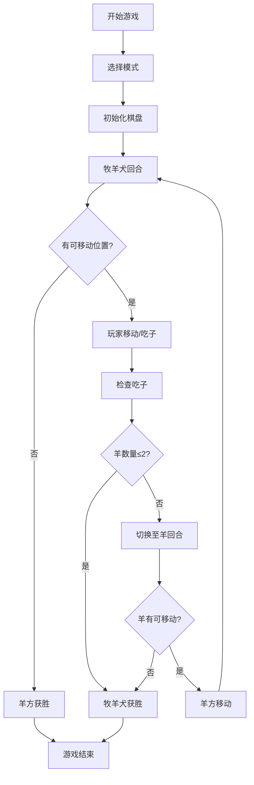

## 1. 产品概述

一款像素风双人对战/AI 对战棋类游戏《牧羊犬与羊》。游戏基于经典虎羊棋玩法改编，将"虎"替换为"牧羊犬"，24只羊对抗2只牧羊犬。玩家通过策略移动和跳跃吃子，体验清新复古的像素风格棋盘对战。

## 2. 核心功能

### 2.1 用户角色
| 角色 | 说明 | 核心权限 |
|------|------|----------|
| 玩家1 | 牧羊犬方 | 控制2只牧羊犬棋子 |
| 玩家2/AI | 羊群方 | 控制24只羊棋子 |

### 2.2 功能模块
1. **主菜单页面**: 游戏标题、模式选择（双人对战/AI对战）、游戏规则说明
2. **游戏对战页面**: 像素风棋盘、棋子动画、回合指示、胜负判定
3. **游戏结束页面**: 胜负结果展示、重新开始/返回菜单

### 2.3 页面详情
| 页面名称 | 模块名称 | 功能描述 |
|----------|----------|----------|
| 主菜单 | 标题区域 | 像素风游戏标题动画展示 |
| 主菜单 | 模式选择 | 双人对战、人机对战按钮 |
| 主菜单 | 规则说明 | 游戏规则弹窗/面板 |
| 游戏页面 | 棋盘区域 | 5x5像素风格棋盘，包含特殊点位 |
| 游戏页面 | 棋子区域 | 牧羊犬(2只)和羊(24只)像素棋子 |
| 游戏页面 | UI状态栏 | 当前回合、剩余棋子数、提示信息 |
| 结束页面 | 结果展示 | 获胜方动画、重新开始选项 |

## 3. 核心流程

### 3.1 游戏流程
玩家进入游戏 → 选择对战模式 → 进入棋盘 → 牧羊犬方先手 → 双方轮流移动 → 触发吃子判定 → 达到胜利条件 → 展示结果

### 3.2 吃子规则
- 牧羊犬移动时，若跳过相邻的羊到达空位，则吃掉该羊
- 羊无法吃子，只能通过围堵策略让牧羊犬无法移动来获胜
- 羊的获胜条件：使所有牧羊犬无法移动（围困）
- 牧羊犬获胜条件：吃掉足够多的羊使羊方无法围困（羊剩余≤2只）

## 4. 用户界面设计

### 4.1 设计风格
- **主题**: 复古像素风 + 清新田园配色
- **主色调**: 草绿色(#7CB342)为底，天空蓝(#87CEEB)为辅
- **棋盘**: 木质棕色(#8D6E63)边框，浅草绿(#A5D6A7)格子
- **棋子**: 
  - 牧羊犬: 棕黄色像素狗头，带项圈
  - 羊: 白色像素羊毛球，黑色小眼睛
- **字体**: 像素风格字体（Press Start 2P 或类似）
- **动画**: 棋子移动跳跃动画、吃子消散粒子效果、胜利庆祝动画
- **布局**: 居中棋盘，两侧状态面板，顶部回合指示器

### 4.2 页面设计概览
| 页面 | 模块 | UI元素 |
|------|------|--------|
| 主菜单 | 背景 | 像素风牧场场景，飘动的云朵 |
| 主菜单 | 标题 | 大号像素字体，上下浮动动画 |
| 主菜单 | 按钮 | 3D像素按钮，hover时凹陷效果 |
| 游戏页 | 棋盘 | 5x5格子，交叉线连接，中心特殊标记 |
| 游戏页 | 棋子 | 32x32像素精灵，选中时高亮边框 |
| 游戏页 | 状态栏 | 像素图标+文字显示当前回合和棋子数 |
| 结束页 | 结果 | 大幅像素字体，背景撒花/星星粒子 |

### 4.3 响应式设计
- 桌面端优先设计，棋盘固定大小
- 移动端自适应缩放，保持棋盘比例
- 触摸友好的棋子选中/移动交互

## 5. 游戏玩法设计

### 5.1 棋盘布局
- 5x5方格棋盘，共25个交叉点
- 牧羊犬初始位置：左上角和右上角（或底部两角）
- 羊初始位置：剩余23个点位（除中心点外）
- 中心点为特殊"羊圈"点

### 5.2 移动规则
- 每次只能沿横/竖/斜线移动一格到相邻空位
- 牧羊犬可以跳过相邻的羊进行吃子（类似跳棋）
- 羊只能移动，不能吃子
- 必须移动，不能跳过回合

### 5.3 胜利条件
- **羊方胜利**: 两只牧羊犬都被围困，无合法移动位置
- **牧羊犬胜利**: 羊的数量减少至2只或以下，无法形成围困

## 6. 素材方案

### 6.1 像素素材规格
- 棋子大小: 32x32 像素
- 棋盘格子: 64x64 像素
- 颜色深度: 限制调色板（8-16色）

### 6.2 素材清单
| 素材名称 | 描述 | 尺寸 |
|----------|------|------|
| 牧羊犬棋子 | 棕黄色像素狗，四方向 | 32x32 |
| 羊棋子 | 白色像素绵羊，四方向 | 32x32 |
| 棋盘格子 | 草地纹理 | 64x64 |
| 棋盘边框 | 木质纹理 | 可变 |
| 选中标记 | 黄色高亮框 | 32x32 |
| 可移动标记 | 半透明圆点 | 16x16 |
| 吃子特效 | 星星/粒子 | 16x16 |
| 背景 | 牧场风景 | 全屏 |
