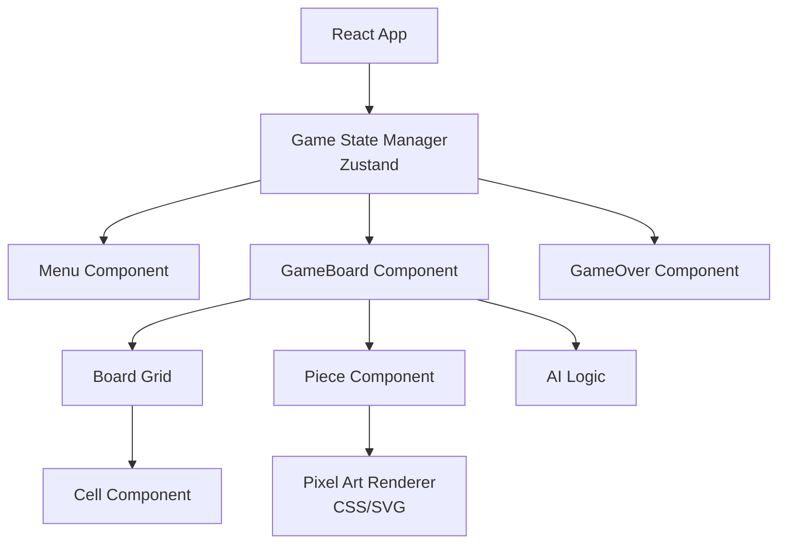

## 1. 架构设计



## 2. 技术描述

- **前端**: React@18 + TypeScript + TailwindCSS + Vite
- **状态管理**: Zustand（管理游戏状态、棋盘数据、回合信息）
- **动画**: CSS动画 + Web Animations API（棋子移动、吃子特效）
- **像素渲染**: CSS pixel-art 风格（box-shadow 像素画或 SVG sprite）
- **AI算法**: Minimax + Alpha-Beta 剪枝（评估函数基于 Mobility 和 Material）

## 3. 路由定义

| 路由 | 用途 |
|------|------|
| / | 主菜单页面 |
| /game | 游戏对战页面 |

## 4. 数据模型

### 4.1 核心类型定义

```typescript
// 棋子类型
type PieceType = 'dog' | 'sheep';

// 棋子位置
interface Position {
  row: number;
  col: number;
}

// 棋子对象
interface Piece {
  id: string;
  type: PieceType;
  position: Position;
}

// 游戏状态
type GamePhase = 'menu' | 'playing' | 'gameover';
type GameMode = 'pvp' | 'pve';
type Player = 'dog' | 'sheep';

interface GameState {
  phase: GamePhase;
  mode: GameMode;
  currentPlayer: Player;
  board: (Piece | null)[][];
  selectedPiece: Piece | null;
  validMoves: Position[];
  dogCount: number;
  sheepCount: number;
  winner: Player | null;
  moveHistory: Move[];
}

// 移动记录
interface Move {
  piece: Piece;
  from: Position;
  to: Position;
  captured?: Piece;
}
```

### 4.2 游戏状态管理 (Zustand Store)

```typescript
interface GameStore {
  // 状态
  phase: GamePhase;
  mode: GameMode;
  currentPlayer: Player;
  board: (Piece | null)[][];
  selectedPiece: Piece | null;
  validMoves: Position[];
  winner: Player | null;
  
  // 动作
  startGame: (mode: GameMode) => void;
  selectPiece: (piece: Piece) => void;
  movePiece: (to: Position) => void;
  resetGame: () => void;
  backToMenu: () => void;
}
```

## 5. 组件架构

### 5.1 组件清单

| 组件 | 职责 | 文件 |
|------|------|------|
| App | 路由切换、全局样式 | App.tsx |
| MenuPage | 主菜单、模式选择 | pages/MenuPage.tsx |
| GamePage | 游戏主容器 | pages/GamePage.tsx |
| GameBoard | 棋盘渲染、点击处理 | components/GameBoard.tsx |
| BoardCell | 单个格子渲染 | components/BoardCell.tsx |
| Piece | 棋子渲染、选中状态 | components/Piece.tsx |
| GameStatus | 状态栏、回合指示 | components/GameStatus.tsx |
| GameOverModal | 结束弹窗 | components/GameOverModal.tsx |
| PixelButton | 像素风格按钮 | components/PixelButton.tsx |
| ParticleEffect | 吃子粒子特效 | components/ParticleEffect.tsx |

### 5.2 AI 模块

```typescript
// AI 接口
interface AIEngine {
  getBestMove(board: Board, player: Player): Move;
}

// Minimax + Alpha-Beta
class SheepAI implements AIEngine {
  private maxDepth = 3;
  
  evaluate(board: Board): number {
    // 评估函数：羊方希望围困牧羊犬，牧羊犬希望吃羊
    const sheepMobility = this.calculateMobility(board, 'sheep');
    const dogMobility = this.calculateMobility(board, 'dog');
    const material = board.sheepCount * 10 - board.dogCount * 50;
    return sheepMobility - dogMobility * 2 + material;
  }
  
  minimax(board: Board, depth: number, alpha: number, beta: number, maximizing: boolean): number;
}
```

## 6. 游戏逻辑

### 6.1 棋盘表示
- 5x5 二维数组，每个元素为 Piece | null
- 索引范围: row 0-4, col 0-4

### 6.2 移动验证
```typescript
function getValidMoves(board: Board, piece: Piece): Position[] {
  const moves: Position[] = [];
  const directions = [
    [-1,-1], [-1,0], [-1,1],
    [0,-1],          [0,1],
    [1,-1],  [1,0],  [1,1]
  ];
  
  for (const [dr, dc] of directions) {
    const newRow = piece.position.row + dr;
    const newCol = piece.position.col + dc;
    
    // 检查边界和空位
    if (isValidPosition(newRow, newCol) && board[newRow][newCol] === null) {
      moves.push({ row: newRow, col: newCol });
    }
    
    // 牧羊犬吃子：跳过相邻羊
    if (piece.type === 'dog') {
      const jumpRow = piece.position.row + dr * 2;
      const jumpCol = piece.position.col + dc * 2;
      const midPiece = board[piece.position.row + dr][piece.position.col + dc];
      
      if (midPiece?.type === 'sheep' && 
          isValidPosition(jumpRow, jumpCol) && 
          board[jumpRow][jumpCol] === null) {
        moves.push({ row: jumpRow, col: jumpCol, capture: midPiece });
      }
    }
  }
  
  return moves;
}
```

### 6.3 胜负判定
```typescript
function checkWinner(board: Board, currentPlayer: Player): Player | null {
  // 牧羊犬胜利：羊数量 <= 2
  if (board.sheepCount <= 2) return 'dog';
  
  // 羊方胜利：牧羊犬无合法移动
  const dogs = board.getPieces('dog');
  for (const dog of dogs) {
    if (getValidMoves(board, dog).length > 0) {
      return null; // 至少一只牧羊犬可以移动
    }
  }
  
  // 所有牧羊犬都被围困
  return 'sheep';
}
```

## 7. 像素艺术渲染方案

### 7.1 CSS Pixel Art 实现
使用 box-shadow 技术绘制 32x32 像素精灵：

```css
.pixel-dog {
  width: 4px;
  height: 4px;
  box-shadow: 
    8px 0 #8B4513, 9px 0 #8B4513,
    7px 1px #8B4513, 8px 1px #D2691E, ...;
  transform: scale(4);
  image-rendering: pixelated;
}
```

### 7.2 替代方案：SVG Sprite
使用 SVG 绘制像素风格图标，支持缩放不失真：

```svg
<svg viewBox="0 0 32 32">
  <rect x="8" y="4" width="4" height="4" fill="#8B4513"/>
  <!-- 更多像素块 -->
</svg>
```

## 8. 动画设计

| 动画 | 实现方式 | 触发条件 |
|------|----------|----------|
| 棋子移动 | CSS transform + transition | 玩家点击目标位置 |
| 选中高亮 | CSS border + animation pulse | 点击棋子 |
| 吃子消散 | CSS opacity + scale fade | 吃子判定成功 |
| 粒子特效 | Web Animations API | 吃子/胜利时 |
| 标题浮动 | CSS @keyframes bounce | 菜单页面持续 |
| 按钮按压 | CSS transform: translateY | hover/active |
