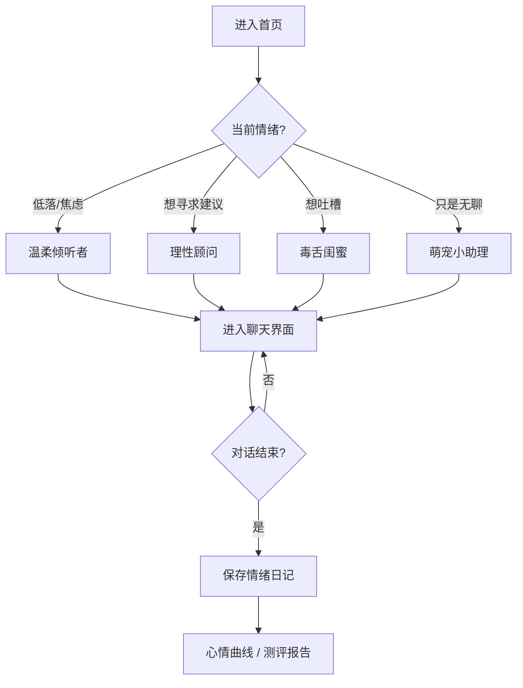

## 1. 产品概述

**心屿 MindIsland** 是一款面向都市年轻人的 AI 情感陪聊 Web 产品，以"心灵树洞"为核心隐喻，通过多人格 AI 角色、共情对话、情绪日记与呼吸冥想功能，为用户提供一个 24 小时在线、私密安全的情绪出口。

- **目标用户**：18–35 岁学生党、职场新人、独居青年，处于情绪低落、孤独、焦虑状态却不便向身边人倾诉的人群
- **核心价值**：社会价值（情绪疏解、心理健康）+ 商业价值（订阅制人格、B 端 EAP 合作）+ 效率价值（即时情绪干预）
- **产品形态**：桌面端 Web 应用（响应式适配移动端）

---

## 2. 核心功能

### 2.1 用户角色
| 角色 | 注册方式 | 核心权限 |
|------|----------|----------|
| 游客用户 | 免注册 | 体验 3 次对话，浏览公开人格 |
| 注册用户 | 邮箱/手机号登录 | 无限对话、情绪日记、历史记录、多人格订阅 |
| 付费用户 | 会员订阅 | 解锁高级人格、情绪报告、AI 心理测评 |

### 2.2 功能模块
1. **首页（Landing）**：产品介绍、情绪引导 CTA、热门人格推荐、呼吸冥想引导
2. **聊天界面（Chat）**：多轮对话、打字动画、情绪标签、对话气泡、快捷键、语音输入
3. **人格选择页（Personalities）**：不同 AI 人格卡片（温柔倾听者 / 理性顾问 / 毒舌闺蜜 / 萌宠小助理 / 心理咨询师）
4. **情绪日记（Diary）**：每日情绪打卡、心情曲线、情绪关键词云、历史对话回顾
5. **心理测评（Assessment）**：PHQ-9 抑郁自评、GAD-7 焦虑自评、AI 生成解读报告
6. **呼吸冥想（Breathing）**：4-7-8 呼吸法可视化引导、白噪音、定时提醒
7. **个人中心（Profile）**：账户信息、会员状态、隐私设置、对话导出

### 2.3 页面详情
| 页面名称 | 模块名称 | 功能描述 |
|----------|----------|----------|
| 首页 | Hero 情绪引导 | 根据时间段（早/中/晚）展示不同问候语与引导入口 |
| 首页 | 热门人格 | 轮播展示 5 个 AI 人格卡片，点击即可进入对话 |
| 首页 | 呼吸引导 | 可视化呼吸圈 + 4-7-8 节拍提示 |
| 聊天页 | 对话气泡 | 用户/AI 消息分列、支持 Markdown、打字中动画 |
| 聊天页 | 情绪标签 | 对话中可标记情绪（开心/难过/愤怒/平静/焦虑） |
| 聊天页 | 快捷回复 | AI 提供 3 个追问建议按钮，降低输入门槛 |
| 人格页 | 人格卡片 | 头像 + 简介 + 标签 + "开始对话"按钮 |
| 日记页 | 心情曲线 | 近 30 天情绪分值折线图 |
| 测评页 | 测评量表 | PHQ-9 / GAD-7 在线作答，AI 自动生成解读 |

---

## 3. 核心流程

用户进入首页 → 选择情绪引导入口 → 选择 AI 人格 → 进入对话界面 → 与 AI 多轮对话 → 对话结束后保存情绪日记 → 查看心情曲线 / 心理测评 → 完成情绪疏解

---

## 4. 用户界面设计

### 4.1 设计风格
- **主色调**：深夜蓝紫渐变（`#1a1640` → `#2d1b69` → `#4a2c7a`）+ 星光点缀，营造"静谧、私密、被理解"的氛围
- **强调色**：温柔粉 `#ff85a2`、薄荷绿 `#7ee7c8`、暖金 `#ffd166`
- **按钮风格**：胶囊圆角 + 柔光阴影 + hover 微发光
- **字体**：标题使用 `Noto Serif SC`（优雅衬线），正文使用 `PingFang SC` / `HarmonyOS Sans`
- **布局**：左侧导航栏 + 主内容区 + 顶栏，三栏布局
- **图标风格**：线性图标 + Emoji 组合，人格头像使用渐变插画
- **动效**：页面进入采用 fade-up，对话气泡逐个出现，打字动画使用三点跳动

### 4.2 页面设计概览
| 页面名称 | 模块名称 | UI 元素 |
|----------|----------|---------|
| 首页 | Hero | 星空渐变背景、浮动光斑、动态情绪引导语 |
| 人格页 | 人格卡片 | 渐变头像、emoji 标签、悬停微动效 |
| 聊天页 | 对话区 | 暗色气泡 + 用户亮色气泡、打字动画、时间戳 |
| 日记页 | 心情曲线 | 折线图 + 情绪点高亮 + 关键词云 |
| 冥想页 | 呼吸引导 | 圆形呼吸圈、节拍数字、白噪音开关 |

### 4.3 响应式
- 桌面优先（1440px 主设计稿）
- 平板（≥ 768px）：侧边栏折叠为图标
- 移动端（< 768px）：单栏布局，底部 Tab 导航

### 4.4 视觉氛围
- 背景：深夜星空渐变 + 漂浮粒子 + 柔和噪点
- 氛围光：页面四角柔光渐变，营造"独自在夜晚被陪伴"的安全感
