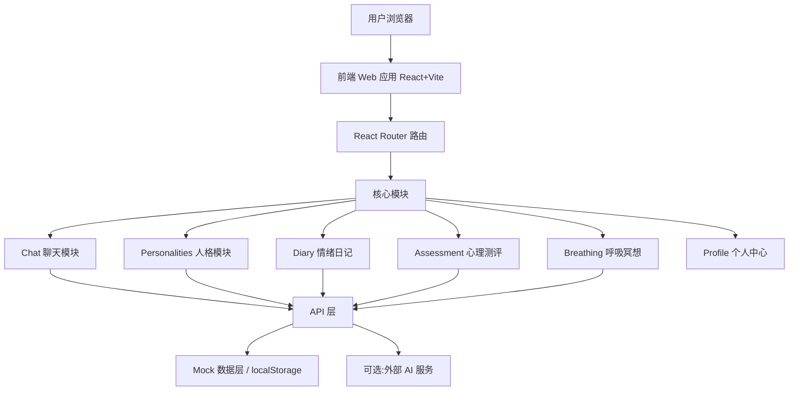

## 1. 架构设计



## 2. 技术说明

- **前端**：React 18 + TypeScript + Vite 5
- **样式**：Tailwind CSS 3 + 自定义 CSS 变量主题 + Framer Motion 动效
- **状态管理**：Zustand
- **路由**：React Router 6
- **图表**：Recharts（情绪曲线）
- **图标**：Lucide React
- **后端**：无（纯前端 Demo，使用 localStorage 存储对话与日记）
- **数据**：Mock 数据 + localStorage 持久化

## 3. 路由定义

| 路由 | 用途 |
|------|------|
| `/` | 首页：Hero 情绪引导 + 热门人格 + 呼吸冥想 |
| `/chat/:id` | 对话页：根据人格 ID 进入不同 AI 对话 |
| `/personalities` | 人格选择页 |
| `/diary` | 情绪日记 + 心情曲线 |
| `/assessment` | 心理测评 |
| `/breathing` | 呼吸冥想 |
| `/profile` | 个人中心 |

## 4. 数据模型（Mock）

### 4.1 人格（Personality）
```ts
interface Personality {
  id: string;
  name: string;
  avatar: string;       // emoji 或渐变色
  tag: string;          // 标签，如「温柔倾听者」
  description: string;  // 一句话介绍
  systemPrompt: string; // AI 人设 prompt
  greeting: string;     // 开场白
  color: string;        // 主题色
}
```

### 4.2 对话消息（Message）
```ts
interface Message {
  id: string;
  role: 'user' | 'ai' | 'system';
  content: string;
  timestamp: number;
  emotion?: EmotionTag;
}

type EmotionTag = 'happy' | 'sad' | 'angry' | 'calm' | 'anxious' | 'confused';
```

### 4.3 会话（Conversation）
```ts
interface Conversation {
  id: string;
  personalityId: string;
  messages: Message[];
  createdAt: number;
  updatedAt: number;
  summary?: string; // AI 对话摘要
}
```

### 4.4 情绪日记（DiaryEntry）
```ts
interface DiaryEntry {
  id: string;
  date: string;           // YYYY-MM-DD
  emotionScore: number;   // 1-5
  keywords: string[];
  note?: string;
  conversationId?: string;
}
```

## 5. 组件结构

```
src/
├── components/
│   ├── Layout/          # 主布局、Sidebar、TopBar
│   ├── Home/            # Hero、PersonalityShowcase、BreathingWidget
│   ├── Chat/            # ChatBubble、ChatInput、TypingIndicator、EmotionTag
│   ├── Personality/    # PersonalityCard、PersonalityGrid
│   ├── Diary/           # MoodChart、KeywordCloud、DiaryList
│   ├── Assessment/     # QuizCard、QuizResult
│   ├── Breathing/       # BreathingCircle、NoiseSelector
│   └── Profile/        # ProfileCard、PrivacySettings
├── pages/               # 路由页面
├── store/               # Zustand stores
├── data/                # Mock 数据（personalities.ts、mockReplies.ts）
└── utils/               # 工具函数
```

## 6. Mock AI 回复策略

由于不依赖真实 LLM，使用预设回复池 + 关键词匹配策略：
- 为每个人格准备 20+ 条开场白、追问、共情回复
- 根据用户输入中的关键词（如"难过""压力""朋友"）匹配对应回复模板
- 随机选择并拼接，保证对话有一定随机性
- 打字动画模拟真实思考过程（800–2000ms 延迟）
