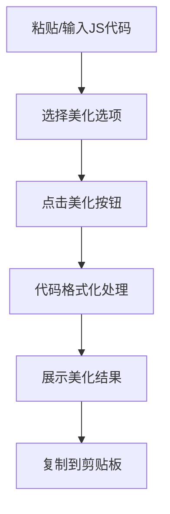

# JS 美颜师 - 产品需求文档

## 1. 产品概述

一个在线 JavaScript 代码美化工具，帮助开发者一键格式化、规范化 JavaScript 代码，提升代码可读性和协作效率。

- 主要目的：解决 JavaScript 代码格式混乱、风格不统一的问题
- 目标用户：前端开发者、JavaScript 学习者、代码审查人员
- 核心价值：提升开发效率，推广代码规范

## 2. 核心功能

### 2.1 用户角色

| 角色 | 使用方式 | 核心权限 |
|------|---------|---------|
| 普通用户 | 直接使用 | 输入代码、美化输出、复制结果 |

### 2.2 功能模块

1. **主页**：代码输入区、美化选项区、美化结果展示区、复制功能

### 2.3 页面详情

| 页面名称 | 模块名称 | 功能描述 |
|---------|---------|---------|
| 主页 | 代码输入区 | 支持粘贴或输入 JavaScript 代码，带语法高亮 |
| 主页 | 美化选项区 | 可选择缩进风格（空格/tab）、引号类型、分号策略 |
| 主页 | 美化结果区 | 展示美化后的代码，带语法高亮 |
| 主页 | 操作按钮 | 一键美化、复制结果、清空重置 |

## 3. 核心流程

用户粘贴杂乱代码 → 选择美化选项 → 点击美化按钮 → 生成规范代码 → 一键复制

## 4. 用户界面设计

### 4.1 设计风格

- **主题**：深色系代码编辑器风格，护眼且专业
- **主色调**：深灰背景 #1e1e1e，配合亮色代码高亮
- **强调色**：蓝色 #007acc 用于按钮和交互元素
- **字体**：JetBrains Mono（代码），思源黑体（界面文字）
- **布局**：左右分栏，左侧输入右侧输出，顶部工具栏

### 4.2 页面设计概览

| 页面名称 | 模块名称 | UI 元素 |
|---------|---------|---------|
| 主页 | 顶部工具栏 | Logo、标题、美化选项下拉 |
| 主页 | 左侧代码区 | textarea 深色背景，代码字体 |
| 主页 | 右侧结果区 | 只读展示区，语法高亮 |
| 主页 | 底部操作栏 | 美化按钮、复制按钮、清空按钮 |

### 4.3 响应式设计

- 桌面端：左右并排布局
- 移动端：上下堆叠布局，代码区域全宽

### 4.4 交互效果

- 按钮悬停：轻微上浮 + 发光效果
- 美化成功：结果区淡入动画
- 复制成功：按钮文字变为"已复制"提示
