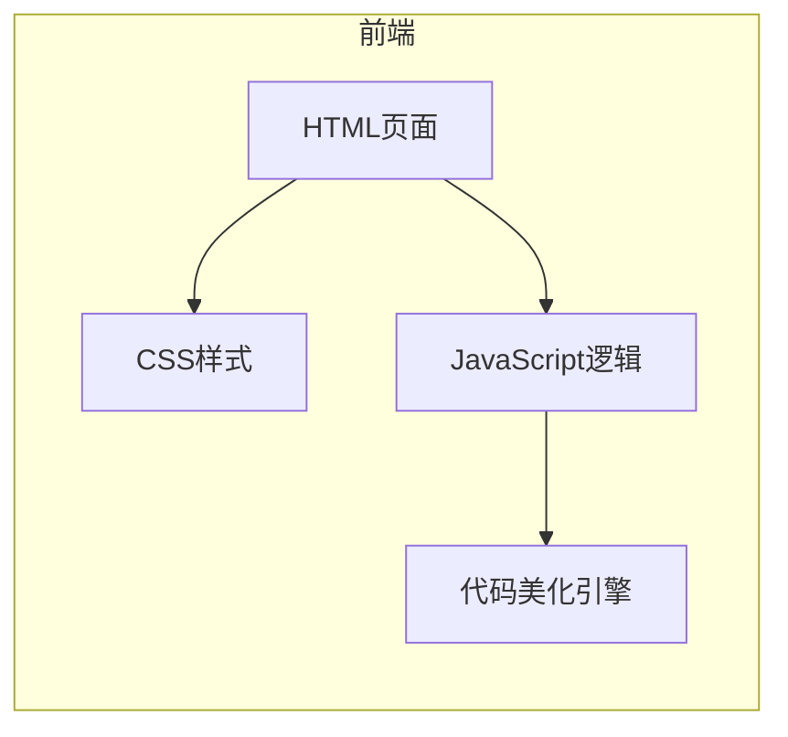

# JS 美颜师 - 技术架构文档

## 1. 架构设计



## 2. 技术选型

- **前端**：纯 HTML + CSS + JavaScript（无框架依赖）
- **代码美化**：使用原生 JS 实现词法解析和格式化
- **样式**：自定义 CSS，响应式设计
- **图标**：内联 SVG 图标

## 3. 路由定义

单页应用，无需路由。

## 4. 文件结构

```
index.html    - 主页面，包含所有 HTML、CSS、JS 代码
```

## 5. 代码美化算法设计

### 5.1 美化规则

1. **缩进**：支持 2/4 空格或 Tab
2. **引号**：统一使用单引号或双引号
3. **分号**：可选添加或移除语句末尾分号
4. **花括号**：可选将开括号放置在同一行或新行
5. **空行**：在逻辑块之间添加空行

### 5.2 实现方式

- 使用正则表达式和字符串处理进行代码解析
- 保留注释不变
- 处理嵌套结构和多行字符串
