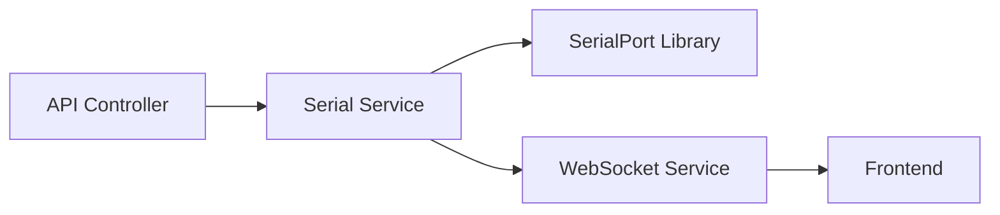

## 1. Architecture Design
```mermaid
graph TB
    subgraph Frontend["前端 (React)"]
        A[主页面组件]
        B[串口控制组件]
        C[数据显示组件]
        D[JSON表格组件]
        E[状态管理 (Zustand)]
    end
    
    subgraph Backend["后端 (Express)"]
        F[串口API控制器]
        G[串口服务]
        H[WebSocket服务]
    end
    
    subgraph Hardware["硬件"]
        I[串口设备]
    end
    
    A --> B
    A --> C
    A --> D
    B --> E
    C --> E
    D --> E
    E <--> F
    F --> G
    G <--> H
    G <--> I
```

## 2. Technology Description
- Frontend: React@18 + TypeScript + tailwindcss@3 + vite + zustand + lucide-react
- Initialization Tool: vite-init
- Backend: Express@4 + TypeScript + serialport
- Database: 无需数据库

## 3. Route Definitions
| Route | Purpose |
|-------|---------|
| / | 主页面 |
| /api/serial/ports | 获取可用串口列表 |
| /api/serial/connect | 连接串口 |
| /api/serial/disconnect | 断开串口 |
| /ws | WebSocket 实时数据推送 |

## 4. API Definitions

### 类型定义
```typescript
// 串口信息
interface SerialPortInfo {
  path: string;
  manufacturer?: string;
  serialNumber?: string;
  pnpId?: string;
  locationId?: string;
  vendorId?: string;
  productId?: string;
}

// 连接配置
interface ConnectConfig {
  path: string;
  baudRate: number;
}

// 串口数据
interface SerialData {
  timestamp: number;
  data: string;
  isJson: boolean;
  parsedJson?: Record<string, any>;
}

// 连接状态
interface ConnectionState {
  isConnected: boolean;
  connectedPort?: string;
  baudRate?: number;
}
```

### API 接口
- `GET /api/serial/ports`: 返回 `SerialPortInfo[]`
- `POST /api/serial/connect`: 接收 `ConnectConfig`，返回 `ConnectionState`
- `POST /api/serial/disconnect`: 返回 `ConnectionState`
- `WebSocket /ws`: 推送 `SerialData`

## 5. Server Architecture Diagram


## 6. Data Model
本项目无需数据库，数据存储在内存中。

### 6.1 内存数据结构
- 连接状态：当前连接的串口和波特率
- 数据缓存：最近接收到的串口数据列表（限制数量）
- JSON数据缓存：解析后的JSON对象列表
