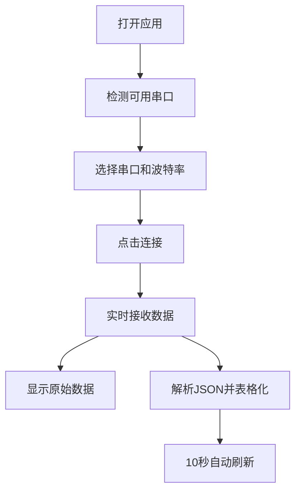

## 1. Product Overview
串口数据读取平台是一款用于实时采集和显示串口设备数据的Web应用，支持串口连接管理、数据可视化和JSON数据表格化展示。
- 主要用途：读取串口设备发送的数据，实时显示并解析JSON格式数据
- 目标用户：工程师、开发者和需要监控串口设备数据的用户

## 2. Core Features

### 2.1 User Roles
无需用户角色区分，所有用户拥有相同权限。

### 2.2 Feature Module
1. **主页面**：串口选择、连接控制、数据显示、JSON表格
2. **数据管理**：数据记录、刷新控制

### 2.3 Page Details
| Page Name | Module Name | Feature description |
|-----------|-------------|---------------------|
| 主页面 | 串口选择 | 自动检测可用串口，下拉选择，显示连接状态 |
| 主页面 | 连接控制 | 连接/断开按钮，波特率配置 |
| 主页面 | 原始数据显示 | 滚动显示串口采集的原始数据 |
| 主页面 | JSON表格 | 解析并表格化显示JSON格式数据 |
| 主页面 | 自动刷新 | 页面每10秒自动刷新数据 |

## 3. Core Process
用户打开应用 → 检测可用串口 → 选择串口并配置波特率 → 点击连接 → 实时接收并显示串口数据 → 自动解析JSON数据并表格化展示 → 10秒自动刷新页面

## 4. User Interface Design
### 4.1 Design Style
- 主色调：深蓝(#1e3a5f) + 科技蓝(#2563eb)
- 辅助色：绿色(#10b981)表示连接成功，红色(#ef4444)表示断开
- 按钮风格：圆角矩形，带有轻微阴影和悬停效果
- 字体：Inter 系列，标题使用粗体
- 布局：卡片式布局，分区清晰
- 图标：使用 lucide-react 线性图标

### 4.2 Page Design Overview
| Page Name | Module Name | UI Elements |
|-----------|-------------|-------------|
| 主页面 | 串口控制区 | 卡片式设计，下拉选择器，波特率输入，连接按钮 |
| 主页面 | 数据显示区 | 深色背景，滚动终端风格，固定高度 |
| 主页面 | JSON表格区 | 响应式表格，斑马纹，排序高亮 |
| 主页面 | 状态栏 | 顶部状态栏，显示连接状态和最后更新时间 |

### 4.3 Responsiveness
- Desktop-first 设计，支持平板和移动端适配
- 使用 Tailwind CSS 响应式类实现多端适配
- 在小屏幕上采用垂直堆叠布局

### 4.4 3D Scene Guidance
本项目不涉及 3D 场景。
