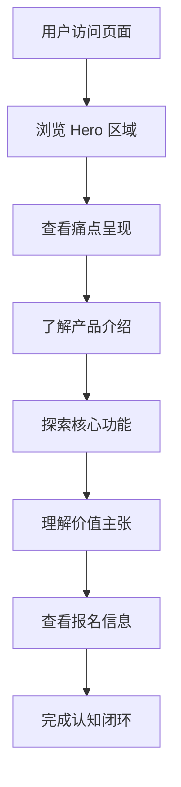

## 1. 产品概述

FocusFlow 是一款面向学习工作者与知识从业者的智能专注力管理 Web 应用，旨在解决注意力分散、任务规划混乱、学习进度难以追踪三大痛点，通过 AI 驱动的个性化建议帮助用户进入深度工作状态。

- 核心目标：将番茄钟、待办清单、学习追踪三大分散工具整合为一个统一的工作流系统
- 市场价值：面向学生、考研党、自由职业者、知识工作者的效率工具市场，具备 SaaS 订阅潜力

## 2. 核心功能

### 2.1 用户角色

| 角色 | 注册方式 | 核心权限 |
|------|----------|----------|
| 普通用户 | 邮箱注册 | 使用专注计时、任务管理、数据统计基础功能 |
| 高级用户 | 订阅升级 | 解锁 AI 智能计划、深度数据分析、跨设备同步 |

### 2.2 功能模块

1. **首页（创意展示页）**：Hero 区域、痛点呈现、产品介绍、核心功能展示、价值主张、行动召唤
2. **功能详情区**：专注计时器演示、智能计划生成、学习进度可视化
3. **报名信息区**：赛道标签、创意介绍、目标用户、价值意义

### 2.3 页面详情

| 页面名称 | 模块名称 | 功能描述 |
|----------|----------|----------|
| 首页 | Hero 区域 | 品牌标语、动态背景、主视觉展示、CTA 按钮 |
| 首页 | 痛点呈现 | 三大痛点卡片展示，配图标与说明 |
| 首页 | 产品介绍 | 产品形态说明、核心机制图解 |
| 首页 | 核心功能 | 专注计时、智能计划、进度追踪三大功能展示 |
| 首页 | 价值主张 | 商业价值、效率提升、社会价值三维度 |
| 首页 | 报名信息 | 赛道标签、创意名称、目标用户、使用场景 |

## 3. 核心流程

用户访问创意展示页 → 浏览 Hero 区域了解产品定位 → 查看痛点呈现产生共鸣 → 了解产品介绍与核心功能 → 理解价值主张 → 查看报名信息完成认知闭环

## 4. 用户界面设计

### 4.1 设计风格

- **主色调**：深空蓝（#0A0E27）作为背景主色，搭配电光青（#00F5FF）与暖橙（#FF6B35）作为强调色
- **辅助色**：雾紫（#7B61FF）用于数据可视化，柔白（#F0F4F8）用于文字
- **按钮风格**：圆角胶囊形，带霓虹光晕效果，悬浮时发光增强
- **字体**：标题使用 "Space Grotesk" 或 "Sora" 展示字体，正文使用 "Inter" 或 "Noto Sans SC"
- **布局风格**：单页滚动式，卡片化模块，大量留白与几何装饰元素
- **图标风格**：线性图标配合微动画，科技感与人文感平衡
- **视觉氛围**：暗色主题为主，营造深度专注的沉浸感，配合粒子动效与渐变光晕

### 4.2 页面设计概览

| 页面名称 | 模块名称 | UI 元素 |
|----------|----------|---------|
| 首页 | Hero 区域 | 全屏暗色背景、动态粒子、大号展示字体标题、霓虹 CTA 按钮、向下滚动指示 |
| 首页 | 痛点呈现 | 三列卡片布局、毛玻璃效果、图标悬浮动画、渐变边框 |
| 首页 | 产品介绍 | 左右分栏、产品截图模拟、功能流程图解、数字标注 |
| 首页 | 核心功能 | 交错式卡片布局、计时器模拟动画、进度条可视化、悬浮交互 |
| 首页 | 价值主张 | 三栏对称布局、数据数字突出、图标装饰、渐变背景 |
| 首页 | 报名信息 | 标签式布局、信息卡片、赛道徽章、结构化展示 |

### 4.3 响应式

- 桌面优先设计，宽度 ≥1200px 完整展示三列布局
- 平板端（768px-1200px）调整为双列布局
- 移动端（<768px）单列堆叠，优化触控交互，简化动画效果

### 4.4 视觉细节指引

- 背景：深空蓝渐变配合微弱噪点纹理，营造夜空专注氛围
- 装饰元素：几何线条、光晕粒子、网格背景、渐变光斑
- 动效：滚动渐入、悬浮缩放、数字递增、计时器旋转、进度条填充
- 微交互：按钮悬浮发光、卡片倾斜、图标弹跳、文字逐字显现
