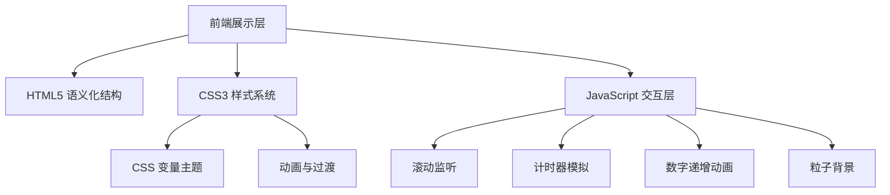

## 1. 架构设计



## 2. 技术说明

- **前端**：纯 HTML5 + CSS3 + 原生 JavaScript（单文件部署，便于社区上传展示）
- **构建工具**：无需构建，直接浏览器打开即可运行
- **字体方案**：Google Fonts 在线加载（Space Grotesk + Noto Sans SC）
- **图标方案**：内联 SVG 图标，无外部依赖
- **动画方案**：CSS Animations + Intersection Observer API 实现滚动触发
- **响应式**：CSS Grid + Flexbox + 媒体查询

## 3. 路由定义

| 路由 | 用途 |
|------|------|
| index.html | 单页创意展示，包含所有模块（Hero、痛点、产品、功能、价值、报名信息） |

## 4. 模块划分

### 4.1 HTML 结构

```
- header（导航栏）
- main
  - section#hero（Hero 区域）
  - section#pain-points（痛点呈现）
  - section#product（产品介绍）
  - section#features（核心功能）
  - section#value（价值主张）
  - section#registration（报名信息）
- footer（页脚）
```

### 4.2 JavaScript 功能模块

| 模块 | 功能描述 |
|------|----------|
| 粒子背景 | Canvas 绘制浮动粒子，营造科技氛围 |
| 滚动动画 | Intersection Observer 触发元素渐入 |
| 计时器演示 | 模拟番茄钟倒计时动画 |
| 数字递增 | 价值数据从 0 递增到目标值 |
| 导航交互 | 平滑滚动到对应区块 |
| 悬浮效果 | 卡片 3D 倾斜跟随鼠标 |

## 5. 性能优化

- CSS 动画优先使用 transform 和 opacity，避免触发重排
- 粒子数量根据屏幕尺寸动态调整，移动端减少粒子
- 图片资源使用 SVG 矢量图，保证清晰度与加载速度
- 字体使用 font-display: swap 避免文字闪烁

## 6. 兼容性

- 现代浏览器（Chrome 90+、Firefox 88+、Safari 14+、Edge 90+）
- 支持 prefers-reduced-motion 无障碍设置
- 移动端触控优化
