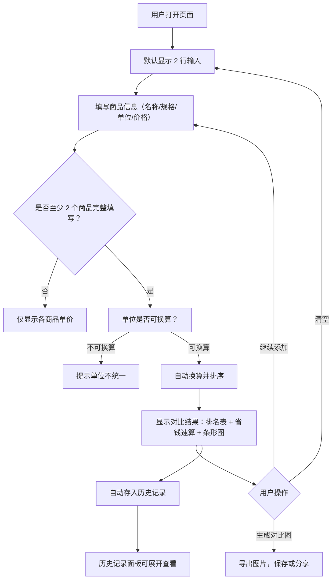

## 1. 产品概述

「价比 · UnitPrice」是一款极简的商品单价对比工具。用户输入多个商品的规格和价格，系统自动计算并排序单价，3 秒内告诉你哪个更划算。核心解决超市购物、电商比价、采购决策中的心算难题——无需注册、无需安装、打开即用。

- **目标用户**：日常购物者、家庭采购者、价格敏感型消费者
- **核心价值**：消除心算误差，节省决策时间，让每一分钱花得明白

## 2. 核心功能

### 2.1 功能模块

1. **商品输入区**：支持添加 2-6 个商品，提供名称、规格、单位、价格四个字段，实时计算单价
2. **对比结果区**：单价排名表、省钱速算、差价可视化条形图
3. **分享与导出**：生成精美对比结果卡片图片，支持保存与分享
4. **历史记录**：基于 localStorage 存储最近 20 条对比记录，支持重新对比

### 2.2 页面详情

| 页面名称 | 模块名称 | 功能描述 |
|---------|---------|---------|
| 主页 | 商品输入区 | 默认显示 2 行输入，支持增删行（最多 6 个），实时计算单价，单位自动换算，价格格式宽容解析 |
| 主页 | 对比结果区 | 按单价排序展示排名表，最优商品绿色高亮，显示省钱速算和差价条形图 |
| 主页 | 分享导出区 | 生成对比结果卡片图片，包含排名、省钱信息和水印 |
| 主页 | 历史记录区 | 折叠面板，存储最近 20 条记录，支持重新对比和清空历史 |

## 3. 核心流程

## 4. 用户界面设计

### 4.1 设计风格

- **主题**：明亮清爽的极简风格，以白色为主背景，营造干净、高效的计算工具感
- **主色调**：绿色（#10B981）作为"划算"的视觉锚点，深灰（#1F2937）作为文字主色
- **辅色调**：暖橙（#F59E0B）用于强调和交互提示，浅灰（#F3F4F6）用于卡片背景
- **字体**：标题使用 `DM Sans`（现代几何感），正文使用 `Noto Sans SC`（中文优化）
- **布局**：移动端优先的单列布局，桌面端居中最大宽度 480px
- **圆角**：大圆角（16px）卡片，营造友好亲和感
- **阴影**：轻柔的卡片阴影，不使用强投影
- **动画**：输入即算的即时反馈，结果区平滑展开，条形图填充动画

### 4.2 页面设计概览

| 页面名称 | 模块名称 | UI 元素 |
|---------|---------|--------|
| 主页 | 头部 | 品牌 logo "价比 · UnitPrice"，副标题 slogan，极简无导航 |
| 主页 | 商品输入区 | 白色卡片容器，每行包含名称/规格/单位/价格/删除按钮，"添加商品"和"全部清空"按钮 |
| 主页 | 对比结果区 | 绿色渐变背景的排名卡片，排名表含条形图，省钱速算文字，生成对比图按钮 |
| 主页 | 历史记录区 | 折叠面板，时间线样式，每条记录可点击展开和重新对比 |

### 4.3 响应式设计

- **移动端（< 640px）**：全宽布局，输入行纵向排列，卡片无边距
- **桌面端（≥ 640px）**：居中 480px 最大宽度，增加卡片间距

## 5. 非功能性要求

| 指标 | 要求 |
|-----|------|
| 首屏加载 | < 1 秒 |
| 实时计算 | 输入即算，无延迟（纯前端计算） |
| 页面体积 | < 80KB（不含字体） |
| 兼容性 | iOS Safari 15+、Android Chrome 100+、桌面主流浏览器 |
| 无障碍 | 输入框有 label 标签，支持 Tab 切换 |