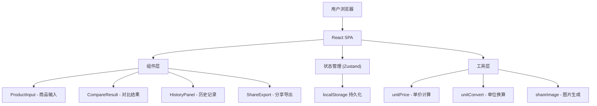

## 1. 架构设计



## 2. 技术选型

- **前端框架**：React 18 + TypeScript
- **构建工具**：Vite
- **样式方案**：Tailwind CSS 3
- **状态管理**：Zustand
- **图标库**：lucide-react
- **图片生成**：html2canvas（生成对比图）
- **后端**：无（纯前端应用）
- **数据持久化**：localStorage

## 3. 路由定义

| 路由 | 用途 |
|-----|------|
| / | 主页（唯一页面，包含所有功能模块） |

## 4. 数据模型

### 4.1 核心类型定义

```typescript
// 单位类型
type UnitType = 'volume' | 'weight' | 'count' | 'times';

// 单位定义
interface Unit {
  id: string;        // 如 'ml', 'L', 'g', 'kg'
  label: string;     // 显示名称
  type: UnitType;    // 单位类别
  toBase: number;    // 换算到基准单位的系数
}

// 商品信息
interface Product {
  id: string;
  name: string;
  quantity: number;
  unit: string;      // 单位 id
  price: number;
}

// 对比结果
interface CompareResult {
  productId: string;
  unitPrice: number;        // 换算后单价
  normalizedUnit: string;   // 归一化后的单位
  rank: number;
  isBest: boolean;
  priceDiffPercent: number | null; // 比最优贵多少百分比
}

// 历史记录
interface HistoryRecord {
  id: string;
  timestamp: number;
  products: Product[];
  bestProductId: string;
  result: CompareResult[];
}
```

### 4.2 单位换算表

```typescript
const UNIT_CONVERSION: Record<string, { type: UnitType; toBase: number }> = {
  'ml':  { type: 'volume', toBase: 1 },
  'L':   { type: 'volume', toBase: 1000 },
  'g':   { type: 'weight', toBase: 1 },
  'kg':  { type: 'weight', toBase: 1000 },
  '片':  { type: 'count',  toBase: 1 },
  '包':  { type: 'count',  toBase: 1 },
  '袋':  { type: 'count',  toBase: 1 },
  '个':  { type: 'count',  toBase: 1 },
  '只':  { type: 'count',  toBase: 1 },
  '条':  { type: 'count',  toBase: 1 },
  '罐':  { type: 'count',  toBase: 1 },
  '瓶':  { type: 'count',  toBase: 1 },
  '次':  { type: 'times',  toBase: 1 },
  '回':  { type: 'times',  toBase: 1 },
  '份':  { type: 'times',  toBase: 1 },
};
```

## 5. 组件树

```
App
├── Header（品牌标识）
├── ProductInputPanel（输入面板）
│   ├── ProductRow × N（每行商品输入）
│   │   ├── NameInput
│   │   ├── QuantityInput（含快捷规格）
│   │   ├── UnitSelect
│   │   ├── PriceInput
│   │   └── DeleteButton
│   ├── AddProductButton
│   └── ClearAllButton
├── CompareResultPanel（对比结果面板）
│   ├── RankTable（排名表）
│   │   └── RankRow × N（含条形图）
│   ├── SavingSummary（省钱速算）
│   └── ShareButton（生成对比图）
└── HistoryPanel（历史记录面板）
    └── HistoryItem × N
```

## 6. 状态管理（Zustand Store）

```typescript
interface AppState {
  products: Product[];
  addProduct: () => void;
  removeProduct: (id: string) => void;
  updateProduct: (id: string, field: string, value: any) => void;
  clearAll: () => void;
  loadFromHistory: (products: Product[]) => void;
  
  // 历史记录
  history: HistoryRecord[];
  addHistory: (record: HistoryRecord) => void;
  clearHistory: () => void;
}
```