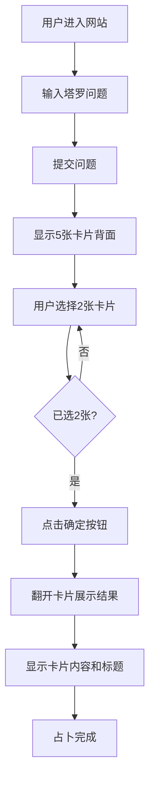

# AI塔罗牌 - 产品需求文档

## 1. 产品概述
AI塔罗牌是一款神秘的在线塔罗牌占卜工具，帮助用户通过塔罗牌获得心灵的指引和答案。

### 核心用途
- 为用户提供塔罗牌占卜体验
- 通过选择卡片获得塔罗牌的神秘指引
- 神秘、优雅的视觉风格，营造沉浸式占卜氛围

### 目标用户
- 对塔罗牌感兴趣的用户
- 需要心灵指引和答案的用户
- 追求神秘体验的用户

## 2. 核心功能

### 2.1 功能模块

1. **问题输入阶段**
   - 用户输入塔罗占卜的问题
   - 问题输入框简洁优雅
   - 提交按钮启动占卜流程

2. **卡片选择阶段**
   - 显示5张塔罗牌背面
   - 神秘感十足的卡片展示
   - 用户选择2张卡片
   - 卡片有悬停动画效果

3. **结果展示阶段**
   - 点击确定按钮翻开卡片
   - 显示卡片正面图案
   - 展示卡片名称和含义解读
   - 优雅的卡片动画效果

## 3. 核心流程

### 用户使用流程图


## 4. 用户界面设计

### 4.1 设计风格
- **主题**: 神秘、优雅、魔幻
- **配色方案**: 
  - 主色: 深紫色 (#4a0e4e)
  - 副色: 金色 (#d4af37)
  - 背景: 深蓝黑色 (#0a0a1a)
  - 文字: 象牙白 (#f5f5f0)
- **字体**: 优雅的衬线字体
- **布局**: 居中布局，卡片横向排列

### 4.2 页面设计

#### 阶段1: 问题输入
| 元素 | 样式描述 |
|------|----------|
| 标题 | 神秘风格的塔罗牌标题 |
| 输入框 | 深色背景，金色边框，圆角 |
| 提交按钮 | 金色渐变，悬停发光效果 |

#### 阶段2: 卡片展示
| 元素 | 样式描述 |
|------|----------|
| 问题展示 | 显示用户输入的问题 |
| 卡片背面 | 神秘图案，金色边框 |
| 卡片状态 | 悬停放大，选中高亮 |
| 确定按钮 | 金色渐变，禁用/启用状态 |

#### 阶段3: 结果展示
| 元素 | 样式描述 |
|------|----------|
| 卡片正面 | 显示塔罗牌图案 |
| 卡片名称 | 金色大字，居中显示 |
| 卡片解读 | 优雅的文字描述 |

### 4.3 响应式设计
- 桌面优先设计
- 移动端适配：卡片缩小，垂直排列
- 触摸设备优化

### 4.4 动画效果
- 卡片悬停: 轻微上浮 + 发光
- 卡片翻转: 3D翻转动画
- 页面切换: 淡入淡出
- 加载效果: 神秘光晕动画

## 5. 技术实现说明

### 预留图片资源
- `/images/card-back.png` - 卡片背面图案
- `/images/cards/` - 塔罗牌正面图片目录
  - card-01.png ~ card-78.png (78张塔罗牌)

### 数据结构
```javascript
// 塔罗牌数据结构
const tarotCards = [
  {
    id: 1,
    name: "愚人",
    image: "card-01.png",
    description: "自由、纯真、新的开始..."
  },
  // ... 共78张塔罗牌
]
```

## 6. 开发阶段

### 第一阶段（当前）
- ✅ HTML/CSS/JS基础框架
- ✅ 问题输入界面
- ✅ 卡片展示和选择逻辑
- ✅ 结果展示框架
- ✅ 预留图片文件夹

### 第二阶段（后续）
- 替换卡片图片资源
- 完善78张塔罗牌数据
- 优化动画效果
- 添加更多交互细节
