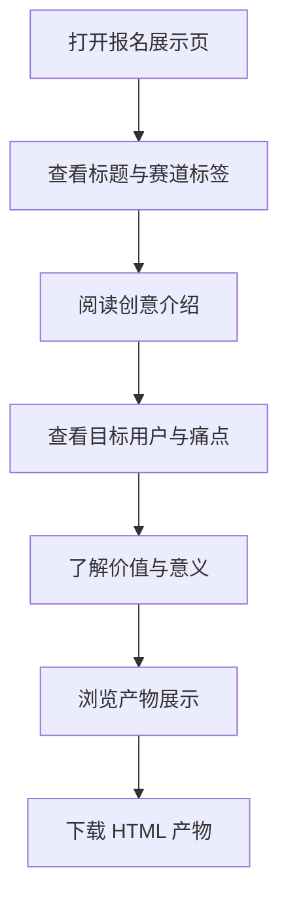

# 产品需求文档（PRD）

## 1. 产品概述

本项目为「邻时工具箱」社区共享工具平台的赛事报名展示页。页面以单页 HTML 形式呈现，用于在开发者社区发布报名帖，完整展示创意名称、赛道标签、创意介绍、目标用户与痛点、价值与意义等必填信息，并附带可直接下载/预览的 HTML 产物文件。

- 解决核心问题：帮助参赛者以视觉化、结构化方式展示创意方案，降低社区评审阅读成本，同时体现 TRAE Work 生成创意产物的能力。
- 目标用户：赛事评委、社区开发者、潜在用户与合作伙伴。

## 2. 核心功能

### 2.1 功能模块

1. **顶部报名区**：赛事标题、赛道标签、创意名称与一句话 slogan。
2. **创意介绍区**：痛点描述、灵感来源、产品形态概述。
3. **目标用户与痛点区**：核心用户画像、使用场景、当前痛点。
4. **价值与意义区**：商业价值与社会价值说明。
5. **产物展示区**：平台界面概念图 / 原型示意、下载入口。
6. **页脚区**：团队/作者信息、联系方式、版权声明。

### 2.2 页面详情

| 页面名称 | 模块名称 | 功能描述 |
|---------|---------|---------|
| 报名展示页 | 顶部报名区 | 展示赛事标题、赛道标签、创意名称、slogan，支持标签高亮 |
| 报名展示页 | 创意介绍区 | 三段式展示：想解决什么问题、为什么想到做这个、大概是什么产品 |
| 报名展示页 | 目标用户与痛点区 | 用户画像卡片 + 场景描述 + 痛点列表 |
| 报名展示页 | 价值与意义区 | 商业价值与社会价值双栏展示 |
| 报名展示页 | 产物展示区 | 概念界面截图/示意、HTML 产物下载按钮 |
| 报名展示页 | 页脚区 | 作者信息、联系方式、版权说明 |

## 3. 核心流程

用户打开报名展示页后，按自上而下顺序阅读：
1. 查看顶部标题与标签，快速判断赛道与主题；
2. 阅读创意介绍，理解产品定位；
3. 查看目标用户与痛点，评估需求真实性；
4. 了解价值与意义，判断创意价值；
5. 浏览产物展示，下载 HTML 产物文件。

## 4. 用户界面设计

### 4.1 设计风格

- **主色调**：暖橙色（#F97316）作为品牌色，象征社区互助的活力与温暖；深灰（#1F2937）作为文字主色，米白（#FDFBF7）作为背景色，营造亲和、可信赖的社区氛围。
- **按钮样式**：圆角矩形（8px），主按钮使用暖橙渐变背景，hover 时微抬升并加深阴影。
- **字体搭配**：标题使用「霞鹜文楷」或「Noto Serif SC」增加人文感；正文使用「Noto Sans SC」保证可读性。
- **布局风格**：单页长滚动，采用卡片式分块，左右不对称留白，关键数据使用大号数字强调。
- **图标/插画风格**：线性图标 + 手绘风格插画，呼应社区共享、邻里互助主题。

### 4.2 页面设计概述

| 页面名称 | 模块名称 | UI 元素 |
|---------|---------|---------|
| 报名展示页 | 顶部报名区 | 大号标题、赛道标签徽章、slogan、背景几何装饰 |
| 报名展示页 | 创意介绍区 | 三栏卡片、数字序号、图标 |
| 报名展示页 | 目标用户与痛点区 | 用户头像/图标、场景描述卡片、痛点列表 |
| 报名展示页 | 价值与意义区 | 双栏布局、数据指标、图标 |
| 报名展示页 | 产物展示区 | 模拟设备框架、截图示意、下载按钮 |
| 报名展示页 | 页脚区 | 简洁文字链接、版权信息 |

### 4.3 响应式设计

- 桌面端优先，最大内容宽度 1200px，居中展示。
- 平板端（≤1024px）调整为双栏或单栏，保持卡片可读性。
- 移动端（≤640px）全部改为单栏，标题字号递减，按钮全宽。
- 图片与容器使用相对单位，确保在不同设备上完整显示。

### 4.4 动画与微交互

- 页面加载时，各区块依次淡入上移（fade-in-up），使用 CSS 动画与 animation-delay 实现错落效果。
- 标签徽章 hover 时轻微放大。
- 卡片 hover 时抬升并增强阴影。
- 下载按钮 hover 时背景色加深并出现箭头位移。
