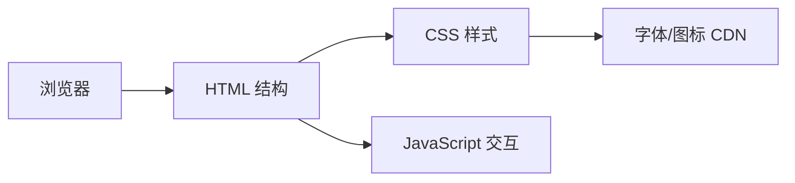

# 技术架构文档

## 1. 架构设计

本项目为纯前端单页展示站点，无需后端服务与数据库。所有内容静态化写入 HTML/CSS/JS，产物可直接部署或作为附件下载。



## 2. 技术描述

- **前端**：原生 HTML5 + CSS3 + 少量 JavaScript（无需框架）。
- **构建工具**：无构建工具，单文件 HTML 直接运行。
- **样式方案**：CSS 变量管理主题色，Flexbox/Grid 布局，媒体查询实现响应式。
- **字体**：通过 CDN 引入「Noto Sans SC」与「Noto Serif SC」。
- **图标**：内联 SVG 或 Unicode 符号，避免外部图标库依赖。
- **动画**：纯 CSS 动画（`@keyframes` + `transition`），不引入动画库。
- **产物交付**：生成单一 `index.html` 文件，可直接在浏览器打开或上传社区。

## 3. 路由定义

| 路由 | 用途 |
|-----|------|
| /index.html | 报名展示页唯一入口 |

## 4. API 定义

本项目无需后端 API，所有数据硬编码于 HTML 中。

## 5. 数据模型

无需数据库与数据模型。展示内容以静态文本与图片形式维护。

## 6. 目录结构

```
/Users/andy/html/
├── index.html          # 报名展示页主文件
└── .trae/documents/
    ├── PRD-邻时工具箱报名展示页.md
    └── Technical-Architecture-邻时工具箱报名展示页.md
```
