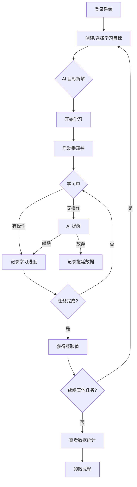
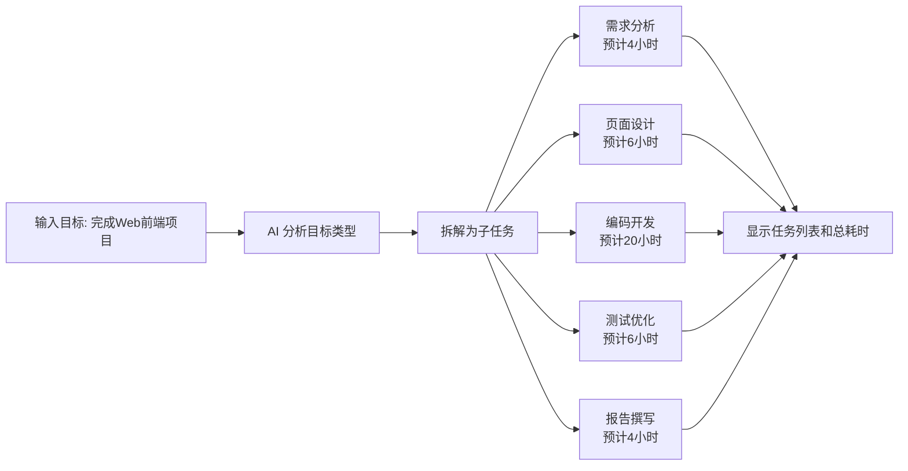

# FocusPal AI学习监督官 - 产品需求文档

## 1. 产品概述

FocusPal 是一款面向大学生和考研群体的 AI 学习监督与成长系统，致力于解决用户制定计划后无法坚持执行、拖延症严重、学习效率低的问题。

产品通过游戏化成长机制、AI 目标拆解、智能学习监督等功能，将枯燥的学习过程转化为充满成就感的成长旅程，帮助用户养成自律习惯，提升学习效率。

**目标市场价值：** 在竞争日益激烈的学习环境中，帮助用户克服拖延、保持专注、实现目标。

---

## 2. 核心功能

### 2.1 用户角色

| 角色 | 注册方式 | 核心权限 |
|------|----------|----------|
| 学习者 | 邮箱/手机注册 | 创建目标、AI 监督、学习记录、成就系统 |

### 2.2 功能模块

1. **AI 目标拆解**
   - 用户输入笼统目标（如"完成Web前端项目"）
   - AI 自动拆解为多个可执行子任务
   - 提供预计耗时估算

2. **AI 学习监督**
   - 番茄钟计时器
   - 实时学习时长统计
   - 长时间无操作智能提醒
   - 学习效率分析

3. **AI 学习助手**
   - 随时提问获取学习指导
   - 知识点解析
   - 学习资源推荐

4. **游戏化成长系统**
   - 经验值机制（学习30分钟+50exp，完成任务+100exp）
   - 等级体系（Lv1-Lv5）
   - 连续学习奖励

5. **数据可视化**
   - 今日/本周学习时长
   - 任务完成统计
   - 连续打卡天数
   - 成长等级展示

6. **成就系统**
   - 首次学习徽章
   - 连续7天打卡
   - 累计学习50小时
   - 完成大型项目徽章

7. **AI 拖延症分析（加分功能）**
   - 分析用户拖延时间段
   - 识别易放弃任务类型
   - 发现效率最高时间段

### 2.3 页面详情

| 页面名称 | 模块名称 | 功能描述 |
|----------|----------|----------|
| 登录注册页 | 登录/注册表单 | 邮箱注册、登录、忘记密码 |
| 首页仪表盘 | 概览统计卡片 | 今日学习时长、本周统计、等级进度、快捷入口 |
| 学习任务页 | 任务列表/创建 | AI 目标拆解、任务创建、编辑、完成状态管理 |
| AI 监督页 | 番茄钟/监督面板 | 启动学习、监督提醒、效率统计 |
| 数据统计页 | 图表中心 | ECharts 图表展示学习数据、趋势分析 |
| 成就中心页 | 徽章墙 | 已解锁/未解锁成就展示 |
| 个人中心页 | 设置中心 | 用户信息、偏好设置、数据导出 |

---

## 3. 核心流程

### 3.1 用户学习流程

### 3.2 AI 目标拆解流程

---

## 4. 用户界面设计

### 4.1 设计风格

- **主色调：** 深色科技风 - 背景 #0a0e17，主题色 #6366f1（靛蓝），强调色 #22d3ee（青色）
- **按钮风格：** 圆角卡片式，hover 发光效果
- **字体选择：** 标题使用 Orbitron（科技感），正文使用 Noto Sans SC（清晰易读）
- **布局风格：** 卡片式布局，侧边导航，响应式设计
- **图标风格：** Lucide Icons，线性风格
- **动效：** 渐入动画、数字滚动、进度条动画、徽章解锁特效

### 4.2 页面设计概览

| 页面名称 | 模块名称 | UI 元素 |
|----------|----------|---------|
| 登录注册页 | 背景 | 粒子动画/渐变网格 |
| | 表单卡片 | 毛玻璃效果，浮动标签 |
| 首页仪表盘 | 统计卡片 | 渐变边框，数字滚动 |
| | 等级进度 | 环形进度条 |
| | 快捷入口 | 图标按钮网格 |
| 学习任务页 | 任务列表 | 卡片式，带复选框 |
| | AI 拆解区 | 对话气泡样式 |
| AI 监督页 | 番茄钟 | 大型圆形计时器 |
| | 效率图表 | 实时折线图 |
| 数据统计页 | 图表区 | ECharts 多图表 |
| 成就中心页 | 徽章墙 | 网格布局，解锁状态区分 |
| 个人中心页 | 设置列表 | 分组列表项 |

### 4.3 响应式设计

- 桌面端优先设计
- 平板/移动端自适应布局
- 移动端触摸优化

---

## 5. 技术选型

| 层级 | 技术栈 |
|------|--------|
| 前端框架 | Vue3 + Composition API + Vite |
| UI 组件库 | Element Plus |
| 图表库 | ECharts |
| 后端框架 | Node.js + Express |
| 数据库 | SQLite |
| 认证方式 | JWT |
