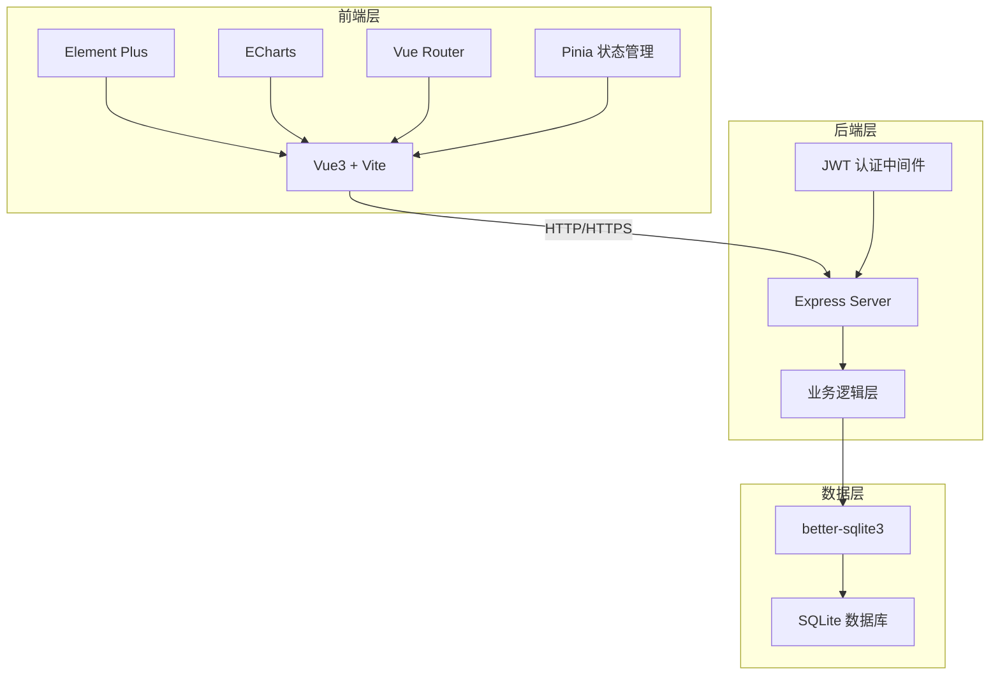
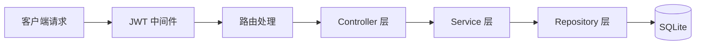
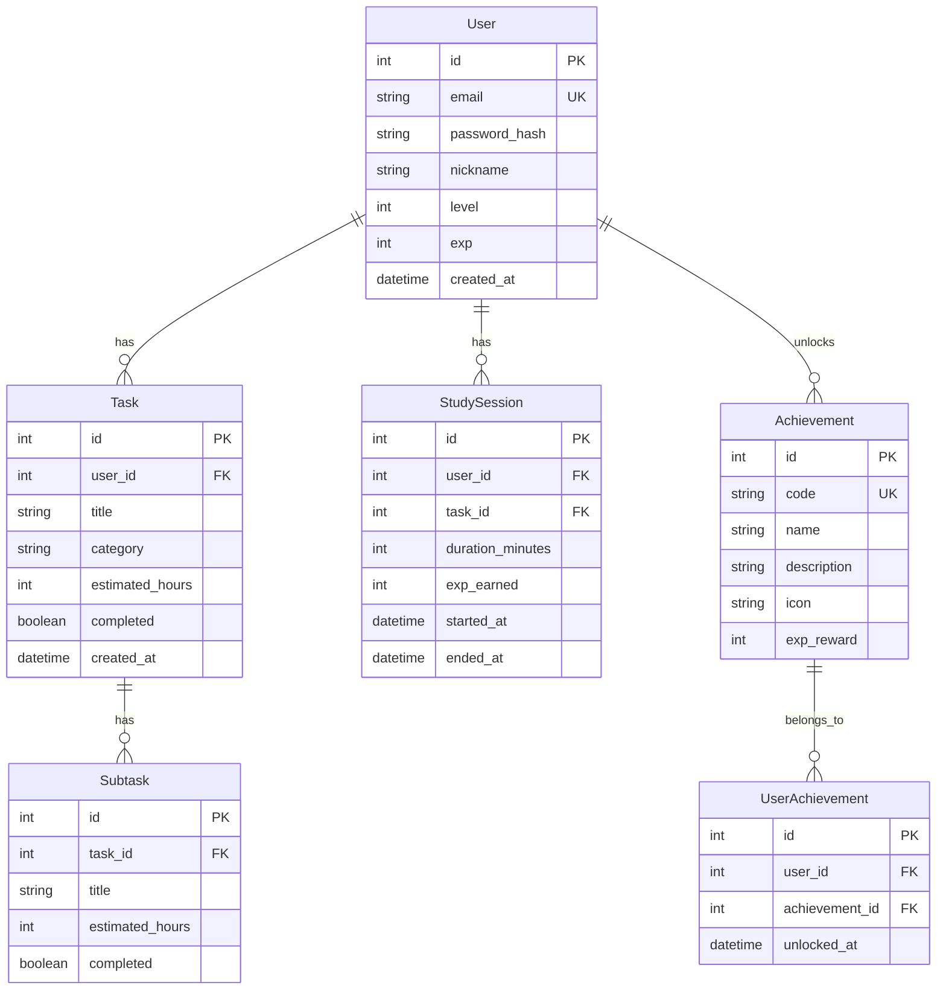

# FocusPal AI学习监督官 - 技术架构文档

## 1. 系统架构设计



---

## 2. 技术栈说明

| 层级 | 技术选型 | 版本要求 |
|------|----------|----------|
| 前端框架 | Vue3 (Composition API) | ^3.4 |
| 构建工具 | Vite | ^5.0 |
| UI 组件库 | Element Plus | ^2.5 |
| 图表库 | ECharts | ^5.4 |
| 路由管理 | Vue Router | ^4.2 |
| 状态管理 | Pinia | ^2.1 |
| HTTP 客户端 | Axios | ^1.6 |
| 后端框架 | Express | ^4.18 |
| 数据库 | SQLite | ^3 |
| ORM | better-sqlite3 | ^9.0 |
| 认证 | JWT | ^9.0 |

---

## 3. 路由定义

### 3.1 前端路由

| 路由路径 | 页面名称 | 功能描述 |
|----------|----------|----------|
| /login | 登录页 | 用户登录 |
| /register | 注册页 | 用户注册 |
| / | 首页仪表盘 | 概览统计、快捷入口 |
| /tasks | 学习任务页 | 任务管理、AI 拆解 |
| /study | AI 监督页 | 番茄钟、监督提醒 |
| /stats | 数据统计页 | 图表分析 |
| /achievements | 成就中心 | 徽章展示 |
| /profile | 个人中心 | 设置管理 |

### 3.2 后端 API

| 请求方法 | API 路径 | 功能描述 |
|----------|----------|----------|
| POST | /api/auth/register | 用户注册 |
| POST | /api/auth/login | 用户登录 |
| GET | /api/auth/profile | 获取用户信息 |
| PUT | /api/auth/profile | 更新用户信息 |
| GET | /api/tasks | 获取任务列表 |
| POST | /api/tasks | 创建任务 |
| PUT | /api/tasks/:id | 更新任务 |
| DELETE | /api/tasks/:id | 删除任务 |
| POST | /api/tasks/:id/complete | 完成任务 |
| POST | /api/ai/decompose | AI 目标拆解 |
| POST | /api/ai/chat | AI 学习助手 |
| GET | /api/study/sessions | 获取学习记录 |
| POST | /api/study/sessions | 创建学习记录 |
| POST | /api/study/sessions/:id/heartbeat | 学习心跳 |
| GET | /api/stats/daily | 每日统计数据 |
| GET | /api/stats/weekly | 每周统计数据 |
| GET | /api/achievements | 获取成就列表 |
| POST | /api/achievements/:id/unlock | 解锁成就 |
| GET | /api/analysis/procrastination | 拖延症分析 |

---

## 4. API 详细设计

### 4.1 认证模块

#### POST /api/auth/register - 用户注册

**请求体：**
```json
{
  "email": "user@example.com",
  "password": "password123",
  "nickname": "学习达人"
}
```

**响应：**
```json
{
  "success": true,
  "data": {
    "token": "jwt_token_here",
    "user": {
      "id": 1,
      "email": "user@example.com",
      "nickname": "学习达人",
      "level": 1,
      "exp": 0
    }
  }
}
```

#### POST /api/auth/login - 用户登录

**请求体：**
```json
{
  "email": "user@example.com",
  "password": "password123"
}
```

**响应：**
```json
{
  "success": true,
  "data": {
    "token": "jwt_token_here",
    "user": {
      "id": 1,
      "email": "user@example.com",
      "nickname": "学习达人",
      "level": 1,
      "exp": 0
    }
  }
}
```

### 4.2 任务模块

#### POST /api/tasks - 创建任务

**请求体：**
```json
{
  "title": "完成Web前端项目",
  "category": "project",
  "estimated_hours": 40
}
```

**响应：**
```json
{
  "success": true,
  "data": {
    "id": 1,
    "title": "完成Web前端项目",
    "category": "project",
    "estimated_hours": 40,
    "subtasks": [
      { "id": 101, "title": "需求分析", "estimated_hours": 4, "completed": false },
      { "id": 102, "title": "页面设计", "estimated_hours": 6, "completed": false },
      { "id": 103, "title": "编码开发", "estimated_hours": 20, "completed": false },
      { "id": 104, "title": "测试优化", "estimated_hours": 6, "completed": false },
      { "id": 105, "title": "报告撰写", "estimated_hours": 4, "completed": false }
    ],
    "created_at": "2024-01-01T00:00:00Z"
  }
}
```

### 4.3 AI 模块

#### POST /api/ai/decompose - AI 目标拆解

**请求体：**
```json
{
  "goal": "完成Web前端项目"
}
```

**响应：**
```json
{
  "success": true,
  "data": {
    "subtasks": [
      { "title": "需求分析", "estimated_hours": 4 },
      { "title": "页面设计", "estimated_hours": 6 },
      { "title": "编码开发", "estimated_hours": 20 },
      { "title": "测试优化", "estimated_hours": 6 },
      { "title": "报告撰写", "estimated_hours": 4 }
    ],
    "total_hours": 40
  }
}
```

#### POST /api/ai/chat - AI 学习助手

**请求体：**
```json
{
  "message": "Vue组件通信怎么实现？"
}
```

**响应：**
```json
{
  "success": true,
  "data": {
    "reply": "Vue 组件通信有多种方式：\n1. Props/Emit：父子组件通信\n2. Vuex/Pinia：全局状态管理\n3. Provide/Inject：跨级组件通信\n4. Event Bus：任意组件通信\n\n你想了解哪种方式的详细实现？"
  }
}
```

### 4.4 学习记录模块

#### POST /api/study/sessions - 创建学习记录

**请求体：**
```json
{
  "task_id": 1,
  "duration_minutes": 30
}
```

**响应：**
```json
{
  "success": true,
  "data": {
    "id": 1,
    "task_id": 1,
    "duration_minutes": 30,
    "exp_earned": 50,
    "created_at": "2024-01-01T00:00:00Z"
  }
}
```

### 4.5 数据统计模块

#### GET /api/stats/weekly - 每周统计

**响应：**
```json
{
  "success": true,
  "data": {
    "total_minutes": 480,
    "total_exp": 800,
    "tasks_completed": 5,
    "daily_stats": [
      { "date": "2024-01-01", "minutes": 120, "exp": 200 },
      { "date": "2024-01-02", "minutes": 90, "exp": 150 },
      { "date": "2024-01-03", "minutes": 150, "exp": 250 },
      { "date": "2024-01-04", "minutes": 60, "exp": 100 },
      { "date": "2024-01-05", "minutes": 30, "exp": 50 },
      { "date": "2024-01-06", "minutes": 30, "exp": 50 },
      { "date": "2024-01-07", "minutes": 0, "exp": 0 }
    ]
  }
}
```

---

## 5. 服务器架构图



---

## 6. 数据模型

### 6.1 ER 图



### 6.2 DDL 数据定义

```sql
-- 用户表
CREATE TABLE users (
    id INTEGER PRIMARY KEY AUTOINCREMENT,
    email TEXT UNIQUE NOT NULL,
    password_hash TEXT NOT NULL,
    nickname TEXT NOT NULL,
    level INTEGER DEFAULT 1,
    exp INTEGER DEFAULT 0,
    created_at DATETIME DEFAULT CURRENT_TIMESTAMP
);

-- 任务表
CREATE TABLE tasks (
    id INTEGER PRIMARY KEY AUTOINCREMENT,
    user_id INTEGER NOT NULL,
    title TEXT NOT NULL,
    category TEXT,
    estimated_hours INTEGER,
    completed BOOLEAN DEFAULT 0,
    created_at DATETIME DEFAULT CURRENT_TIMESTAMP,
    FOREIGN KEY (user_id) REFERENCES users(id)
);

-- 子任务表
CREATE TABLE subtasks (
    id INTEGER PRIMARY KEY AUTOINCREMENT,
    task_id INTEGER NOT NULL,
    title TEXT NOT NULL,
    estimated_hours INTEGER,
    completed BOOLEAN DEFAULT 0,
    FOREIGN KEY (task_id) REFERENCES tasks(id)
);

-- 学习记录表
CREATE TABLE study_sessions (
    id INTEGER PRIMARY KEY AUTOINCREMENT,
    user_id INTEGER NOT NULL,
    task_id INTEGER,
    duration_minutes INTEGER NOT NULL,
    exp_earned INTEGER NOT NULL,
    started_at DATETIME,
    ended_at DATETIME,
    FOREIGN KEY (user_id) REFERENCES users(id),
    FOREIGN KEY (task_id) REFERENCES tasks(id)
);

-- 成就表
CREATE TABLE achievements (
    id INTEGER PRIMARY KEY AUTOINCREMENT,
    code TEXT UNIQUE NOT NULL,
    name TEXT NOT NULL,
    description TEXT,
    icon TEXT,
    exp_reward INTEGER DEFAULT 0
);

-- 用户成就表
CREATE TABLE user_achievements (
    id INTEGER PRIMARY KEY AUTOINCREMENT,
    user_id INTEGER NOT NULL,
    achievement_id INTEGER NOT NULL,
    unlocked_at DATETIME DEFAULT CURRENT_TIMESTAMP,
    FOREIGN KEY (user_id) REFERENCES users(id),
    FOREIGN KEY (achievement_id) REFERENCES achievements(id),
    UNIQUE(user_id, achievement_id)
);

-- 插入初始成就数据
INSERT INTO achievements (code, name, description, icon, exp_reward) VALUES
    ('first_study', '首次学习', '完成第一次学习', 'book', 50),
    ('seven_days', '连续7天打卡', '连续学习7天', 'fire', 200),
    ('fifty_hours', '学习50小时', '累计学习满50小时', 'clock', 500),
    ('first_task', '首个任务', '完成第一个任务', 'check', 100),
    ('level_5', '卷王之王', '达到Lv5等级', 'crown', 1000);
```

---

## 7. 项目目录结构

```
focuspal/
├── client/                 # 前端项目
│   ├── public/
│   │   └── index.html
│   ├── src/
│   │   ├── assets/         # 静态资源
│   │   │   └── styles/     # 全局样式
│   │   │       └── main.css
│   │   ├── components/     # 公共组件
│   │   │   ├── NavBar.vue
│   │   │   ├── SideBar.vue
│   │   │   ├── StatCard.vue
│   │   │   └── AchievementBadge.vue
│   │   ├── views/          # 页面组件
│   │   │   ├── LoginView.vue
│   │   │   ├── RegisterView.vue
│   │   │   ├── DashboardView.vue
│   │   │   ├── TasksView.vue
│   │   │   ├── StudyView.vue
│   │   │   ├── StatsView.vue
│   │   │   ├── AchievementsView.vue
│   │   │   └── ProfileView.vue
│   │   ├── router/
│   │   │   └── index.js
│   │   ├── stores/         # Pinia 状态
│   │   │   ├── auth.js
│   │   │   ├── tasks.js
│   │   │   └── stats.js
│   │   ├── api/            # API 请求
│   │   │   └── index.js
│   │   ├── App.vue
│   │   └── main.js
│   ├── index.html
│   ├── vite.config.js
│   ├── package.json
│   └── .env
│
├── server/                 # 后端项目
│   ├── src/
│   │   ├── routes/         # 路由
│   │   │   ├── auth.js
│   │   │   ├── tasks.js
│   │   │   ├── ai.js
│   │   │   ├── study.js
│   │   │   ├── stats.js
│   │   │   └── achievements.js
│   │   ├── middleware/
│   │   │   └── auth.js     # JWT 中间件
│   │   ├── services/      # 业务逻辑
│   │   │   ├── aiService.js
│   │   │   └── levelService.js
│   │   ├── db/
│   │   │   ├── index.js    # 数据库初始化
│   │   │   └── schema.sql
│   │   └── index.js        # 服务器入口
│   ├── package.json
│   └── .env
│
├── showcase/               # 创意展示页面
│   └── index.html
│
└── README.md
```

---

## 8. 等级体系设计

| 等级 | 名称 | 所需经验 | 称号 |
|------|------|----------|------|
| Lv1 | 新手学员 | 0 | 初出茅庐 |
| Lv2 | 自律达人 | 500 | 小有所成 |
| Lv3 | 学霸 | 1500 | 学富五车 |
| Lv4 | 学神 | 3500 | 登堂入室 |
| Lv5 | 卷王之王 | 7000 | 天下无双 |

**经验值获取规则：**
- 学习 30 分钟：+50 经验
- 完成任务：+100 经验
- 连续学习（每30分钟）：+20 额外奖励
- 成就解锁：按成就奖励
