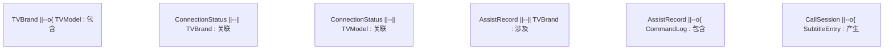

## 1. 架构设计

```mermaid
flowchart TD
    "A[前端 React 应用]" --> "B[状态管理 Context]"
    "B --> C[品牌选择模块]"
    "B --> D[遥控器模块]"
    "B --> E[通话字幕模块]"
    "C --> F[品牌数据 JSON]"
    "D --> G[遥控指令模拟]"
    "E --> H[Web Speech API]"
    "E --> I[WebRTC getUserMedia]"
    "H --> J[实时字幕转写]"
    "I --> K[语音通话采集]"
    "G --> L[操作日志记录]"
    "L --> M[localStorage 持久化]"
```

## 2. 技术说明
- **前端框架**：React@18 + tailwindcss@3 + vite
- **初始化工具**：vite-init (react-ts 模板)
- **后端**：无（纯前端应用，使用浏览器原生 API）
- **数据存储**：localStorage（协助记录、品牌偏好）+ 内置 JSON（电视品牌数据）
- **核心 API**：
  - `Web Speech API (SpeechRecognition)`：实时语音转字幕
  - `MediaDevices.getUserMedia()`：麦克风采集语音通话
  - `Web Audio API`：通话音量、静音控制
- **图标库**：lucide-react
- **动画库**：framer-motion

## 3. 路由定义
| 路由 | 用途 |
|------|------|
| `/` | 首页控制台，显示连接状态与快捷入口 |
| `/brand` | 电视品牌选择页，品牌网格与配对向导 |
| `/remote` | 远程遥控台，虚拟遥控器与通话悬浮窗 |
| `/call` | 语音通话字幕页，双向字幕与通话控制 |

## 4. API 定义（前端模块接口）

### 4.1 品牌数据结构
```typescript
interface TVBrand {
  id: string;
  name: string;          // 品牌名称
  logo: string;          // 品牌色块标识
  color: string;         // 品牌主色
  models: TVModel[];     // 支持型号
}

interface TVModel {
  id: string;
  name: string;          // 型号名称
  year: number;          // 生产年份
  features: string[];    // 支持特性
}

interface ConnectionStatus {
  brand: TVBrand | null;
  model: TVModel | null;
  connected: boolean;
  lastConnected: string;  // ISO 时间
}
```

### 4.2 遥控指令定义
```typescript
type RemoteCommand =
  | 'power' | 'menu' | 'home' | 'back'
  | 'up' | 'down' | 'left' | 'right' | 'ok'
  | 'volume_up' | 'volume_down' | 'mute'
  | 'channel_up' | 'channel_down'
  | 'source' | 'settings';

interface CommandLog {
  id: string;
  command: RemoteCommand;
  timestamp: string;
  label: string;
}
```

### 4.3 通话与字幕
```typescript
interface SubtitleEntry {
  id: string;
  speaker: 'helper' | 'elder';  // 协助者 / 长辈
  text: string;
  timestamp: string;
  confidence: number;
}

interface CallStatus {
  active: boolean;
  duration: number;       // 秒
  muted: boolean;
  speakerOn: boolean;
  fontSize: 'normal' | 'large' | 'xl';
}
```

## 5. 服务端架构（不适用）
本项目为纯前端应用，无后端服务。

## 6. 数据模型

### 6.1 数据模型定义


### 6.2 数据定义语言（localStorage Schema）

```javascript
// localStorage 键值定义
const STORAGE_KEYS = {
  CONNECTION: 'remote_guard_connection',     // ConnectionStatus JSON
  ASSIST_RECORDS: 'remote_guard_records',    // AssistRecord[] JSON
  PREFERENCES: 'remote_guard_prefs',         // 用户偏好设置
  SUBTITLES: 'remote_guard_subtitles'        // 当前会话字幕缓存
};

// 协助记录结构
interface AssistRecord {
  id: string;
  brandName: string;
  modelName: string;
  startTime: string;
  duration: number;
  commandCount: number;
  summary: string;
}
```
