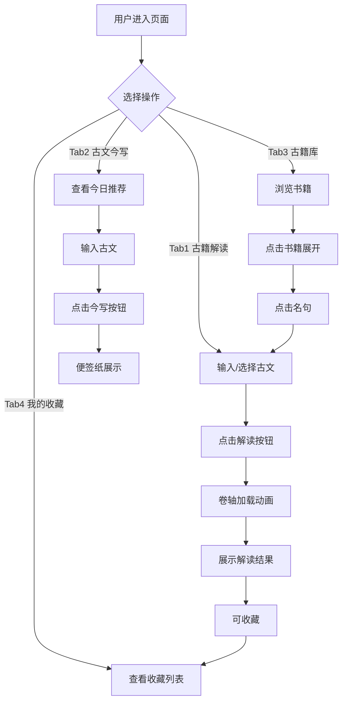

# 古懂 - AI 古籍智能解读工具 产品需求文档

## 1. 产品概述

"古懂"是一款面向 TRAE AI 创造力大赛的交互 Demo，核心亮点是"沉浸式 AI 交互体验"——通过精心设计的动画和预设文案制造 AI 真实感。

- **主要用途**：让用户通过现代化、趣味化的方式理解和欣赏中国古典文献
- **目标用户**：对古文感兴趣但觉得晦涩难懂的年轻人
- **市场价值**：展示 AI 在文化传承领域的应用潜力，通过交互设计让古文"活"起来

## 2. 核心功能

### 2.1 功能模块

1. **古籍解读 Tab**：输入古文 → AI 解读 → 展示多维度解读结果
2. **古文今写 Tab**：将古文转化为现代年轻人语言
3. **古籍库 Tab**：浏览经典古籍和名句
4. **我的收藏 Tab**：收藏和管理喜欢的解读

### 2.2 页面详情

| 页面名称 | 模块名称 | 功能描述 |
|-----------|-------------|---------------------|
| 古籍解读 | 输入区域 | 文本输入框 + 3个示例快捷按钮 |
| 古籍解读 | 加载动画 | 卷轴展开动效 + 文字切换（5秒） |
| 古籍解读 | 结果卡片 | 原文/翻译/注释/背景/今写/场景举例 |
| 古籍解读 | 收藏功能 | 每张卡片右下角收藏按钮 |
| 古文今写 | 今日推荐 | 随机展示一个预设的今写示例 |
| 古文今写 | 输入区域 | 输入古文 → 今写动画 → 便签纸展示 |
| 古籍库 | 书籍列表 | 5本书卡片，点击展开名句 |
| 古籍库 | 名句跳转 | 点击名句自动跳转Tab1并填入 |
| 我的收藏 | 收藏列表 | 表格展示收藏项，支持删除 |

## 3. 核心流程

### 古籍解读流程
1. 用户点击 Tab1 或从古籍库点击名句
2. 输入/填入古文内容
3. 点击"解读"按钮
4. 展示卷轴展开加载动画（约5秒）
5. 动画结束后结果卡片滑入
6. 用户可收藏该解读

### 古文今写流程
1. 用户点击 Tab2
2. 查看今日推荐（随机）
3. 输入古文或点击示例
4. 点击"今写"按钮
5. 展示笔墨书写动画
6. 便签纸展示今写结果

### 古籍库流程
1. 用户点击 Tab3
2. 浏览5本书籍卡片
3. 点击书籍展开名句列表
4. 点击名句 → 跳转 Tab1 并填入

### 收藏流程
1. 在解读结果卡片点击收藏按钮
2. 数据存储到 localStorage
3. 在 Tab4 查看/删除收藏

## 4. 用户界面设计

### 4.1 设计风格

- **配色方案**：
  - 主背景：#F5E6C8（米黄色纸色）
  - 主文字：#2C1810（墨色）
  - 点缀色：#8B2500（朱红）
  - 辅助色：#D4A574（浅棕）、#5C4033（深棕）

- **字体**：
  - 标题：宋体（SimSun）
  - 正文：楷体（KaiTi）
  - 代码/注释：等线体

- **按钮样式**：圆角矩形，朱红色边框，hover 时微微放大

- **布局风格**：卡片式布局，带阴影和圆角

- **图标/Emoji**：使用 Emoji 作为功能标识

### 4.2 页面设计概览

| 页面名称 | 模块名称 | UI 元素 |
|-----------|-------------|-------------|
| 古籍解读 | 输入区域 | 文本框 + 3个示例按钮（朱红色）+ 解读按钮 |
| 古籍解读 | 加载动画 | 卷轴展开 CSS 动画 + 文字轮播 |
| 古籍解读 | 结果卡片 | 6个信息区块 + 收藏按钮 |
| 古文今写 | 便签纸 | 古风便签纸样式，带阴影和倾斜效果 |
| 古籍库 | 书籍卡片 | 书名 + 介绍 + 名句数量，点击展开 |
| 我的收藏 | 表格 | 四列表格 + 删除按钮 |

### 4.3 响应式设计

- **桌面端**：正常布局，最大宽度 1200px
- **移动端**：手机模拟器框架内展示，宽度 375px
- **手机模拟器**：外框模拟手机边框，内部为实际内容区域

### 4.4 动画设计

**卷轴加载动画**：
- 卷轴从中间向两侧展开（CSS animation）
- 卷轴内文字依次切换：
  1. "正在翻阅《论语》…"
  2. "查找历代注疏…"
  3. "比对不同版本…"
  4. "生成解读…"
- 每条停留 1.5 秒，总时长约 5 秒
- 动画结束后卷轴收起，结果卡片滑入

**笔墨书写动画**（Tab2）：
- 文字逐字显现效果
- 配合淡入淡出

## 5. 预设数据

### 5.1 示例古文数据

**示例 1：学而时习之**
- 原文：学而时习之，不亦说乎
- 翻译：学习知识并经常复习实践，不是很愉快吗
- 注释：时——在一定的时候；习——实践、演习；说——同"悦"，喜悦
- 背景：出自《论语·学而》
- 今写：你新学了一个技能，反复练反复用，突然有一天发现已经得心应手了——那种"我居然会了"的爽感，孔子两千五百年前就用"不亦说乎"总结过了。
- 场景：学生/上班族/运动员

**示例 2：道可道非常道**
- 原文：道可道，非常道
- 翻译：可以用语言表达的道，就不是永恒不变的道
- 注释：第一个"道"指宇宙的本源和规律；第二个"道"指用语言表达；常——永恒不变的
- 背景：出自《道德经》开篇
- 今写：有些东西是说不清的。你学会了骑自行车，别人问你"怎么保持平衡"，你张了张嘴发现说不出来——因为你"知道"怎么骑，但那个"知道"不是用语言能表达的。老子说的就是这个意思。
- 场景：学生/上班族/运动员

**示例 3：鱼我所欲也**
- 原文：鱼，我所欲也；熊掌，亦我所欲也。二者不可得兼
- 翻译：鱼是我想要的，熊掌也是我想要的。两样不能同时得到
- 注释：欲——想要；熊掌——熊的脚掌，珍贵食品；兼——同时得到
- 背景：出自《孟子·告子上》
- 今写：你在奶茶和减肥之间反复横跳的样子，孟子两千年前就看透了。他说"鱼和熊掌不可兼得"——不是让你放弃，是让你想清楚：你更想要哪一个。
- 场景：学生/上班族/运动员

### 5.2 古籍库数据

| 书名 | 介绍 | 代表名句 |
|------|------|----------|
| 论语 | 孔子与弟子的对话集 | 学而时习之、己所不欲勿施于人、温故而知新 |
| 孟子 | 孟子阐述仁义思想 | 鱼我所欲也、生于忧患死于安乐、天将降大任 |
| 道德经 | 老子论道，五千言 | 道可道非常道、上善若水、无为而治 |
| 诗经 | 最早诗歌总集 | 关关雎鸠、蒹葭苍苍、桃之夭夭 |
| 史记 | 司马迁著，二十四史之首 | 天下熙熙皆为利来、不飞则已一飞冲天 |

### 5.3 预设收藏数据

预设 2 条示例收藏，存储在 localStorage。
