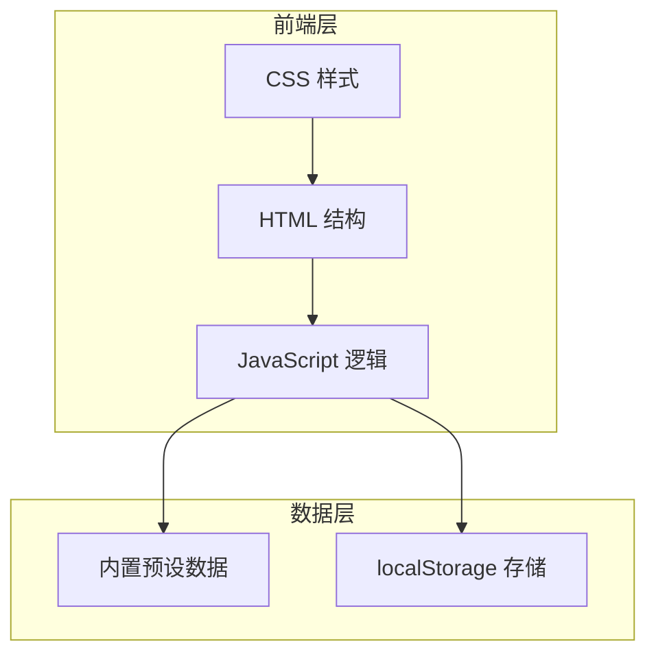

# 古懂 - 技术架构文档

## 1. 架构设计



## 2. 技术说明

- **前端技术栈**：纯 HTML + CSS + JavaScript（ES6+）
- **项目结构**：单页面应用（SPA），所有资源内置
- **数据存储**：
  - 预设数据：JavaScript 对象内置
  - 用户收藏：localStorage
- **动画实现**：CSS Animation + JavaScript 控制
- **无后端依赖**：纯前端 Demo，可直接打开运行

## 3. 文件结构

```
古懂/
├── index.html          # 主页面，包含所有 HTML 结构
├── styles.css          # 样式文件，古籍风设计
├── script.js           # 交互逻辑
└── .trae/
    └── documents/
        ├── prd.md      # 产品需求文档
        └── tech.md     # 技术架构文档
```

## 4. 数据结构定义

### 4.1 预设古文数据

```javascript
const presetData = {
  "学而时习之": {
    original: "学而时习之，不亦说乎",
    translation: "学习知识并经常复习实践，不是很愉快吗",
    annotations: [
      { word: "时", meaning: "在一定的时候" },
      { word: "习", meaning: "实践、演习" },
      { word: "说", meaning: "同"悦"，喜悦" }
    ],
    background: "出自《论语·学而》，孔子教弟子学习的方法——学不只是听课，还要反复练习",
    modern: "你新学了一个技能，反复练反复用，突然有一天发现已经得心应手了——那种"我居然会了"的爽感，孔子两千五百年前就用"不亦说乎"总结过了。",
    scenarios: [
      { role: "学生", emoji: "🧑‍🎓", content: "今天复习英语时，不是重新看一遍笔记，而是合上书试着默写一遍单词。写不出来的就是你没"习"透的。" },
      { role: "上班族", emoji: "💼", content: "上周学了一个新工具，今天找一个小任务刻意用它做一遍，而不是继续用老方法。" },
      { role: "运动员", emoji: "🏃", content: "今天训练完，回顾昨天的配速数据，想想哪里能改进——"时习之"不只是复习，是复盘。", note: "就是我" }
    ]
  },
  // ... 其他示例
};
```

### 4.2 古籍库数据

```javascript
const booksData = [
  {
    name: "论语",
    description: "孔子与弟子的对话集",
    quotes: ["学而时习之", "己所不欲勿施于人", "温故而知新"]
  },
  // ... 其他书籍
];
```

### 4.3 收藏数据结构

```javascript
// localStorage key: "gudong_favorites"
const favorites = [
  {
    id: "timestamp",
    original: "学而时习之，不亦说乎",
    source: "论语·学而",
    time: "2024-01-01 12:00:00"
  }
];
```

## 5. 核心功能实现

### 5.1 Tab 切换

```javascript
function switchTab(tabId) {
  // 隐藏所有 tab 内容
  // 显示目标 tab 内容
  // 更新 tab 按钮状态
}
```

### 5.2 卷轴加载动画

```javascript
function showScrollAnimation(text) {
  // 1. 显示卷轴容器
  // 2. 触发 CSS 展开动画
  // 3. 每 1.5 秒切换文字
  // 4. 5 秒后收起卷轴，显示结果
}
```

### 5.3 收藏功能

```javascript
function addFavorite(item) {
  // 1. 从 localStorage 读取现有收藏
  // 2. 添加新收藏项
  // 3. 保存回 localStorage
  // 4. 更新收藏列表 UI
}

function removeFavorite(id) {
  // 1. 从 localStorage 读取
  // 2. 过滤掉目标项
  // 3. 保存回 localStorage
  // 4. 更新 UI
}
```

### 5.4 手机模拟器

```css
.phone-frame {
  width: 375px;
  height: 812px;
  border: 12px solid #1a1a1a;
  border-radius: 40px;
  overflow: hidden;
  /* 内部为实际内容 */
}
```

## 6. 动画实现细节

### 6.1 卷轴展开动画

```css
@keyframes scrollUnfold {
  0% { 
    width: 0; 
    opacity: 0; 
  }
  100% { 
    width: 100%; 
    opacity: 1; 
  }
}

.scroll-container {
  animation: scrollUnfold 1s ease-out forwards;
}
```

### 6.2 文字轮播

```javascript
const loadingTexts = [
  "正在翻阅《论语》…",
  "查找历代注疏…",
  "比对不同版本…",
  "生成解读…"
];

let currentIndex = 0;
const interval = setInterval(() => {
  currentIndex++;
  if (currentIndex >= loadingTexts.length) {
    clearInterval(interval);
    // 显示结果
  }
  updateLoadingText(loadingTexts[currentIndex]);
}, 1500);
```

## 7. 响应式策略

- **桌面端**：居中显示手机模拟器框架
- **移动端**：全屏展示，隐藏手机框架
- **断点**：768px 以下切换为移动端布局

## 8. 性能优化

- CSS 动画使用 `transform` 和 `opacity`，避免重排
- 预设数据一次性加载，无网络请求
- localStorage 操作防抖处理
