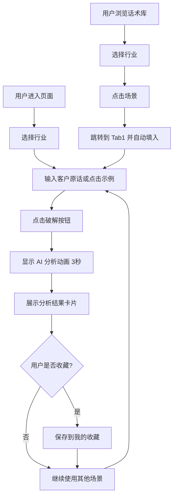

# 逢客必应 - 产品需求文档 (PRD)

## 1. 产品概述

"逢客必应"是一款销售话术 AI 助手交互 Demo，专为 TRAE AI 创造力大赛设计。当销售人员遇到客户的刁钻问题时，输入场景，AI 即时给出应对策略、话术模板和心理分析。

- **主要用途**：帮助销售人员快速应对客户异议，提升成交率
- **解决的问题**：销售在面对客户刁钻问题时缺乏应对策略
- **目标用户**：销售人员、销售培训师、销售经理
- **市场价值**：展示 AI 在销售场景的实际应用价值

## 2. 核心功能

### 2.1 功能模块

1. **客户难题破解**：输入客户原话，AI 分析心理并提供话术
2. **话术库**：按行业分类展示常用话术场景
3. **我的收藏**：收藏和管理常用话术
4. **我的业绩**：模拟销售仪表盘展示使用效果

### 2.2 页面详情

| 页面名称 | 模块名称 | 功能描述 |
|---------|---------|---------|
| 客户难题破解 | 行业选择 | 下拉框选择行业（房产/保险/课程/汽车/SaaS软件/零售） |
| 客户难题破解 | 场景输入 | 输入框 + 5 个示例按钮（"你们太贵了"等） |
| 客户难题破解 | AI 分析动画 | 进度条 + 文字逐条变化（识别客户类型→分析潜在顾虑→匹配最佳策略） |
| 客户难题破解 | 结果展示卡片 | 展示心理分析、3套话术模板、禁忌雷区、下一步建议 |
| 话术库 | 行业分类 | 5 个行业标签，点击展开该行业 Top 5 高频场景 |
| 话术库 | 场景列表 | 点击场景跳转到 Tab1 并自动填入 |
| 我的收藏 | 收藏列表 | 展示收藏的话术（客户原话、行业、收藏时间、删除按钮） |
| 我的业绩 | 数据卡片 | 本月跟进客户数、转化率、话术使用次数、好评率 |
| 我的业绩 | 柱状图 | Canvas 绘制展示"使用前后"对比数据 |

## 3. 核心流程

## 4. 用户界面设计

### 4.1 设计风格

- **主色调**：深蓝 #1A237E（专业、信任）
- **辅助色**：金色 #FFD700（高端、价值）
- **背景色**：白色 #FFFFFF + 浅灰 #F5F5F5
- **按钮样式**：圆角矩形，金色渐变，悬停时轻微上浮阴影
- **字体**：系统默认字体，标题加粗，正文常规
- **布局风格**：卡片式布局，顶部 Tab 导航
- **图标风格**：使用 Emoji 表情符号增加亲和力

### 4.2 页面设计概览

| 页面名称 | 模块名称 | UI 元素 |
|---------|---------|---------|
| 客户难题破解 | 顶部导航 | 4 个 Tab 按钮，当前选中状态金色下划线 |
| 客户难题破解 | 行业选择 | 下拉框，深蓝边框，白色背景 |
| 客户难题破解 | 输入区域 | 大输入框，placeholder "客户说了什么？"，金色"破解"按钮 |
| 客户难题破解 | 示例按钮 | 5 个圆角按钮，浅灰背景，悬停变金色 |
| 客户难题破解 | 加载动画 | 进度条 + 文字逐条淡入淡出 |
| 客户难题破解 | 结果卡片 | 白色卡片，金色左边框，分区展示 4 部分内容 |
| 话术库 | 行业标签 | 横向排列的标签按钮，选中状态金色背景 |
| 话术库 | 场景列表 | 垂直列表，每项可点击，悬停效果 |
| 我的收藏 | 收藏列表 | 表格形式，每行包含客户原话、行业、时间、删除按钮 |
| 我的业绩 | 数据卡片 | 4 个数据卡片，每个显示指标名称和数值 |
| 我的业绩 | 柱状图 | Canvas 绘制的柱状图，蓝色和金色对比 |

### 4.3 响应式设计

- **桌面优先**：默认设计宽度 1200px
- **平板适配**：768px - 1024px，调整卡片布局为 2 列
- **手机适配**：< 768px，单列布局，Tab 按钮横向滚动，输入框全宽
- **触摸优化**：按钮最小高度 44px，点击区域充足

### 4.4 交互细节

- **Tab 切换**：点击 Tab 时平滑过渡，内容区域淡入
- **示例按钮**：点击后自动填入输入框，按钮短暂高亮
- **破解按钮**：点击后禁用，显示加载状态，3 秒后恢复
- **结果卡片**：从下往上滑入，带轻微弹跳效果
- **收藏功能**：点击收藏图标，图标填充金色，提示"已收藏"
- **删除确认**：删除收藏项时弹出确认对话框

## 5. 预设数据

### 5.1 示例场景数据（5 组）

1. **"你们太贵了"**
   - 心理分析：嫌贵不是因为真的没钱，而是在试探你的底价。他需要你给一个"值得"的理由。
   - 话术模板：温和型、专业型、幽默型各一套
   - 禁忌雷区：2 条
   - 下一步建议：1 句

2. **"我再考虑考虑"**
   - 心理分析：他不是真的在考虑，而是在逃避决策压力。他需要有人帮他"推一把"。
   - 话术模板：温和型、专业型、幽默型各一套
   - 禁忌雷区：2 条
   - 下一步建议：1 句

3. **"我朋友推荐了别家"**
   - 心理分析：他在拿你的产品和朋友的推荐做比较。他需要确认"选你不会错"。
   - 话术模板：温和型、专业型、幽默型各一套
   - 禁忌雷区：2 条
   - 下一步建议：1 句

4. **"我没钱"**
   - 心理分析：要么是真没钱，要么是借口。你需要判断哪种情况。
   - 话术模板：温和型、专业型、幽默型各一套
   - 禁忌雷区：2 条
   - 下一步建议：1 句

5. **"你们不如XX家"**
   - 心理分析：他在做横向对比。他需要确认"选你没错"。
   - 话术模板：温和型、专业型、幽默型各一套
   - 禁忌雷区：2 条
   - 下一步建议：1 句

### 5.2 话术库数据（5 个行业 × 5 个场景）

- **房产**：价格太贵、位置太偏、户型不好、我再看看、首付不够
- **保险**：不需要保险、太贵了、回去商量、已经买了、理赔麻烦
- **课程**：没时间学、效果不好、价格太高、考虑一下、网上有免费的
- **汽车**：价格太高、油耗太大、配置不够、再看看、分期太贵
- **SaaS软件**：功能不够、价格太贵、操作复杂、数据安全、再考虑

### 5.3 业绩数据（模拟）

- 本月跟进客户数：87 人
- 转化率：34%
- 话术使用次数：156 次
- 好评率：92%

## 6. 底部信息

- 显示："由 TRAE 驱动 | 报名用户：那日苏"
- 居中显示，灰色小字
