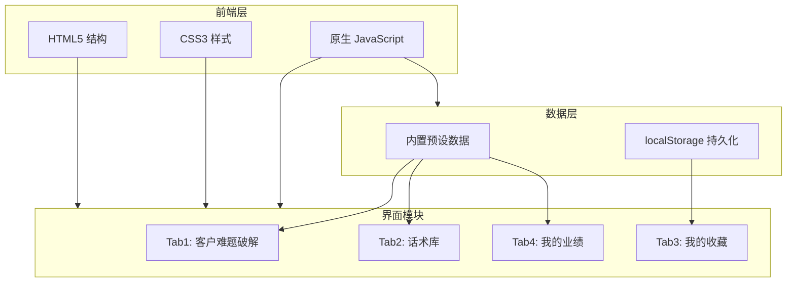

# 逢客必应 - 技术架构文档

## 1. 架构设计



## 2. 技术说明

- **前端**：纯 HTML5 + CSS3 + 原生 JavaScript（无框架）
- **文件结构**：单文件 `index.html`，内联 CSS 和 JS
- **数据存储**：localStorage 存储收藏数据
- **图表绘制**：Canvas API 绘制柱状图
- **动画效果**：CSS 动画 + JavaScript 定时器
- **响应式**：CSS Media Queries 实现移动端适配

## 3. 文件结构

```
逢客必应/
├── index.html          # 主页面（包含所有 HTML、CSS、JS）
└── .trae/
    └── documents/
        ├── PRD.md      # 产品需求文档
        └── TECH.md     # 技术架构文档
```

## 4. 数据模型

### 4.1 预设话术数据

```javascript
// 每组预设数据结构
{
  input: "你们太贵了",           // 客户原话
  industry: "通用",              // 适用行业
  psychology: "...",             // 心理分析（30-50字）
  scripts: {
    gentle: "...",               // 温和型话术（50-80字）
    professional: "...",         // 专业型话术（50-80字）
    humorous: "..."              // 幽默型话术（50-80字）
  },
  taboos: [
    "❌ 别说...",                // 禁忌1
    "❌ 别直接..."               // 禁忌2
  ],
  nextStep: "..."                // 下一步建议
}
```

### 4.2 话术库数据

```javascript
// 行业话术库结构
{
  industry: "房产",
  scenes: [
    { name: "价格太贵", input: "你们的价格太高了" },
    { name: "位置太偏", input: "这个位置太偏了" },
    ...
  ]
}
```

### 4.3 收藏数据（localStorage）

```javascript
// 收藏项结构
{
  id: "timestamp",              // 唯一标识
  input: "你们太贵了",           // 客户原话
  industry: "房产",              // 行业
  savedAt: "2024-01-01 12:00"   // 收藏时间
}
```

### 4.4 业绩数据

```javascript
{
  clients: 87,                   // 本月跟进客户数
  conversionRate: 34,            // 转化率（%）
  scriptUsage: 156,              // 话术使用次数
  satisfactionRate: 92,          // 好评率（%）
  monthlyData: [                 // 月度柱状图数据
    { month: "1月", before: 15, after: 28 },
    { month: "2月", before: 18, after: 35 },
    ...
  ]
}
```

## 5. 核心功能实现

### 5.1 Tab 切换

- 使用 JavaScript 控制 `display` 属性切换四个 Tab 内容
- 当前选中 Tab 添加 `active` 类名，显示金色下划线

### 5.2 AI 分析动画

- 点击"破解"按钮后：
  1. 显示进度条容器，隐藏结果卡片
  2. 启动 3 秒定时器
  3. 进度条从 0% 到 100% 线性增长
  4. 文字每 1 秒切换一次（识别客户类型→分析潜在顾虑→匹配最佳策略）
  5. 动画结束后隐藏进度条，显示结果卡片

### 5.3 示例按钮

- 5 个预设示例按钮，点击后将文字填入输入框
- 自动触发"破解"功能

### 5.4 收藏功能

- 结果卡片右上角收藏按钮
- 点击后将当前数据存入 localStorage
- Tab3 读取 localStorage 数据展示列表
- 支持删除操作

### 5.5 柱状图

- 使用 Canvas API 绘制
- 蓝色柱表示"使用前"，金色柱表示"使用后"
- 显示 6 个月的数据对比
- 包含坐标轴、标签、图例

### 5.6 响应式设计

- CSS Media Queries 断点：768px、1024px
- 移动端：单列布局，Tab 横向滚动
- 平板：卡片 2 列布局
- 桌面：最大宽度 1200px 居中

## 6. 配色方案

| 用途 | 颜色值 | 说明 |
|-----|-------|------|
| 主色 | #1A237E | 深蓝色，用于标题、按钮、边框 |
| 辅助色 | #FFD700 | 金色，用于强调、选中状态、按钮 |
| 背景色 | #FFFFFF | 白色，主背景 |
| 次背景 | #F5F5F5 | 浅灰，卡片背景、分区背景 |
| 文字色 | #333333 | 深灰，正文 |
| 次文字 | #666666 | 中灰，辅助文字 |
| 成功色 | #4CAF50 | 绿色，用于正面指标 |
| 警告色 | #FF5722 | 橙红，用于禁忌雷区 |
