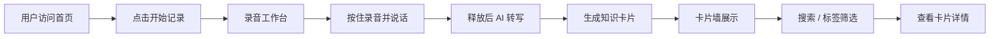

# 产品需求文档（PRD）

## 1. 产品概述

思绪胶囊（MindCapsule）是一款面向学生、创作者与知识工作者的 AI 语音灵感速记 Web 应用。用户只需按下录音按钮，用自然语言说出碎片灵感、课堂重点或会议随想，系统即可自动转写、提取关键词、生成结构化知识卡片，并支持标签归类与全文检索，解决“灵感来了来不及记录、记了却找不到”的痛点。

产品以 Web 应用形态首发，后续可扩展为鸿蒙 App / 微信小程序，强调“语音入口 + AI 整理 + 视觉化复习”的轻量化学习工作流。

## 2. 核心功能

### 2.1 用户角色

| 角色 | 注册方式 | 核心权限 |
|------|----------|----------|
| 普通用户 | 无需注册，本地存储 | 录音、转写、生成卡片、标签管理、搜索、导出 |

### 2.2 功能模块

1. **首页（Hero）**：品牌展示、核心卖点、快速体验入口
2. **录音工作台**：一键录音、实时波形、转写结果预览
3. **知识卡片墙**：以卡片瀑布流展示所有灵感，支持标签筛选与关键词搜索
4. **卡片详情**：查看完整转写文本、关键词标签、AI 摘要、时间戳

### 2.3 页面详情

| 页面名称 | 模块名称 | 功能描述 |
|----------|----------|----------|
| 首页 | Hero 区域 | 品牌 slogan、动态胶囊视觉、CTA 进入工作台 |
| 首页 | 功能亮点 | 三步流程展示：录音 → AI 整理 → 卡片复习 |
| 录音工作台 | 录音控制 | 开始/停止录音、实时音波动画、模拟 AI 转写进度 |
| 录音工作台 | 转写预览 | 展示模拟转写文本，支持一键生成卡片 |
| 知识卡片墙 | 卡片列表 | 瀑布流展示卡片，含标题、摘要、标签、时间 |
| 知识卡片墙 | 筛选搜索 | 顶部搜索框 + 热门标签快速筛选 |
| 卡片详情 | 详情面板 | 完整内容、关键词、AI 摘要、删除/关闭 |

## 3. 核心流程

用户进入首页后，点击“开始记录”进入录音工作台。按住录音按钮说出灵感，释放后系统模拟 AI 转写与整理，生成一张知识卡片并展示在卡片墙上。用户可以通过搜索框或标签快速找到历史卡片，点击卡片查看详情。

## 4. 用户界面设计

### 4.1 设计风格

- **主色调**：深空灰 `#1a1a2e` 作为背景，营造专注夜读氛围；胶囊蓝 `#6366f1` 作为品牌主色；荧光青 `#22d3ee` 作为高亮点缀。
- **按钮风格**：大圆角胶囊形按钮，主按钮带渐变与微光阴影，悬浮时放大并出现光晕。
- **字体**：标题使用圆润有力的展示字体（Space Grotesk 风格中文字体回退为思源黑体），正文使用清晰易读的无衬线字体。
- **布局风格**：单页滚动 + 模态面板。首页全屏 Hero，功能区三段式，工作台与卡片墙以模态或独立区块呈现。
- **图标/emoji**：使用简洁线性图标，配合胶囊、声波、卡片等图形元素。

### 4.2 页面设计概述

| 页面名称 | 模块名称 | UI 元素 |
|----------|----------|---------|
| 首页 | Hero 区域 | 居中标题、呼吸动画胶囊、渐变背景、CTA 胶囊按钮 |
| 首页 | 三步流程 | 横向卡片，带序号圆圈、图标、简述 |
| 录音工作台 | 录音面板 | 圆形录音按钮、同心圆波纹动画、实时波形条 |
| 录音工作台 | 转写结果 | 玻璃拟态卡片、打字机效果文本、生成按钮 |
| 知识卡片墙 | 卡片网格 | 瀑布流 / 响应式网格、标签 chips、悬停上浮动画 |
| 知识卡片墙 | 搜索筛选 | 顶部固定搜索栏、横向可滚动标签 |
| 卡片详情 | 详情弹窗 | 模态框、关键词标签、AI 摘要、完整文本 |

### 4.3 响应式设计

- 桌面端：左右分栏，左侧录音区，右侧卡片墙；Hero 全屏展示。
- 移动端：垂直堆叠，录音按钮置于底部固定区域，卡片墙单列展示，详情使用底部抽屉。
- 触控优化：录音按钮尺寸 ≥ 72px，支持长按交互；所有可点击元素带明显 hover / active 状态。

### 4.4 动画与交互

- 页面加载：标题逐字上浮、胶囊图形呼吸缩放。
- 录音状态：同心圆波纹扩散，波形条随录音时长动态变化。
- 卡片生成：新卡片从下方弹入，带轻微弹性效果。
- 筛选搜索：卡片以淡入淡出方式重新排列。
