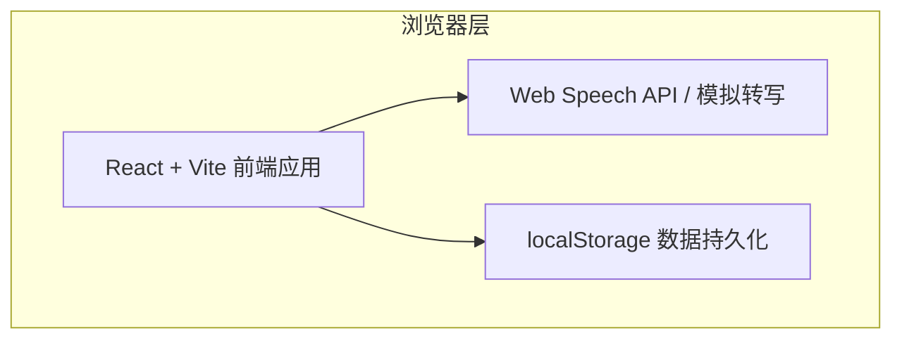

# 技术架构文档

## 1. 架构设计

本项目为纯前端演示应用，无需后端服务。所有数据存储在浏览器本地（localStorage），语音转写与 AI 整理通过前端模拟实现，便于快速演示与社区上传。



## 2. 技术选型

- **前端框架**：React 18 + TypeScript
- **构建工具**：Vite
- **样式方案**：Tailwind CSS 3
- **状态管理**：Zustand（本地卡片状态）
- **图标库**：lucide-react
- **语音能力**：Web Speech API（演示环境回退为模拟录音）
- **数据持久化**：localStorage

## 3. 路由定义

| 路由 | 用途 |
|------|------|
| `/` | 首页，包含 Hero、功能亮点、CTA |
| `/app` | 应用主界面，包含录音工作台与知识卡片墙 |

## 4. API 定义

本项目无后端 API。前端通过自定义 Hook 封装语音转写与卡片管理逻辑。

## 5. 数据模型

### 5.1 类型定义

```typescript
interface MindCapsule {
  id: string;
  title: string;
  content: string;
  summary: string;
  tags: string[];
  createdAt: number;
  audioDuration: number;
}

interface CapsuleState {
  capsules: MindCapsule[];
  addCapsule: (capsule: MindCapsule) => void;
  removeCapsule: (id: string) => void;
  filterTag: string | null;
  setFilterTag: (tag: string | null) => void;
  searchQuery: string;
  setSearchQuery: (query: string) => void;
}
```

### 5.2 本地存储结构

- Key: `mindcapsule_capsules`
- Value: `MindCapsule[]` 的 JSON 字符串

## 6. 项目结构

```
/Users/andy/html/
├── .trae/documents/
│   ├── PRD-MindCapsule.md
│   └── Technical-Architecture-MindCapsule.md
├── src/
│   ├── components/
│   │   ├── Hero.tsx
│   │   ├── FeatureSteps.tsx
│   │   ├── Recorder.tsx
│   │   ├── CapsuleCard.tsx
│   │   ├── CapsuleWall.tsx
│   │   └── CapsuleDetail.tsx
│   ├── hooks/
│   │   └── useCapsules.ts
│   ├── pages/
│   │   ├── HomePage.tsx
│   │   └── AppPage.tsx
│   ├── store/
│   │   └── capsuleStore.ts
│   ├── types/
│   │   └── capsule.ts
│   ├── utils/
│   │   └── mockAi.ts
│   ├── App.tsx
│   ├── main.tsx
│   └── index.css
├── index.html
├── package.json
├── tsconfig.json
├── vite.config.ts
├── tailwind.config.js
└── postcss.config.js
```
