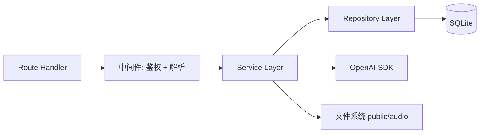
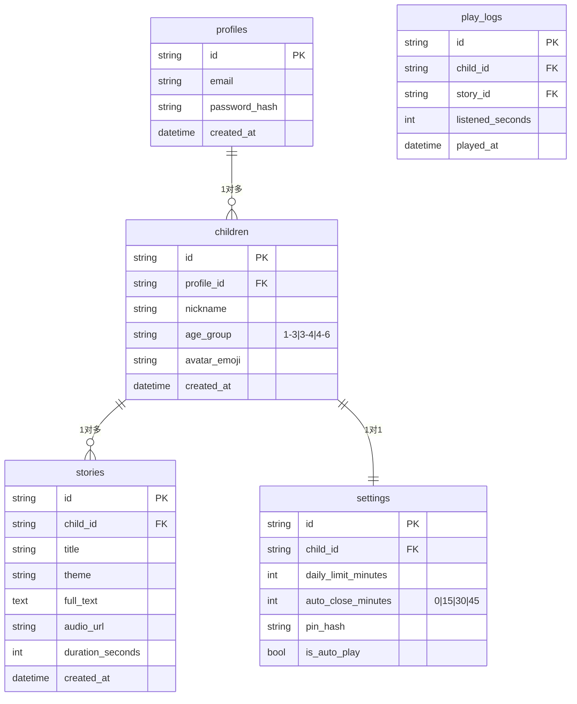

# 技术架构文档 — 奇想小剧场

> 文档版本：v1.0 · 适用于 MVP 阶段（本地 SQLite 模式） · 文档语言：中文

---

## 1. 架构设计

```mermaid
graph TB
    subgraph 客户端 Browser
        A[Next.js 14 App Router] --> B[React 18 + TypeScript]
        B --> C[Tailwind CSS 3 + CSS Variables]
        B --> D[Zustand 全局状态]
        B --> E[Shadcn/ui 组件]
        A --> F[原生 audio + useSound]
    end

    subgraph 服务端 Next.js API Routes
        G[/api/auth] --> H[bcryptjs 密码哈希]
        I[/api/generate-story] --> J[OpenAI gpt-4o-mini]
        I --> K[按年龄 Prompt 模板]
        L[/api/text-to-speech] --> M[OpenAI tts-1]
        L --> N[public/audio 本地缓存]
        O[/api/stories/recommend] --> P[SQLite 查询]
    end

    subgraph 数据层
        Q[better-sqlite3] --> R[(SQLite 文件 dev.db)]
        S[localStorage] --> T[离线备用故事]
    end

    A --> G
    A --> I
    A --> L
    A --> O
    I --> Q
    L --> Q
    O --> Q
    F --> N
    B --> S
```

---

## 2. 技术选型

| 层级 | 技术 | 版本 | 说明 |
|------|------|------|------|
| 框架 | Next.js | 14.2.x (App Router) | 全栈一体；API Routes 内置 |
| UI 库 | React | 18.x | App Router 强制 18+ |
| 语言 | TypeScript | 5.x | 严格模式 strict: true |
| 样式 | Tailwind CSS | 3.4.x | 配合 CSS Variables 实现语义化色板 |
| 组件 | Shadcn/ui | latest | 仅引入需要的原子组件（Button/Input/Card/Dialog） |
| 状态 | Zustand | 4.x | 轻量；用于 child profile / audio 全局状态 |
| 数据库 | better-sqlite3 | 11.x | 本地零配置，文件型持久化 |
| 密码 | bcryptjs | 2.x | 纯 JS 实现，跨平台免编译 |
| AI | openai | 4.x | gpt-4o-mini + tts-1 |
| 图标 | lucide-react | latest | 严格按 Skill 规范 |
| 包管理 | npm | - | 用户环境默认 npm；不强制 pnpm |
| 测试 | curl + 浏览器 | - | 轻量验证，无 Jest 依赖 |

> 注：MVP 阶段选用本地 SQLite 而非 Supabase，理由：① 零配置即跑通；② 演示数据更可控；③ Schema 文件可后续迁移到 Postgres。

---

## 3. 目录结构

```
fantasy-theater/
├── .env.local                      # OPENAI_API_KEY / DATABASE_PATH / PIN_SALT
├── .env.example                    # 提交到 git 的示例
├── next.config.mjs
├── tsconfig.json
├── tailwind.config.ts
├── postcss.config.mjs
├── components.json                 # shadcn 配置
├── package.json
├── public/
│   ├── audio/                      # TTS 生成的 MP3（gitignore 内）
│   └── favicon.ico
├── data/
│   ├── dev.db                      # SQLite 文件（gitignore）
│   ├── migrations/                 # 迁移 SQL
│   │   ├── 001_init.sql
│   │   └── 002_seed_stories.sql
│   └── seed/                       # 6 个种子故事 JSON
│       └── stories.json
├── scripts/
│   ├── migrate.ts                  # 执行迁移
│   └── seed.ts                     # 导入种子数据
├── src/
│   ├── app/
│   │   ├── layout.tsx              # 根布局：字体 + suppressHydrationWarning
│   │   ├── globals.css             # Tailwind + 语义化 CSS 变量
│   │   ├── page.tsx                # 根路由：登录态判断后重定向
│   │   ├── login/page.tsx
│   │   ├── onboarding/page.tsx
│   │   ├── home/page.tsx
│   │   ├── player/[id]/page.tsx
│   │   ├── parent/page.tsx
│   │   └── api/
│   │       ├── auth/
│   │       │   ├── register/route.ts
│   │       │   └── login/route.ts
│   │       ├── generate-story/route.ts
│   │       ├── text-to-speech/route.ts
│   │       ├── stories/
│   │       │   ├── recommend/route.ts
│   │       │   └── [id]/route.ts
│   │       ├── children/route.ts
│   │       └── settings/pin/route.ts
│   ├── components/
│   │   ├── ui/                     # shadcn 原子组件
│   │   ├── ChildLock.tsx
│   │   ├── AudioPlayer.tsx
│   │   ├── StoryCard.tsx
│   │   ├── StarCard.tsx            # 闪卡彩蛋
│   │   ├── MagicLoader.tsx         # 魔法星星旋转加载
│   │   ├── PinDialog.tsx
│   │   └── ParentNav.tsx
│   ├── lib/
│   │   ├── db.ts                   # better-sqlite3 单例
│   │   ├── openai.ts               # OpenAI 客户端
│   │   ├── auth.ts                 # session + bcrypt
│   │   ├── offline.ts              # localStorage 离线故事
│   │   ├── theme.ts                # 主题 -> Emoji 映射
│   │   └── prompts/
│   │       ├── age-1-3.ts
│   │       ├── age-3-4.ts
│   │       └── age-4-6.ts
│   ├── store/
│   │   ├── useProfileStore.ts      # 当前家长/孩子
│   │   ├── usePlayerStore.ts       # 播放状态
│   │   └── useSettingsStore.ts     # 每日限额 / PIN
│   ├── types/
│   │   ├── database.ts
│   │   ├── api.ts
│   │   └── story.ts
│   └── utils/
│       ├── format.ts               # 时间格式化
│       └── validation.ts           # zod 表单校验
└── .trae/
    └── documents/                  # PRD.md / 技术架构.md
```

---

## 4. 路由定义

| 路由 | 类型 | 鉴权 | 用途 |
|------|------|------|------|
| `/` | SSR | - | 读取 cookie 判断登录态，已登录跳 `/home`，否则跳 `/login` |
| `/login` | SSR | - | 邮箱+密码登录/注册 |
| `/onboarding` | CSR | 必登录 | 首次登录强制 |
| `/home` | CSR | 必登录 + 必配置孩子 | 儿童主界面 |
| `/player/[id]` | CSR | 必登录 | 故事播放 |
| `/parent` | CSR | 必登录 + PIN | 家长管控中心 |
| `/api/auth/register` | POST | - | 创建家长账号 |
| `/api/auth/login` | POST | - | 验证并写 cookie session |
| `/api/generate-story` | POST | 必登录 | AI 生成故事 |
| `/api/text-to-speech` | POST | 必登录 | TTS 转 MP3 |
| `/api/stories/recommend` | GET | 必登录 | 拉取推荐 |
| `/api/stories/[id]` | GET | 必登录 | 单个故事详情 |
| `/api/children` | GET/POST | 必登录 | 孩子档案 CRUD |
| `/api/settings/pin` | POST | 必登录 | 验证/更新 PIN |

---

## 5. API 定义

### 5.1 通用响应结构

```typescript
type ApiResponse<T> = {
  ok: boolean;
  data?: T;
  error?: { code: string; message: string };
};
```

### 5.2 POST /api/auth/register

```typescript
// Request
{ email: string; password: string }
// Response
{ profileId: string; email: string }
```

### 5.3 POST /api/auth/login

```typescript
// Request
{ email: string; password: string }
// Response (Set-Cookie: session=<id>)
{ profileId: string; email: string; hasOnboarded: boolean }
```

### 5.4 POST /api/generate-story

```typescript
// Request
{ childId: string; theme?: ThemeKey; customPrompt?: string }
// Response
{
  story: {
    id: string;
    title: string;
    fullText: string;
    theme: ThemeKey;
    durationSeconds: number; // 按字数估算
  }
}
```

**逻辑**：
1. 查询 children 表得到 age_group
2. 加载对应 `lib/prompts/age-{1-3|3-4|4-6}.ts` 的 system prompt
3. 拼接 user prompt（theme + customPrompt）
4. 调用 `openai.chat.completions.create({ model: 'gpt-4o-mini', ... })`
5. 解析返回的 `title` 和 `full_text`
6. 估算 duration_seconds = 字数 / 3.5
7. 插入 stories 表（audio_url 暂为空）
8. 立即异步触发 `/api/text-to-speech` 或前端轮询

### 5.5 POST /api/text-to-speech

```typescript
// Request
{ storyId: string; text: string }
// Response
{ audioUrl: string; cached: boolean }
```

**逻辑**：
1. 检查 `public/audio/story_{id}.mp3` 是否存在 → 是则直接返回
2. 调用 `openai.audio.speech.create({ model: 'tts-1', voice: 'nova', input: text })`
3. 写入 `public/audio/story_{id}.mp3`
4. 更新 stories.audio_url 字段
5. 返回 `/audio/story_{id}.mp3` 相对路径

**降级策略**：若 `OPENAI_API_KEY` 未配置，使用浏览器原生 `speechSynthesis.speak()` 前端兜底（前端检测 audio_url 以 `/offline/` 开头时降级）。

### 5.6 GET /api/stories/recommend

```typescript
// Response
{ stories: Array<{ id: string; title: string; theme: ThemeKey; emoji: string; durationSeconds: number }> }
```

**逻辑**：
1. 读取当前孩子的 childId
2. 查询 stories WHERE child_id = ? AND created_at < 7 days ORDER BY created_at DESC LIMIT 3
3. 若结果少于 3 个，从 `data/seed/stories.json` 读取种子数据补足
4. 返回的每条记录带 emoji（由 theme 映射）

### 5.7 POST /api/settings/pin

```typescript
// Request
{ pin: string; action: 'verify' | 'update'; newPin?: string }
// Response
{ ok: true }
```

**逻辑**：
- verify：从 settings 表读取 pin_hash（bcrypt），与输入 pin 比对
- update：将 newPin bcrypt 后写回
- 父级默认 hash 由 `lib/auth.ts` 启动时 seed：bcrypt('0000') 后写入 settings 表

---

## 6. 服务端架构



- **中间件层**：`lib/auth.ts#getSessionFromRequest(req)` 从 cookie 提取 sessionId
- **Service 层**：`generateStory()`、`textToSpeech()`、`recommendStories()`
- **Repository 层**：`storiesRepo.findById()`、`childrenRepo.findByProfile()`、`settingsRepo.verifyPin()`

---

## 7. 数据模型

### 7.1 ER 图



### 7.2 DDL（SQLite 方言）

```sql
-- 001_init.sql
PRAGMA foreign_keys = ON;

CREATE TABLE profiles (
  id TEXT PRIMARY KEY,
  email TEXT UNIQUE NOT NULL,
  password_hash TEXT NOT NULL,
  created_at TEXT DEFAULT (datetime('now'))
);

CREATE TABLE children (
  id TEXT PRIMARY KEY,
  profile_id TEXT NOT NULL REFERENCES profiles(id) ON DELETE CASCADE,
  nickname TEXT NOT NULL,
  age_group TEXT NOT NULL CHECK (age_group IN ('1-3', '3-4', '4-6')),
  avatar_emoji TEXT DEFAULT '🐰',
  created_at TEXT DEFAULT (datetime('now'))
);

CREATE TABLE stories (
  id TEXT PRIMARY KEY,
  child_id TEXT NOT NULL REFERENCES children(id) ON DELETE CASCADE,
  title TEXT NOT NULL,
  theme TEXT NOT NULL,
  full_text TEXT NOT NULL,
  audio_url TEXT,
  duration_seconds INTEGER DEFAULT 0,
  created_at TEXT DEFAULT (datetime('now'))
);

CREATE TABLE settings (
  id TEXT PRIMARY KEY,
  child_id TEXT UNIQUE NOT NULL REFERENCES children(id) ON DELETE CASCADE,
  daily_limit_minutes INTEGER DEFAULT 30,
  auto_close_minutes INTEGER DEFAULT 0,
  pin_hash TEXT NOT NULL,
  is_auto_play INTEGER DEFAULT 1
);

CREATE TABLE play_logs (
  id TEXT PRIMARY KEY,
  child_id TEXT NOT NULL REFERENCES children(id) ON DELETE CASCADE,
  story_id TEXT NOT NULL REFERENCES stories(id) ON DELETE CASCADE,
  listened_seconds INTEGER DEFAULT 0,
  played_at TEXT DEFAULT (datetime('now'))
);

CREATE INDEX idx_stories_child ON stories(child_id, created_at DESC);
CREATE INDEX idx_playlogs_child_day ON play_logs(child_id, played_at);
```

### 7.3 种子数据策略

`data/seed/stories.json` 内置 6 个故事元数据。`scripts/seed.ts` 执行：
1. 创建 demo profile `demo@fantasy.local / demo1234`
2. 创建 demo child "小柚" 3-4 岁
3. 把 6 个 seed story id 关联到 demo child 之外，另存为"全局公共" → 实际通过在 stories.child_id 用 'public' 这个特殊值（外键关闭情况下可绕过）
4. 推荐接口优先返回公共故事 + 该 child 专属故事

> 简化方案：seed 阶段为每个新注册家长自动把这 6 个故事复制到 child_id 下，规避外键特殊值。

---

## 8. 关键代码模式

### 8.1 SQLite 单例（lib/db.ts）

```typescript
import Database from 'better-sqlite3';
const DB_PATH = process.env.DATABASE_PATH || './data/dev.db';
let _db: Database.Database | null = null;
export function getDB() {
  if (!_db) {
    _db = new Database(DB_PATH);
    _db.pragma('journal_mode = WAL');
    _db.pragma('foreign_keys = ON');
  }
  return _db;
}
```

### 8.2 Session Cookie（lib/auth.ts）

```typescript
import { cookies } from 'next/headers';
import bcrypt from 'bcryptjs';
import { v4 as uuid } from 'uuid';

const SESSION_COOKIE = 'fantasy_session';
export const SALT_ROUNDS = 10;
export const DEFAULT_PIN = '0000';
export const DEFAULT_PIN_HASH = bcrypt.hashSync(DEFAULT_PIN, SALT_ROUNDS);

export function createSession(profileId: string) {
  cookies().set(SESSION_COOKIE, profileId, {
    httpOnly: true, sameSite: 'lax', path: '/', maxAge: 60 * 60 * 24 * 30
  });
}
export function getSession() {
  return cookies().get(SESSION_COOKIE)?.value || null;
}
export function clearSession() { cookies().delete(SESSION_COOKIE); }
```

### 8.3 按年龄 Prompt 模板（lib/prompts/age-1-3.ts）

```typescript
export const AGE_1_3_SYSTEM = `你是一位温柔的儿童故事妈妈。
要求：
- 故事主角只能是 1 个，名字简单（不超过 2 个字）
- 每句话不超过 10 个字
- 大量拟声词（"哗啦啦"、"喵喵"、"咕噜咕噜"）
- 情节简单线性：起床→玩耍→回家
- 故事中禁止出现暴力、恐怖、悲伤结局，必须包含积极向上的价值观
- 总字数 200–300 字
- 输出 JSON 格式：{"title": "故事标题", "fullText": "故事正文"}`;
```

```typescript
// lib/prompts/age-4-6.ts
export const AGE_4_6_SYSTEM = `你是一位寓教于乐的儿童故事老师。
要求：
- 故事主角 1–2 个，名字生动
- 包含因果关系（"因为...所以..."）
- 融入一点科普知识或习惯养成（如刷牙、分享、勇敢）
- 段落 3–5 段，情节有起承转合
- 故事中禁止出现暴力、恐怖、悲伤结局，必须包含积极向上的价值观
- 总字数 350–500 字
- 输出 JSON 格式：{"title": "故事标题", "fullText": "故事正文"}`;
```

### 8.4 主题 Emoji 映射（lib/theme.ts）

```typescript
export const THEME_EMOJI: Record<string, string> = {
  dinosaur: '🦕',
  princess: '👸',
  car: '🚗',
  space: '🚀',
  animal: '🐰',
  default: '📖',
};
export function emojiFor(theme: string) {
  return THEME_EMOJI[theme] || THEME_EMOJI.default;
}
```

### 8.5 离线备用故事（lib/offline.ts）

```typescript
const KEY = 'fantasy_theater_offline_stories';
export const OFFLINE_STORIES = [
  { id: 'offline_01', title: '小兔子的彩虹', theme: 'animal',
    fullText: '小白兔跳跳在草地上看到一道彩虹...' },
  { id: 'offline_02', title: '小汽车去旅行', theme: 'car',
    fullText: '红色小汽车嘀嘀要去看大海...' },
  { id: 'offline_03', title: '月亮上的朋友', theme: 'space',
    fullText: '小星星闪闪邀请小兔子去月亮上玩耍...' },
];
export function ensureOfflineCache() {
  if (typeof window === 'undefined') return;
  if (!localStorage.getItem(KEY)) {
    localStorage.setItem(KEY, JSON.stringify(OFFLINE_STORIES));
  }
}
```

### 8.6 Hydration 防御

- `/src/app/layout.tsx` 根 `<html><body>` 加 `suppressHydrationWarning`
- 所有使用 `localStorage` / `Date.now()` / `Math.random()` 的客户端组件顶部 `'use client'`
- 闪卡随机位置用 `useEffect` 内 `setState` 初始化，避免 SSR/CSR mismatch

### 8.7 闪卡彩蛋（components/StarCard.tsx）

```typescript
'use client';
import { useEffect, useState } from 'react';
import { motion, AnimatePresence } from 'framer-motion';

const VOCAB = [
  { emoji: '🦕', word: '小恐龙' },
  { emoji: '🌟', word: '亮星星' },
  { emoji: '🌈', word: '彩虹' },
  { emoji: '🦋', word: '蝴蝶' },
];

export function StarCard({ trigger }: { trigger: number }) {
  const [visible, setVisible] = useState(false);
  const [pos, setPos] = useState({ x: 0, y: 0 });
  const [item, setItem] = useState(VOCAB[0]);

  useEffect(() => {
    if (trigger === 0) return;
    setItem(VOCAB[Math.floor(Math.random() * VOCAB.length)]);
    setPos({
      x: Math.random() * 60 + 10,
      y: Math.random() * 50 + 20,
    });
    setVisible(true);
    const t = setTimeout(() => setVisible(false), 4000);
    return () => clearTimeout(t);
  }, [trigger]);

  return (
    <AnimatePresence>
      {visible && (
        <motion.button
          initial={{ opacity: 0, scale: 0.8 }}
          animate={{ opacity: 1, scale: 1 }}
          exit={{ opacity: 0, scale: 1.3 }}
          transition={{ type: 'spring', stiffness: 200 }}
          style={{ left: `${pos.x}%`, top: `${pos.y}%` }}
          className="absolute z-30 bg-[var(--paper)] rounded-2xl px-4 py-3 shadow-lg flex items-center gap-2"
          onClick={() => setVisible(false)}
        >
          <span className="text-4xl">{item.emoji}</span>
          <span className="text-base font-medium">{item.word}</span>
        </motion.button>
      )}
    </AnimatePresence>
  );
}
```

### 8.8 加载动画（components/MagicLoader.tsx）

```typescript
'use client';
import { motion } from 'framer-motion';
export function MagicLoader() {
  return (
    <div className="flex flex-col items-center gap-4 py-12">
      <motion.div
        animate={{ rotate: 360 }}
        transition={{ repeat: Infinity, duration: 1.2, ease: 'linear' }}
        className="text-6xl"
      >🌟</motion.div>
      <p className="text-[var(--muted)] animate-pulse">小精灵正在编故事...</p>
    </div>
  );
}
```

---

## 9. 环境变量

`.env.local`（不提交到 git）：

```bash
OPENAI_API_KEY=sk-...                  # 可为空：为空时 TTS 降级到浏览器 speechSynthesis
DATABASE_PATH=./data/dev.db
SESSION_SECRET=change-me-in-prod       # MVP 默认 hardcode
```

`.env.example`（提交到 git）：

```bash
OPENAI_API_KEY=
DATABASE_PATH=./data/dev.db
SESSION_SECRET=
```

---

## 10. 验收清单

| 项目 | 标准 |
|------|------|
| 类型检查 | `npx tsc --noEmit` 通过 |
| 启动 | `npm install && npm run db:migrate && npm run db:seed && npm run dev` |
| Lint | `npm run lint` 0 警 0 错 |
| 浏览器 | Chrome 120+ / Safari 17+ / 移动端 Safari/微信内置 |
| 离线 | 飞行模式打开 home → 点击"听故事" → 仍可播放 3 个本地故事 |
| AI 降级 | 不配 OPENAI_API_KEY → TTS 走浏览器 speechSynthesis，UI 提示"使用浏览器内置语音" |
| 字号 | 移动端 375px 宽度下主操作按钮 ≥ 64×64px |
| 字体 | Fraunces + Noto Serif SC + Inter + Noto Sans SC 全部正确加载 |
| 色彩 | 无硬编码 hex，无蓝紫渐变 |
| 动效 | 听故事按钮点击 scale 反馈、闪卡 spring 动画、PIN 错误 shake |
