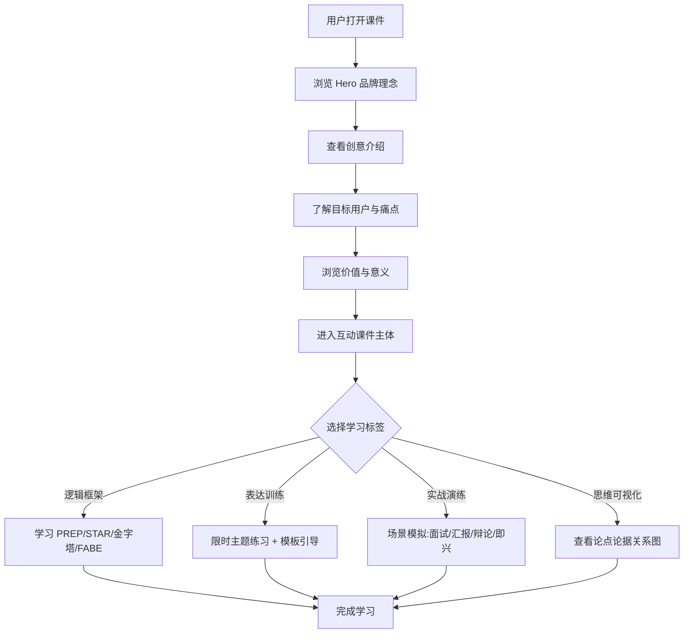

## 1. 产品概述

"言思"是一款基于浏览器的口才逻辑互动课件，通过结构化的思维框架（PREP、STAR、金字塔原理等）、可交互的表达训练与实战场景演练，帮助用户在短时间内组织出逻辑清晰、表达有力的语言内容。

- 面向职场人士、学生群体、内容创作者，解决"想到什么说什么、表达缺乏结构、紧张时大脑空白"的痛点
- 以单页交互式 HTML 课件形式呈现，无需安装，打开即用，兼具知识科普与互动练习

## 2. 核心功能

### 2.1 功能模块

1. **创意介绍**：品牌理念、痛点阐述、产品形态说明
2. **目标用户与痛点**：三类核心用户画像、使用场景、当前痛点可视化
3. **价值与意义**：效率提升、商业价值、社会价值三大维度
4. **互动课件主体**：四大标签页可切换学习内容
   - 逻辑框架库：PREP / STAR / 金字塔原理 / FABE 四套经典表达结构，可交互展开
   - 表达训练器：给定主题，限时组织语言，提供结构模板填充引导
   - 实战演练场：面试 / 汇报 / 辩论 / 即兴演讲四类场景模拟
   - 思维可视化：论点-论据关系图、逻辑链路动画演示

### 2.2 页面详情

| 页面名称 | 模块名称 | 功能描述 |
|---------|---------|---------|
| 单页课件 | 顶部导航 | 品牌标识、章节锚点导航、赛道标签 |
| 单页课件 | Hero 区 | 主标题"言思"、副标题、核心标签、行动按钮、滚动提示 |
| 单页课件 | 创意介绍 | 三栏卡片：解决什么问题 / 灵感来源 / 产品形态 |
| 单页课件 | 目标用户 | 用户画像环形图 + 场景列表 + 痛点清单 |
| 单页课件 | 价值意义 | 三栏价值卡片：效率提升 / 商业价值 / 社会价值 |
| 单页课件 | 课件主体 | 标签切换：逻辑框架 / 表达训练 / 实战演练 / 思维可视化 |
| 单页课件 | 页脚 | 品牌信息、赛道归属、技术声明 |

## 3. 核心流程

用户打开课件 → 浏览 Hero 区了解品牌理念 → 滚动查看创意介绍与目标用户 → 进入互动课件主体 → 切换标签学习不同思维框架 → 在表达训练器中练习结构化表达 → 通过实战场景模拟应用 → 查看思维可视化理解逻辑链路

## 4. 用户界面设计

### 4.1 设计风格

- **美学方向**："墨与琥珀"（Ink & Amber）—— 深色编辑风 × 逻辑蓝图美学。深邃墨色背景营造专注思考氛围，琥珀金代表表达的温度，薄荷青代表逻辑的清晰
- **主色调**：墨黑背景 `#0e0e12`，模块表面 `#16161d`，琥珀金 `#ffb627`（表达），薄荷青 `#3ddc97`（逻辑），暖白文字 `#f2ede4`
- **按钮风格**：圆角矩形按钮，主操作按钮带琥珀色发光描边，次要按钮为描边样式
- **字体**：标题使用 Fraunces（可变光学衬线体，有性格的显示字体），正文使用 Manrope（现代几何无衬线），技术标签使用 JetBrains Mono 等宽字体
- **布局风格**：非对称网格布局，强排版层级，几何线条与逻辑连接符作为装饰元素
- **图标风格**：线性几何图标，统一描边粗细，配合逻辑节点圆点
- **背景细节**：细密网格纹理 + 微光渐变 + 逻辑连线装饰，营造思维空间质感

### 4.2 页面设计概览

| 页面名称 | 模块名称 | UI 元素 |
|---------|---------|---------|
| 单页课件 | 顶部导航 | 品牌标识"言思"、章节锚点、赛道标签"学习工作" |
| 单页课件 | Hero 区 | 巨型主标题、英文副标题、三个核心标签、双按钮、滚动指示线 |
| 单页课件 | 创意介绍 | 三栏卡片：问题/动机/形态，每卡带图标、标签、高亮引述 |
| 单页课件 | 目标用户 | 左侧三圆环用户画像图、右侧场景卡片列表、底部深色痛点框 |
| 单页课件 | 价值意义 | 三栏渐变价值卡片，每卡带序号、中英文标题、要点列表 |
| 单页课件 | 课件主体 | 标签切换栏 + 内容面板（框架卡片/训练器/场景卡/可视化图） |
| 单页课件 | 页脚 | 品牌信息、赛道标签、技术声明 |

### 4.3 响应式

- 桌面优先设计，宽屏下多栏网格布局（2-3 列）
- 平板下调整为 2 列
- 移动端折叠为单列垂直堆叠，导航简化为汉堡菜单，触摸友好的控件尺寸（最小 44px 触摸目标）

### 4.4 动效设计

- 页面加载时元素依次淡入上移（staggered reveal）
- Hero 区主标题字符逐字浮现动画
- 标签切换时内容面板淡入滑动过渡
- 逻辑框架卡片悬停展开 + 高亮描边
- 价值卡片悬停上浮 + 光晕扩散
- 背景逻辑连线缓慢流动动画
- 滚动触发章节标题入场动画
