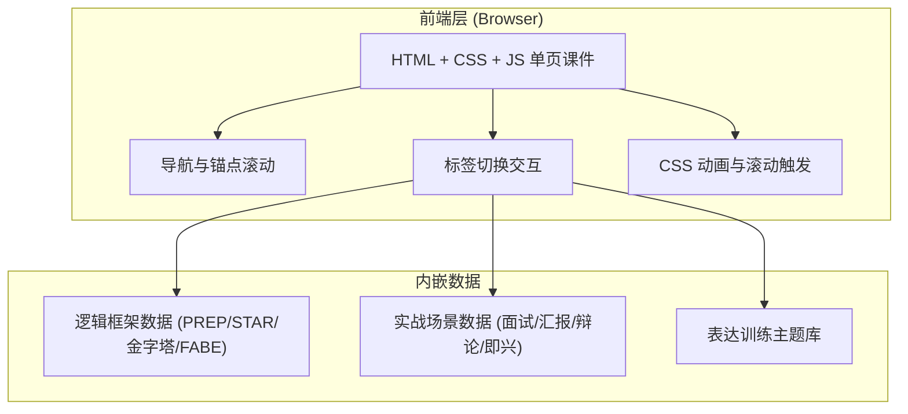

## 1. 架构设计



**架构说明**：纯前端单页 HTML 课件，无后端服务、无构建工具、无外部依赖（仅引用 Google Fonts CDN）。所有交互逻辑通过原生 JavaScript 实现，数据内嵌于文件内，打开即用，便于直接上传社区展示。

## 2. 技术说明

- **前端方案**：原生 HTML5 + CSS3 + JavaScript（ES6+），单文件交付
- **样式方案**：CSS 自定义变量（墨与琥珀主题）+ CSS Grid/Flexbox 布局 + CSS 动画
- **字体方案**：Google Fonts CDN 引入 Fraunces / Manrope / JetBrains Mono
- **交互方案**：原生 DOM 事件 + IntersectionObserver 滚动触发动画
- **图标方案**：内联 SVG 几何线性图标
- **无构建依赖**：无需 npm/vite，直接浏览器打开即可运行

## 3. 路由定义

| 锚点 | 用途 |
|-------|---------|
| `#hero` | 顶部品牌区 |
| `#intro` | 创意介绍 |
| `#users` | 目标用户与痛点 |
| `#value` | 价值与意义 |
| `#courseware` | 互动课件主体 |

## 4. 数据结构（内嵌 JSON）

### 4.1 逻辑框架数据

```javascript
const frameworks = [
  {
    id: "prep",
    name: "PREP",
    full: "Point-Reason-Example-Point",
    cn: "结论先行",
    color: "amber",
    steps: [
      { label: "P", name: "结论", desc: "先抛出核心观点" },
      { label: "R", name: "理由", desc: "解释为什么这样认为" },
      { label: "E", name: "案例", desc: "用具体例子佐证" },
      { label: "P", name: "重申", desc: "再次强调结论" }
    ],
    example: "我认为远程办公应成为常态（P）。因为它能提升员工幸福感与效率（R）..."
  },
  // STAR / 金字塔 / FABE 同结构
];
```

### 4.2 实战场景数据

```javascript
const scenarios = [
  {
    id: "interview",
    name: "面试答辩",
    icon: "briefcase",
    framework: "STAR",
    prompt: "请描述一次你解决复杂问题的经历",
    tips: ["用 STAR 结构组织", "聚焦你的具体行动", "量化结果"]
  },
  // 汇报 / 辩论 / 即兴 同结构
];
```

## 5. 组件结构

```
口才逻辑课件.html (单文件)
├── <head>
│   ├── Meta 与标题
│   ├── Google Fonts 引入
│   └── <style> 全部样式
├── <body>
│   ├── <nav> 顶部导航
│   ├── <header class="hero"> Hero 区
│   ├── <section id="intro"> 创意介绍
│   ├── <section id="users"> 目标用户与痛点
│   ├── <section id="value"> 价值与意义
│   ├── <section id="courseware"> 课件主体（标签切换）
│   │   ├── 标签栏
│   │   └── 内容面板 ×4
│   ├── <footer> 页脚
│   └── <script> 交互逻辑
└── 交互逻辑
    ├── 导栏滚动状态
    ├── 标签切换
    ├── 框架卡片展开/收起
    ├── 训练器计时与模板填充
    └── 滚动入场动画 (IntersectionObserver)
```

## 6. 技术约束与说明

- **单文件交付**：所有 HTML/CSS/JS 内联于一个 `.html` 文件，便于直接上传社区展示，无跨文件依赖
- **字体依赖**：通过 Google Fonts CDN 加载，需网络连接；离线场景降级为系统衬线/无衬线字体
- **浏览器兼容**：支持 Chrome/Edge/Safari/Firefox 较新版本，依赖 CSS Grid、CSS 自定义变量、IntersectionObserver
- **响应式**：桌面优先，通过媒体查询适配平板与移动端
- **无障碍**：语义化 HTML 标签，键盘可操作，色彩对比度满足 WCAG AA 标准
