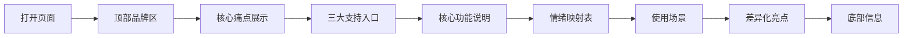

## 1. 产品概述

"心情着陆点"是一款轻量级情绪支持与能量补给微信小程序的创意展示页面，用于 TRAE AI 创造力大赛 2026 的方案展示。

- **核心定位**：填补"什么都不做"和"去看心理医生"之间空白的日常情绪支持工具
- **目标用户**：18-35 岁的学生和职场新人
- **核心 Slogan**：先接住情绪，再补一点能量，慢慢看见自己正在变好
- **核心体验闭环**：记录此刻 → 获得支持 → 完成一个小动作 → 看见变化

## 2. 核心功能

### 2.1 用户角色
| 角色 | 描述 |
|------|------|
| 访客 | 浏览创意展示页面，了解产品理念和功能 |

### 2.2 功能模块
1. **顶部品牌区域**：产品名、副标题、主 Slogan
2. **核心痛点展示**：4 个用户痛点，图标 + 简短文字
3. **三大支持入口**：我想缓一下、我想给自己打打气、我想看看最近的变化
4. **核心功能说明**：5 个核心功能卡片
5. **情绪映射表**：不同情绪对应的回应策略表格
6. **典型使用场景**：6 个使用场景标签/卡片
7. **差异化亮点**：4 个产品差异化亮点
8. **底部区域**：产品边界说明、代码仓库信息

### 2.3 页面详情
| 页面名称 | 模块名称 | 功能描述 |
|-----------|-------------|---------------------|
| 创意展示页 | 顶部品牌区 | 产品名称、副标题、主 Slogan、品牌视觉 |
| 创意展示页 | 核心痛点区 | 4 个痛点图标卡片，滚动渐入动画 |
| 创意展示页 | 三大入口区 | 3 个功能入口卡片，悬停交互效果 |
| 创意展示页 | 核心功能区 | 5 个功能说明卡片，图标 + 标题 + 描述 |
| 创意展示页 | 情绪映射表 | 情绪回应策略表格，移动端适配 |
| 创意展示页 | 使用场景区 | 6 个场景标签卡片 |
| 创意展示页 | 差异化亮点区 | 4 个亮点说明 |
| 创意展示页 | 底部信息区 | 产品边界声明、代码仓库链接 |

## 3. 核心流程

用户打开页面 → 向下滚动浏览各模块 → 了解产品理念和功能 → 查看详细信息

## 4. 用户界面设计

### 4.1 设计风格
- **主色调**：暖橙色（#FF8A65）、柔粉色（#F8BBD0）、浅米色（#FFF8E1）
- **辅助色**：柔和绿色（#A5D6A7）、淡紫色（#CE93D8）
- **中性色**：米白背景、深灰文字、浅灰分割线
- **按钮风格**：大圆角、柔和阴影、渐变填充
- **字体**：中文使用系统无衬线字体，标题加粗，正文清晰易读
- **布局风格**：卡片式布局、充足留白、圆角设计
- **图标风格**：简约线性图标、统一圆角风格
- **整体调性**：温暖、柔和、有温度、可信任、不压迫

### 4.2 页面设计概述
| 页面名称 | 模块名称 | UI 元素 |
|-----------|-------------|-------------|
| 创意展示页 | 顶部品牌区 | 渐变背景、产品名大标题、副标题、Slogan、装饰元素 |
| 创意展示页 | 核心痛点区 | 图标卡片网格、图标 + 文字、悬停微动效 |
| 创意展示页 | 三大入口区 | 大卡片、不同主题色、图标 + 标题 + 描述 |
| 创意展示页 | 核心功能区 | 功能卡片列表、序号标记、图标 + 标题 + 描述 |
| 创意展示页 | 情绪映射表 | 表格设计、情绪分类标签、移动端自适应 |
| 创意展示页 | 使用场景区 | 标签式卡片、场景图标/文字、流动布局 |
| 创意展示页 | 差异化亮点区 | 亮点卡片、醒目标记、对比说明 |
| 创意展示页 | 底部信息区 | 柔和背景、说明文字、仓库链接 |

### 4.3 响应式设计
- **移动端优先**：375px - 414px 宽度优化
- **平板适配**：768px 左右双列布局
- **桌面端适配**：1024px+ 最大宽度限制，居中展示
- **触摸优化**：按钮和可点击区域足够大（≥44px）

### 4.4 动效设计
- 页面滚动渐入动画（Intersection Observer）
- 卡片悬停微动效（阴影、微位移）
- 顶部区域加载动画（渐入 + 上移）
- 呼吸灯效果（用于重点元素）
- 平滑滚动体验
