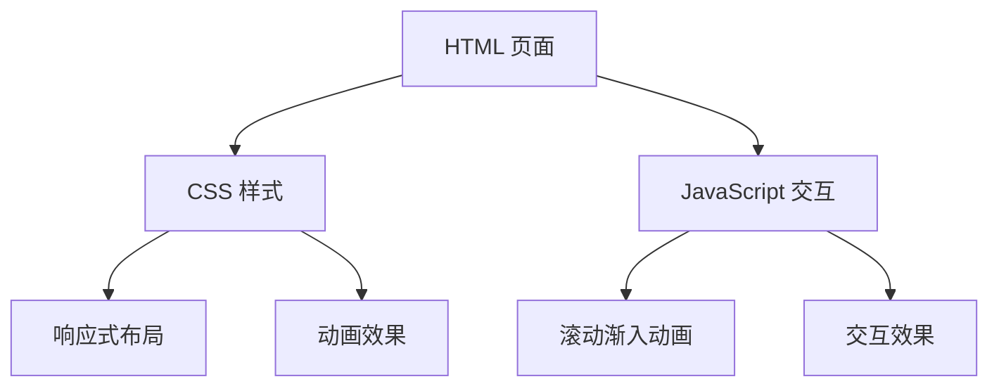

## 1. 架构设计

## 2. 技术描述

- **前端**：纯 HTML5 + CSS3 + Vanilla JavaScript（ES6+）
- **无构建工具**：可直接在浏览器中打开
- **无外部依赖**：纯原生实现，零依赖
- **图标方案**：使用 Unicode 表情符号 + CSS 绘制装饰元素
- **字体**：使用系统字体栈，无需外部字体加载

## 3. 文件结构

| 文件 | 用途 |
|-------|---------|
| index.html | 主页面，包含所有内容结构 |
| css/style.css | 样式文件，包含所有样式和动画 |
| js/main.js | 交互脚本，滚动动画和交互效果 |

## 4. 技术要点

### 4.1 CSS 技术栈
- CSS 变量（自定义属性）管理主题色
- Flexbox + Grid 布局
- CSS 动画和过渡
- 媒体查询实现响应式
- CSS 渐变和阴影效果

### 4.2 JavaScript 功能
- Intersection Observer API 实现滚动渐入
- 平滑滚动
- 悬停交互增强
- 移动端触摸优化

### 4.3 响应式断点
- `< 480px`：移动端单列布局
- `480px - 768px`：大屏手机/小平板
- `768px - 1024px`：平板双列布局
- `> 1024px`：桌面端最大宽度限制

## 5. 性能优化

- 无外部资源依赖，加载速度快
- CSS 动画优先使用 transform 和 opacity
- 使用 Intersection Observer 替代滚动监听，性能更好
- 图片使用装饰性 SVG/CSS 绘制，避免网络请求
