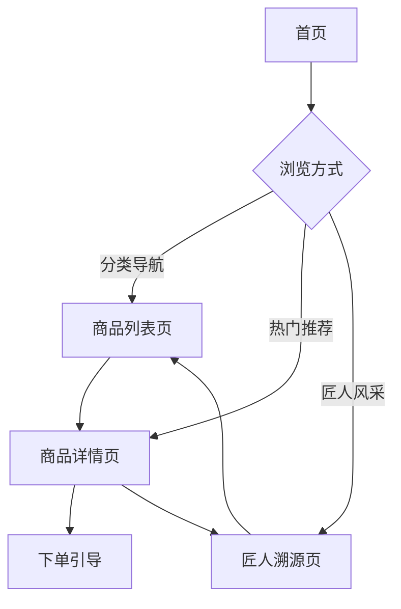

## 1. Product Overview
非遗匠人好物商城是一个展示中国非物质文化遗产手工艺品的电商展示平台，致力于推广传统手工艺文化，连接匠心手艺人与现代消费者。
- 主要目的：展示和销售非遗文创产品，传承和弘扬中国传统手工艺文化
- 目标用户：文化爱好者、礼品购买者、非遗收藏家、旅游消费者

## 2. Core Features

### 2.1 User Roles
| Role | Registration Method | Core Permissions |
|------|---------------------|------------------|
| Visitor | None | Browse products, view details, view craftsman info |

### 2.2 Feature Module
1. **首页**: 品牌展示、分类导航、热门商品推荐、匠人风采
2. **商品列表页**: 分类筛选、商品卡片展示、排序功能
3. **商品详情页**: 商品大图、工艺介绍、规格参数、价格、下单引导
4. **匠人溯源页**: 匠人故事、传承历程、代表作品、联系方式

### 2.3 Page Details
| Page Name | Module Name | Feature description |
|-----------|-------------|---------------------|
| 首页 | Hero Banner | 品牌宣传图轮播，展示非遗文化主题 |
| 首页 | 分类导航 | 按工艺类型分类（刺绣、陶瓷、木雕等） |
| 首页 | 热门推荐 | 精选非遗好物展示 |
| 首页 | 匠人风采 | 展示匠人头像和简介 |
| 商品列表页 | 筛选栏 | 分类筛选、价格区间、排序选项 |
| 商品列表页 | 商品网格 | 响应式商品卡片展示 |
| 商品详情页 | 商品图片 | 主图+多图展示 |
| 商品详情页 | 商品信息 | 名称、价格、工艺介绍、规格参数 |
| 商品详情页 | 下单引导 | 数量选择、加入购物车、立即购买 |
| 匠人溯源页 | 匠人档案 | 匠人照片、姓名、籍贯、师承 |
| 匠人溯源页 | 传承故事 | 工艺传承历程、代表作品展示 |

## 3. Core Process
用户访问首页 → 浏览分类或热门推荐 → 点击商品查看详情 → 选择规格加入购物车/立即购买 → 查看匠人溯源了解工艺背景

## 4. User Interface Design

### 4.1 Design Style
- **主色调**: 温润米白色背景(#FDFBF7)，赭石色(#C4956A)作为主色，墨色(#2C2C2C)作为文字色
- **辅助色**: 青绿(#5B8C5A)用于强调，浅金(#D4AF37)用于装饰
- **按钮风格**: 圆角矩形，赭石色主按钮，米白色边框按钮
- **字体**: 思源宋体作为主要字体，体现国风韵味
- **布局风格**: 卡片式布局，留白充足，营造雅致氛围
- **图标风格**: 线条简洁的中式风格图标

### 4.2 Page Design Overview
| Page Name | Module Name | UI Elements |
|-----------|-------------|-------------|
| 首页 | Hero Banner | 全屏轮播图，渐变遮罩，毛笔字体标题 |
| 首页 | 分类导航 | 圆形图标+文字，悬停放大效果 |
| 首页 | 热门推荐 | 横向滚动卡片，阴影层次感 |
| 首页 | 匠人风采 | 圆形头像，网格排列 |
| 商品列表页 | 筛选栏 | 标签式筛选，下拉排序 |
| 商品列表页 | 商品网格 | 响应式网格，悬停显示价格和按钮 |
| 商品详情页 | 商品图片 | 主图居中，缩略图切换 |
| 商品详情页 | 商品信息 | 左图右文布局，标签展示工艺特色 |
| 商品详情页 | 下单引导 | 底部固定栏，数量选择器 |
| 匠人溯源页 | 匠人档案 | 左侧照片，右侧信息，时间线展示传承 |

### 4.3 Responsiveness
- 桌面端：多栏布局，丰富信息展示
- 平板端：自适应双栏布局
- 移动端：单列布局，底部导航

### 4.4 3D Scene Guidance
- 不适用本项目