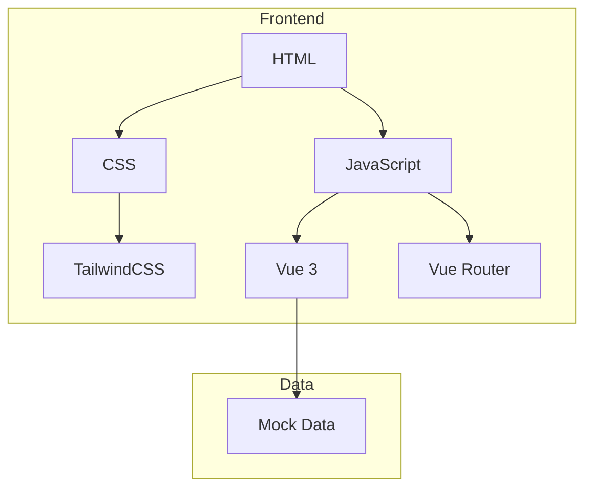
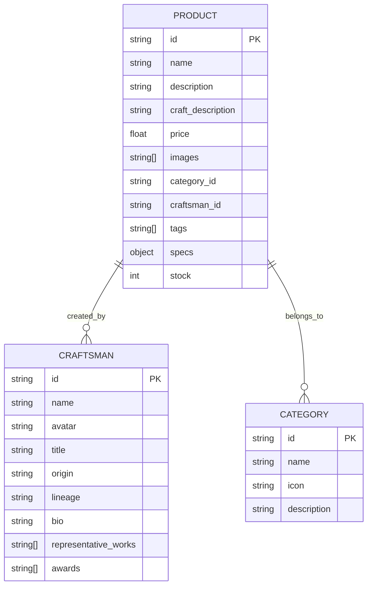

## 1. Architecture Design

## 2. Technology Description
- Frontend: Vue@3 + tailwindcss@3 + vite
- Initialization Tool: vite-init
- Backend: None (Mock data for demo)
- Database: None (Static JSON data)

## 3. Route Definitions
| Route | Purpose |
|-------|---------|
| / | 首页，品牌展示和商品推荐 |
| /products | 商品列表页，分类筛选 |
| /products/:id | 商品详情页 |
| /craftsmen | 匠人列表页 |
| /craftsmen/:id | 匠人溯源详情页 |

## 4. API Definitions
- 本项目使用Mock数据，无需后端API

## 5. Server Architecture Diagram
- 不适用（纯前端项目）

## 6. Data Model

### 6.1 Data Model Definition

### 6.2 Data Definition Language
- 使用JSON文件存储Mock数据
- 数据文件位置: src/data/